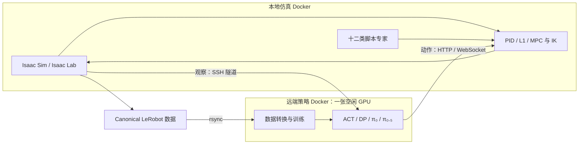

# AM-Bench 双容器研究环境

这份手册在 `research` 分支使用 Isaac Lab 2.3.2 / Isaac Sim 5.1.0，把仿真、机器人控制与脚本专家放在本地仿真容器，把 ACT、Diffusion Policy 和 OpenPI 的模型推理放在独立策略容器。默认部署策略容器到 `tencent-86`，本地和远端均只通过 Docker 安装项目依赖。`usage.md` 给出功能清单、逐项命令和验证记录。

命令中的 `rebuild-20261007` 是本次验收的运行名。当前机器已有对应示范和 checkpoint，可以核验并复用；需要重新采集或训练时，统一替换所有本地输出、远端数据、stats、checkpoint 和评估路径中的运行名，使用空目录。验证采集入口拒绝非空输出目录，上传入口拒绝同名远端目录；训练也应使用新的目录。

> 本分支的容器流程是研究验证路径。主分支 README 所述的原生安装仍是项目目前的维护路径。

## 1. 机器与目录

| 角色 | 设备 | 容器 | 持久目录 |
| --- | --- | --- | --- |
| 仿真、低层控制、数据采集 | 本地 RTX 4070 Ti SUPER 16 GiB | `ambench-sim-research` | 仓库的 `datasets/`、`outputs/`、`videos/`（均不提交） |
| 高层策略训练与推理 | `tencent-86` 上空闲编号最小的 GPU；部署时重新检查 | `ambench-policy-research` | `/diff/dzp_is_sb/ambench-research` |



本机已经把现有 `~/.ssh/id_ed25519.pub` 安装到 `tencent-86`，可用下面的只读检查确认免密登录。换一台本地机器时，先准备自己的公钥并执行 `ssh-copy-id -i ~/.ssh/id_ed25519.pub -p 22 tencent-86`，输入一次该服务器的登录凭据，随后再运行检查命令。不要把密码、私钥、Hugging Face token 或模型文件写进 Git。

```bash
ssh -o BatchMode=yes -p 22 tencent-86 'id -un; nvidia-smi --query-gpu=index,memory.used --format=csv,noheader'
docker compose version
docker run --rm --gpus all ubuntu:22.04 nvidia-smi -L
```

本次连续启动服务时遇到过短 SSH 连接偶发中断，已为本机现有 `tencent-86` 配置连接复用，并通过禁用密码的 BatchMode 检查。其他机器可在已有的 `Host tencent-86` 配置下加入以下三项；保留原来的 HostName、User、IdentityFile 等设置：

```sshconfig
Host tencent-86
  ControlMaster auto
  ControlPersist 30m
  ControlPath ~/.ssh/ambench-%C
```

远端 GPU 编号会随他人的任务变化。每次启动容器前重新执行 `nvidia-smi`；部署脚本默认选取没有计算进程的最小编号，可给脚本传入明确的 GPU ID。不要在已有任务的卡上叠加模型进程。

## 2. 获取源码和构建镜像

从仓库根目录执行。构建上下文包含固定 Git 子模块版本；`ext/` 的生成物仍留在容器层和忽略目录中。

```bash
git switch research
git submodule update --init --recursive ext/pyroki ext/acados ext/openpi
bash tools/research/build_images.sh sim
bash tools/research/build_images.sh policy
```

镜像分别是 `ambench:research-sim` 和 `ambench:research-policy`。仿真镜像基于 NVIDIA 官方 `nvcr.io/nvidia/isaac-lab:2.3.2`，其配套 Isaac Sim 为 5.1.0，Python 为 3.11，Torch 为 2.7.0+cu128。第一次拉取镜像较大，应留出磁盘空间。构建只在容器内安装 Pyroki、acados、AM-Bench 和策略依赖；宿主机不需要安装 Conda、Isaac Lab Python 包或模型包。

2026-10-07 重建的最终两张镜像约为 18.9 GB 和 32.4 GB；策略镜像传输包约 15.1 GB。构建机还需要 Docker 层、下载缓存和该传输包的临时空间；远端需要镜像与传输包的空间。传输包放在本机 `~/.cache/ambench-research/` 和远端研究目录的 `images/`，均不属于 Git 仓库。

OpenPI 的 π₀ 和 π₀.₅ 官方 base checkpoint 各约 11–12 GiB。`fetch_openpi_base.sh` 只在本地无 GPU Docker 中下载到忽略目录 `outputs/openpi-cache/`，校验后用 rsync 传到远端持久缓存并再次校验；同时使用两个模型时，本地和远端分别预留至少 25 GiB 权重空间。

高层镜像内部使用三个互不影响的 Python 环境：`/opt/venvs/act/bin/python`、`/opt/venvs/dp/bin/python`、`/opt/openpi/.venv/bin/python`。ACT 的 LeRobot 0.4.4 依赖与本仓 DP 固定的 diffusers 版本不兼容；OpenPI 也有独立的锁定依赖。三者仍属于**一个**远端 Docker 镜像。

`docker/constraints.sim.txt`、`docker/constraints.act.txt` 和 `docker/constraints.dp.txt` 固定已验证的 Python 运行依赖；OpenPI 使用其子模块的 `uv.lock`。Pyroki 的 JAXLS Git 依赖也固定到成功环境的 commit，未修改第三方子模块。仿真继续采用官方安装脚本要求的 JAX/JAXLIB 0.4.28，即使 JAXLS 元数据声明了更新的版本范围；IK 的实际运行以全量矩阵验证为准。

## 3. 启动仿真容器

```bash
mkdir -p datasets outputs videos
docker compose -f docker/compose.sim.yml up -d
docker exec ambench-sim-research true
```

进入容器：

```bash
docker exec -it ambench-sim-research bash
```

下文中 `SIM='docker exec ambench-sim-research'` 可简化宿主机命令。仿真容器默认工作目录是可写 Docker 卷 `/workspace/ambench-run`：其中 `scripts/`、`source/`、`datasets/`、`outputs/` 等链接到 `/workspace/ambench` 的对应目录。仓库源码仍只读，acados 的相对路径生成物留在工作卷；直接执行 `docker exec ... python scripts/...` 或 `python -m ...` 即可，运行 MPC 时不要先切到只读的 `/workspace/ambench`。Isaac Sim 需要 GPU、NVIDIA 容器运行时及 `ACCEPT_EULA=Y`；compose 文件负责这些设置和持久缓存。先做最轻量的注册与场景检查：

```bash
docker exec ambench-sim-research python scripts/environments/list_envs.py
docker exec ambench-sim-research python scripts/research/verify_environment.py \
  --task PressButton-Am-EE-Abs-PID-Direct-v0 --steps 8 --headless --device cuda:0
```

应看到 106 个注册 ID，随后得到环境构造、reset 和 step 成功记录。若第一步失败，查看容器日志，并确认 `nvidia-smi`、Isaac Sim 5.1 资产网络和镜像内的 acados 路径；不要把单次失败记作通过。

### 3.1 可选的本地 GUI 与遥操作

本机有 X11 桌面时，可用同一仿真镜像的 GUI 覆盖配置。先在宿主机终端确认 `DISPLAY` 与 `XAUTHORITY` 指向现有会话；切换模式会重建仿真容器，应先结束正在运行的评估或矩阵任务。

```bash
test -n "$DISPLAY" && test -f "$XAUTHORITY"
docker compose -f docker/compose.sim.yml -f docker/compose.gui.yml \
  up -d --no-deps --force-recreate sim
docker exec -it ambench-sim-research python scripts/environments/teleop_se3_agent.py \
  --task PressButton-Am-EE-Abs-PID-Direct-v0
```

`teleop_se3_agent.py` 持续运行，结束时按 Ctrl+C。在可见窗口按 R 应触发环境重置。2026-10-07 最终镜像的有界 X11 检查完成 PressButton 场景和 `Se3Keyboard` 初始化；软件事件只发送给本次容器的窗口，日志出现 `Reset triggered` 和 `Environment reset complete`。180 秒上限触发的 exit 124 是连续运行器的预期结束方式，日志为 `outputs/research/rebuild-20261007/gui/teleop.log`，结束后没有残留 Isaac 子进程。公共连续入口没有 seed 参数，此项为 `seed: null`。这项检查验证 GUI 与键盘回调，真人示范、SpaceMouse 和 gamepad 硬件仍未执行。完成后恢复无头服务：

```bash
docker compose -f docker/compose.sim.yml up -d --no-deps --force-recreate sim
```

正式录制人工示范时在容器内执行 `python scripts/data/record_demos_teleop.py --task PressButton-Am-EE-Abs-PID-Direct-v0 --help`，选择 keyboard、SpaceMouse 或 gamepad，再按 `usage.md` 的 canonical 数据验证步骤检查产物。Isaac Lab 2.3.2 会在显示帮助前预解析必填参数，因此这里也传入 task。设备透传取决于设备类型；键盘使用 X11 会话。无桌面的服务器继续使用上一节的无头 compose 配置。

## 4. 上传并启动远端策略容器

远端只在 `/diff/dzp_is_sb/ambench-research` 保存源码、镜像归档、缓存、数据与结果。上传脚本只传策略镜像，仿真镜像留在本地。

```bash
bash tools/research/deploy_policy.sh
ssh -o BatchMode=yes tencent-86 \
  'docker exec ambench-policy-research nvidia-smi -L'
```

需要指定空闲卡时传入编号，例如 `bash tools/research/deploy_policy.sh 0`。容器内只看见所选卡，因此服务命令统一使用 `cuda:0`。不要把服务器八卡全映射给策略容器。

### 4.1 启动服务与 SSH 隧道

远端容器的 ACT/DP HTTP 端口为 8001，OpenPI WebSocket 端口为 8000；只发布到远端环回地址。另开终端建立 SSH 本地转发，仿真容器使用 host 网络访问本地环回地址：

```bash
bash tools/research/tunnel_policy.sh
```

在另一个本地终端选择一个策略服务：

```bash
# ACT：先按 usage.md 第 5 节完成一步训练
bash tools/research/start_policy.sh act \
  /data/checkpoints/rebuild-20261007/act_press_button_smoke/checkpoints/last/pretrained_model

# Diffusion Policy：同一 canonical 数据的一步训练 checkpoint
bash tools/research/start_policy.sh dp \
  /data/outputs/rebuild-20261007/press_button_dp_smoke/checkpoints/latest.ckpt

# OpenPI π₀.₅：第 5.3 节的一步训练 checkpoint
bash tools/research/start_policy.sh pi \
  pi05_am_bench_multitask_openpi_original_20hz_h50_ee_local_relative \
  /data/checkpoints/openpi-rebuild-20261007/pi05_am_bench_multitask_openpi_original_20hz_h50_ee_local_relative/rebuild-20261007/1
```

三个示例都要求先按 `usage.md` 第 5 节生成训练 checkpoint 和对应数据统计；再次复现时统一改用新的运行名和空输出目录。运行 π₀ 时将 OpenPI 命令中的两处 `pi05` 替换为 `pi0`。

启动后在本地宿主机等待服务加载完 checkpoint；把 `act` 替换为实际选择的 `dp` 或 `pi`：

```bash
bash tools/research/wait_policy.sh act 300
```

这三个命令是互斥服务选择，先停止旧服务再启动另一种策略。脚本顶部 `INFERENCE_SEED=42` 固定远端 Python、NumPy 与 Torch 的随机种子，日志包含 `REMOTE_INFERENCE_SEED=42`；本地评估也使用 `--seed 42`。前向 smoke 会消耗模型随机状态，开始可复现的评估前重新启动对应服务。ACT/DP 的仿真侧评估命令使用 `--remote-url http://127.0.0.1:8001`；OpenPI 使用 `--host 127.0.0.1 --port 8000`。跨机器流量经过 SSH 隧道，不需要打开公网推理端口。

## 5. Canonical LeRobot 数据流

唯一源数据格式是记录器写出的 LeRobot 0.4.4 数据集，位于 `<session>/lerobot`，包含 `observation.state`、`action`、`task`、相机图像，以及 `meta/info.json` 的 `ambench.action_semantics` 和有序 `state_keys`。EE 绝对动作 8 维；当前四关节 BaseJoint 动作 12 维；四元数顺序 WXYZ。

```text
本地 Isaac 容器：脚本专家 / teleop → canonical LeRobot
远端策略容器：同一份 canonical ├─ ACT：直接读取
                              ├─ DP：导出 UMI zarr
                              └─ OpenPI：导出固定 reader 的 LeRobot v2.1 派生集
远端策略容器：训练 / checkpoint → 推理服务
本地 Isaac 容器：观察经 SSH RPC → 动作 → 低层控制 → 评估记录
```

源数据不要改写为相对动作；相对轨迹由各策略适配器在训练时构造。DP zarr 与 OpenPI v2.1 是可重新生成的派生格式，不能取代 canonical 源。每次采集后用容器中的 `scripts/data/validate_lerobotdataset.py` 验证，再通过部署目录的同步步骤上传远端。数据、checkpoint、缓存和视频都保持 Git 未跟踪。

完成 `usage.md` 第 5 节开头的 EE 和 BaseJoint 两条固定 seed 示范采集后，在本地宿主机运行。下面的目录和远端名称与后续训练、推理命令一致：

```bash
SESSION_INFO=$(find outputs/research/rebuild-20261007/scripted_press_ee -type f -path '*/lerobot/meta/info.json' | sort | tail -n 1)
SESSION_ROOT=${SESSION_INFO%/lerobot/meta/info.json}
test -f "$SESSION_ROOT/lerobot/meta/info.json"
bash tools/research/sync_dataset.sh "$SESSION_ROOT" press_button_ee_rebuild_20261007
SESSION_INFO=$(find outputs/research/rebuild-20261007/scripted_press_base_joint -type f -path '*/lerobot/meta/info.json' | sort | tail -n 1)
SESSION_ROOT=${SESSION_INFO%/lerobot/meta/info.json}
test -f "$SESSION_ROOT/lerobot/meta/info.json"
bash tools/research/sync_dataset.sh "$SESSION_ROOT" press_button_base_joint_rebuild_20261007
ssh tencent-86 'ls -l /diff/dzp_is_sb/ambench-research/datasets/press_button_{ee,base_joint}_rebuild_20261007/lerobot/meta/info.json'
```

DP zarr 转换在远端的 DP 环境执行；ACT 直接读取上传的 canonical `lerobot/`；OpenPI 的 v2.1 派生数据在远端 ACT 环境从同一 canonical session 导出到 `/data/datasets/openpi-rebuild-20261007` 下的对应 repo ID。完整命令见 `usage.md` 第 5.1–5.3 节；OpenPI 的 norm stats、训练和推理都使用这个独立 dataset home。

同步脚本拒绝覆盖远端同名目录。重新采集时使用新的本地输出目录与远端名称，并一致替换后续命令中的路径。所有训练输出与 checkpoint 放在远端 `/data/checkpoints` 或 `/data/outputs`。

## 6. 完整验证与故障定位

全部 106 个注册 ID 的有界 reset/step 验证：

```bash
docker exec ambench-sim-research python scripts/research/verify_matrix.py \
  --all --steps 8 --timeout-s 600 \
  --video-family-representatives --video-steps 60 \
  --output-dir outputs/research/verify-01
```

`usage.md` 列出任务、机型、控制器、脚本专家、数据、三种策略与扰动的逐项命令。NDT 首次会从 Isaac 资产源加载大型仓库场景，本次首次启动超过了 240 秒，后续在缓存就绪后通过；完整矩阵因此给每项 600 秒上限。镜像导入检查、一次 reset/step 和一个短 rollout 是不同验证级别；只有实际执行且产生相应产物的项目才计为通过。验证中出现超时或失败，先查该 ID 的日志与 GPU 使用，再修复并单独重跑；每次重跑使用新的空输出目录，不要把零动作 smoke 误写成任务成功率。

| 工作目录相关实测 | 结果与证据 |
| --- | --- |
| MPC 验证器的相对输出路径 | 最终镜像上 `verify_environment.py` 完成 seed 42 的 8 步，结果写入预期的 `outputs/research/rebuild-20261007/direct_mpc_relative/records/probe.json`；同级 `videos/` 含 9 帧可解码 MP4，新求解器编译完成。 |
| 普通 MPC 入口 | 最终镜像上 `zero_agent.py --task PressButton-Am-FAHexa-Abs-MPC-Direct-v0 --num_envs 1 --headless` 在可写工作卷完成构造、reset 和 3,151 条步进输出，记录为 `outputs/research/rebuild-20261007/mpc_normal_cwd.json`；75 秒有界运行的 exit 124 为预期，结束后没有残留子进程。公共连续运行器没有 seed 参数，此项为 `seed: null`。 |
| X11 GUI 遥操作 | 最终镜像完成 PressButton EE PID 场景、键盘初始化及定向 R 键重置回调；日志 `outputs/research/rebuild-20261007/gui/teleop.log`，180 秒有界退出后恢复无头 Compose，未将软件事件计为真人示范。 |

常用定位命令：

```bash
docker logs --tail 100 ambench-sim-research
docker exec ambench-sim-research nvidia-smi
ssh tencent-86 'docker logs --tail 100 ambench-policy-research'
ssh tencent-86 'nvidia-smi --query-gpu=index,memory.used --format=csv,noheader'
```

公开训练数据和任务专用 checkpoint 不在本仓库中。没有匹配 checkpoint 的策略评估应标为“未执行”，不能以服务健康检查冒充有效任务成绩。完整评估以 `eval_summary.json` 的 `status: "completed"` 和要求的 rollout 数量为准。

## 7. 删除研究镜像、同步官方源码并完整重建

先结束当前采集、训练和评估，提交本分支的源码改动，再执行下列命令。清理脚本只处理命名的 AM-Bench 研究容器、研究镜像标签及其策略镜像传输包；示范、checkpoint、模型下载缓存和 Docker 持久卷保留。共享基础镜像由 `--pull` 检查，应用层通过 `--no-cache` 重新构建，pip/uv 下载缓存可复用。

```bash
bash tools/research/reset_images.sh all
git fetch --no-tags https://github.com/ambench/ambench.git \
  main:refs/remotes/official/main
git log --oneline research..official/main
git merge --no-edit official/main
git submodule update --init --recursive ext/pyroki ext/acados ext/openpi
bash tools/research/build_images.sh all clean
docker compose -f docker/compose.sim.yml up -d
bash tools/research/deploy_policy.sh
```

2026-10-07 的实际官方检查得到 `60bf5b73041df4eab571f7d9f0a297aeecbf2e0d`，与本次研究分支的原始基线相同。存在新提交时先审查差异和解决合并冲突，再运行后续构建；子模块使用合并后仓库记录的版本。

构建脚本把源码 revision、是否有未提交改动和递归子模块版本写入镜像标签，并将 image inspect 与构建模式保存到忽略目录 `outputs/docker-builds/<image-id>/`。两种镜像内的 `/opt/ambench-build/` 保留各 Python 环境的依赖版本清单；应用安装和导入检查在构建中执行。重建后重新运行本手册第 6 节全量矩阵、`usage.md` 第 4 节示范采集及其策略数据、训练、推理和闭环检查，使用新的空输出目录。

[本次重建快照](usage_assets/rebuild_snapshot.json)记录删除旧镜像、无缓存构建、后续源码修复重建、最终两端镜像和传输包哈希，以及 35 个原始证据的 SHA-256。最终运行镜像嵌入源码 `02d1499`；后续分支提交只更新验证记录和文档。

如果宿主机 `nvidia-smi` 正常，但旧容器内提示 `Failed to initialize NVML: Unknown Error`，先结束该容器内的任务，再重新创建容器，随后检查驱动访问：

```bash
docker compose -f docker/compose.sim.yml up -d --no-deps --force-recreate sim
docker exec ambench-sim-research nvidia-smi
```

本次 π₀.₅ BaseJoint 补测遇到过这一状态，重新创建容器后已完成真实闭环。若宿主机本身的驱动检查也失败，需要先恢复宿主机驱动，再运行研究流程。
