# 主动倾转旋翼飞机：OmniHexa 的控制、学习与完整实验

本手册面向希望研究“电机轴相对机身主动转动”的空中操作读者，独立于项目 README。当前正式注册的主动倾转平台是 **OmniHexa / `omni_scorpion`**：六个旋翼、六个电机臂倾转关节、三个机械臂关节和一个转动夹爪。常规固定轴四旋翼另见 [uaquad.md](uaquad.md)，容器配置沿用 [note.md](note.md)。

**[在线交互与多视角实验](https://zipengdai.com/ambench/tilting/)** · [离线交互页](usage_assets/tilting/index.html) · [本轮录制配置](usage_assets/tilting/recording_specs.json)

介绍方式借鉴 [ARTEX README](https://github.com/mhtsec/ARTEX/blob/main/README.md) 的架构流程、交互入口和执行证据组织。这里的网页用于解释代码、查看真实试次和操作解析分配演示；运行 Isaac 物理仿真仍使用 Docker。解析滑块没有动力学积分、接触或真实飞控，不能当作额外实验成绩。

阅读顺序：[机型范围](#1-哪些飞机确实支持主动倾转) → [完整控制链](#2-一条末端动作怎样驱动六个倾转旋翼) → [倾转分配数学](#3-推力与倾转角如何分配) → [模型与 RL](#4-脚本actdpopenpi-和强化学习的输入输出) → [双 Docker](#5-本地仿真与远端模型如何连接) → [实验与录像](#6-完整实验的设计判定与复现) → [模型复现](#7-模型训练与推理的实验边界) → [real2sim2real](#8-主动倾转平台的-real2sim2real-实现边界) → [代码共享](#9-欠驱动固定倾角与主动倾转的代码共享) → [总结与验收](#10-技术总结与交付验收)。

## 1. 哪些飞机确实支持主动倾转

| 平台 | 旋翼方向相对机身 | 主动电机臂倾转关节 | 基座控制 | 机械臂 | 当前注册 ID 数 |
| --- | --- | --- | --- | --- | --- |
| **OmniHexa** | 六个推力轴由各自电机臂角度改变 | **6 个：`base_motor_arm1`～`6`** | 六维 PID；可变倾角分配 | `servo1`～`3`，3 自由度 | **12** |
| FAHexa | 六个彼此不平行的固定倾角 | 0 | 六维 PID/L1；部分任务 MPC | 4 自由度 | 42 |
| UAQuad | 四个固定平行轴，沿机体 +Z | 0 | 四维 PID，横向移动靠机身倾斜 | 4 自由度 | 12 |
| UAHexa | 六个固定平行轴，沿机体 +Z | 0 | 四维 PID | 4 自由度 | 12 |
| EE | 浮动末端参考模型，无飞行旋翼 | 0 | 末端六维控制 | 夹爪 | 28 |

上述 106 个 ID 来自任务注册源码；控制器、动作接口和 Fast 参考组合会增加 ID 数，不能把 106 当作飞机种类数。**项目目前只有一个正式主动倾转机型，OmniHexa 已注册十二个任务族。** FAHexa 纳入分类解释和重新录制的对照组，它的固定倾斜旋翼没有主动倾转执行器。

“机身 roll/pitch 倾斜”“旋翼轴出厂固定倾斜”“电机臂主动转动”分别属于机体姿态、固定几何与执行器状态。OmniHexa 可以通过倾转改变机体坐标系中的侧向推力；它仍可能在任务中改变机身姿态，并不要求机身永远水平。

代码入口：[OmniHexa 配置](source/ambench/ambench/robots/omni_hexa.py)、[USD](source/ambench/ambench/assets/robots/omni_scorpion.usd)、[URDF](source/ambench/ambench/assets/robots/urdf/omni_scorpion.urdf)、[profile](source/ambench/ambench/tasks/base/robot_profiles.py)、[任务注册](source/ambench/ambench/tasks/)。它是项目的研究机器人模型，未提供 DJI 商品机或其飞控的数字孪生。

### 1.1 正式支持范围

每个任务的正式 ID 都形如 `PressButton-Am-OmniHexa-Abs-PID-Direct-v0`，动作是 8D 末端绝对位姿。

`OMNI_HEXA_ABS_L1` 和 `OMNI_HEXA_BASE_JOINT_ABS_PID` 在 profile 文件中存在，但当前没有对应正式任务注册。MPC 的现有模型和注册基线属于 FAHexa。不能从“类或 profile 可以构造”推断 Omni L1、Omni MPC 或 Omni BaseJoint 已完成端到端验证。

还有一个接口维数差异：通用流水线按 `8 + arm_joint_count` 计算 BaseJoint 维数，Omni 三臂关节会得到 **11D**；现有学习包的 BaseJoint canonical/插值/导出适配器固定为 **12D、四臂关节**。因此现有 FAHexa BaseJoint checkpoint 不能直接接上这个 Omni profile。本手册使用正式 8D EE 接口。

## 2. 一条末端动作怎样驱动六个倾转旋翼

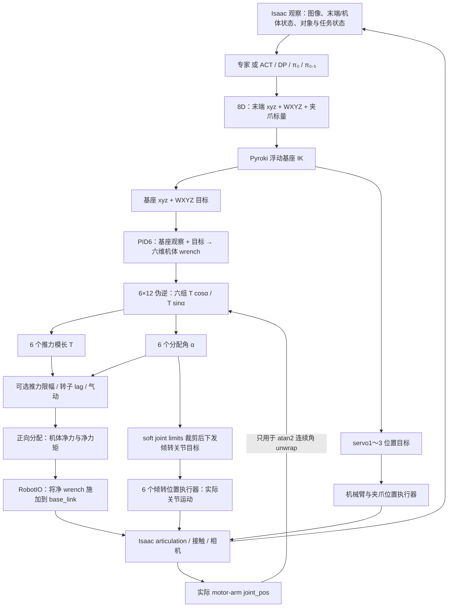

最后一条反馈的作用很具体：**实测倾转角用于 unwrap，不用于计算实际推力方向。** 净 wrench 和六个关节目标是两条分别执行的链，第 3.3 节说明这个差别对真机迁移的影响。

| 边界 | 输入 | 输出 | 单位、坐标与含义 |
| --- | --- | --- | --- |
| 高层策略 | 专家任务真值，或模型 RGB/状态/语言 | `[x,y,z,qw,qx,qy,qz,g]` | xyz 相对环境原点；四元数 WXYZ；g 为无量纲标量 |
| 末端 frame 转换 | 公共目标与 Omni 工具配置 | URDF `end_effector` link 的目标 | Omni 使用 Ry(+90°) 朝向偏移，工具尖端局部偏移 0.0445 m |
| IK | 末端目标与运动学初值 | 基座位姿、三个臂关节目标 | 基座 xyz/roll/pitch/yaw 全部自由；不是固定姿态四旋翼 IK |
| PID6 | 基座位置/四元数/世界线速度/机体角速度与目标 | `[Fx,Fy,Fz,τx,τy,τz]` | 力 N，力矩 Nm；全部在机体坐标系 |
| 分配器 | 六维 wrench、trim 几何、反扭矩比例、实测倾转角 | 六个推力模长、六个倾转角 | 推力 N；角度 rad；推力不是 ESC PWM 或转速 |
| RobotIO | 净 wrench、机械臂/夹爪/倾转目标 | 下一步仿真状态 | 合力施加到基体；关节目标另行执行；旋翼旋转画面为视觉动画 |

物理步长 `dt=1/120 s`、环境 `decimation=1`。Omni PID6 与分配每物理步运行；没有 UAQuad PID4 的 40 Hz 位置外环。位置增益 `kp/kd/ki=200/120/80`，姿态增益 `240/130/130`。这些是仿真调度和配置值，不代表远端推理或真机飞控的实测带宽。

PID6 的力、力矩和积分限值默认均为 None；推力限幅也不会自动反馈到积分器做 anti-windup。质量与惯量在控制器构造时从 articulation 聚合一次，惯量采用局部对角项加平行轴近似，没有随机械臂/倾转运动实时重新辨识，也未完整旋转各 link 惯量坐标。它是控制器参数近似，不能等同于已辨识的时变全身动力学。对应实现：[物理参数聚合](source/ambench/ambench/controllers/utils/control_utils.py)。

### 2.1 浮动基座 IK 与倾转控制的职责

Omni 的三个机械臂关节均绕局部 Y 转动。Pyroki 使用 Omni URDF 解基座六自由度与这三个臂关节；倾转关节和夹爪不是该末端 IK 的可控输出，非臂关节在 IK 配置中恢复默认值。倾转动作由飞行分配器产生，不能把六个倾转角称为大模型或机械臂 IK 的输出。

默认 `enable_collision=False`，基座位置平滑代价和姿态平滑代价均为 1，rest-arm 代价 0.1；默认 safety margin 为 0.3 m。`ik_compute` 会结合当前任务的 wall/pulling-door 几何建立位置界限，LemonHarvesting 另有 IK 配置，safety margin 0.5 m。位置和关节限制主要通过优化代价处理；求解异常可复用上一次解，所以界限配置不能当作真机安全保证。

实现：[运动学控制器](source/ambench/ambench/controllers/pyroki_ik_ctrl.py)、[浮动基座优化](source/ambench/ambench/controllers/pyroki_ctrl/floating_base_ik.py)、[控制流水线](source/ambench/ambench/controllers/control_pipeline.py)、[PID6](source/ambench/ambench/controllers/pid_6dof_ctrl.py)。

### 2.2 Omni 的夹爪标量与实际角度

公共动作仍是 `g=-1` 闭合、`g=+1` 张开。Omni 的 `servo4` 是**转动关节**，闭合目标 0 rad、张开目标 −0.5 rad；映射为 `q_target=-0.25(g+1)`。它没有 UAQuad 双指滑动关节的宽度语义。

十二任务的 `gripper_width` 观察直接取夹爪关节位置之和。对 Omni，它实际为 **servo4 角度 rad**，并非以米表示的物理开口宽度。字段名字和 canonical 8D 形状相同，数值单位、符号和分布不同；旧 EE/UAQuad 模型迁移存在这种状态语义差异。

LemonHarvesting 的当前判定直接使用 `gripper_width>0.0898` 作为张开、`<0.05` 作为闭合；Omni 的正常张开目标 −0.5 rad 不满足这个正阈值。这是共享任务判定与转动夹爪的适配边界，本轮保留原始任务代码与真实结果，不将它改写为已校准的物理夹爪宽度。源码：[Lemon 任务](source/ambench/ambench/tasks/lemon_harvesting/lemon_harvesting_env.py)、[任务阈值](source/ambench/ambench/tasks/lemon_harvesting/lemon_harvesting_env_cfg.py)、[夹爪映射](source/ambench/ambench/robots/robot_io.py)。

## 3. 推力与倾转角如何分配

### 3.1 六维 wrench 到十二个推力分量

每个旋翼在 trim 几何中具有位置 `rᵢ`、互相垂直的单位方向 `cᵢ/sᵢ`。当前 trim 是六个电机臂角度全部为 0，`cᵢ=(0,0,1)`；`sᵢ` 从 URDF 倾转轴与 `cᵢ` 的叉乘得到，各电机的横向方向不同。

```text
dᵢ(αᵢ) = cos(αᵢ)cᵢ + sin(αᵢ)sᵢ
fᵢ       = Tᵢdᵢ
τᵢ       = rᵢ × fᵢ + spinᵢ · k · fᵢ,  k=0.02 m

u = [T₁cosα₁, T₁sinα₁, …, T₆cosα₆, T₆sinα₆]ᵀ
w = A u,    A: 6×12
u = pinv(A) w_desired
Tᵢ = sqrt(uᵢ,cos² + uᵢ,sin²)
αᵢ = atan2(uᵢ,sin, uᵢ,cos)
```

`A` 的每对列由 `[cᵢ; rᵢ×cᵢ+spinᵢkcᵢ]` 与 `[sᵢ; rᵢ×sᵢ+spinᵢksᵢ]` 组成。按当前 URDF 几何重建，该 **6×12 矩阵秩为 6**。若把全部倾转角冻结在 0，只调六个推力，固定方向的 **6×6 矩阵秩为 4**。六维能力来自同时改变推力与方向，不能将有限速度的舵机当成瞬时新增的六个力通道。

Omni 的推力模长由范数恢复，天然非负；它不会像固定轴的无约束分配那样用带符号推力实现目标。但默认关闭上限，仍可能超过配置的 **23 N/旋翼**。六维线性矩阵满秩不保证所有角度、速度、推力和接触约束下的 wrench 都可实现。

分配器使用最小范数伪逆。它没有在六个多余自由度中优化电耗、减少角度变化、限制舵机速度、避开线缆缠绕或优化接触力；限幅后也没有重新解带约束的最优分配。实现：[control_allocation.py](source/ambench/ambench/controllers/utils/control_allocation.py)。

### 3.2 限幅、连续角和零推力

开启 `enable_saturation` 且没有转子动态模型时，分配器按每对 cos/sin 分量的长度将其缩放到 `0～23 N`。缩放保留方向，可能使重建 wrench 偏离目标。

`atan2` 返回主值角；代码将它与**本步实测关节位置**比较，差值 ≥π 时减一次 2π、≤−π 时加一次 2π。它没有按先前命令递归展开，也不是倾转速度控制器。多圈位置超过一次补偿范围时，这个方法不能自动解决所有连续角问题。

零推力时 `atan2(0,0)=0`；当前没有“维持上一角度”的零推力特殊分支或小推力 deadband。随后仍应用上述 unwrap。小推力区的角度可随分量符号跳动，而物理推力接近零；这需要独立分析，不能只看平均推力误差。

分配角之后，流水线再按 USD **soft joint limits** 裁剪下发的关节目标。URDF 六个倾转关节写为 `[-2π,+2π]`、effort 20 Nm、velocity 5 rad/s；实际运行的关节边界取自 USD articulation，而非从这些 URDF 数字直接保证。分配器不读取 soft joint limits，也不因关节目标被裁剪而重新计算推力方向。

本轮首个完整试次保存的 `episode_outcomes.motor_tilt.soft_joint_limits_rad`，直接读取运行时 `robot.data.soft_joint_pos_limits`；六个关节实际均为约 ±6.28318548 rad。因此 ±2π 的运行证据来自加载后的 USD articulation，不是只抄 URDF。全轮的实际边界与来源见[脚本数值摘要](usage_assets/tilting/trials.json)。

### 3.3 分配角、下发目标与真实关节是三个量

| 量 | 代码来源 | 对机体施加的合力有何作用 |
| --- | --- | --- |
| `ControllerOutput.motor_arm_angles` | 伪逆、atan2、unwrap 后的分配角 | 正向分配直接按此角构造推力方向 |
| `RobotCommand.motor_arm_position_targets` | 上述角按 soft limits 裁剪 | 下发到倾转关节位置驱动；不回灌本步 wrench |
| `robot.data.joint_pos` 中六个 motor-arm 值 | Isaac 实际关节状态 | 用于下一次 unwrap；未用于重建真实推力轴 |

六个倾转舵机使用隐式位置执行器：stiffness 100000、damping 1000、`effort_limit_sim=100 Nm`、`velocity_limit_sim=5 rad/s`。这里的 5 rad/s 是执行器配置值，不能当作实测关节速度的严格上界：本轮 28 条 Omni 遥测的最大绝对 `joint_vel` 为 10.2471284866 rad/s，出现在 LemonHarvesting seed61 的 step1603、`base_motor_arm4` 的有效 pre-step 状态，该行未终止或 reset；本轮没有辨识这个峰值的物理原因。机械臂的 effort limit 为 1000 Nm，夹爪同样为 1000 Nm；URDF 中对应关节 effort 为 20 Nm。URDF 是运动学描述，USD/运行时执行器参数才支配仿真；两者不是已校准的同一套真机数据。

例如关节仍在 0 rad、分配器已请求侧向倾角时，当前机体 wrench 会立刻使用目标倾角，而画面中的舵机需要按关节动态运动。即使启用了转子推力 lag，方向仍使用分配目标，不能认为倾转响应迟滞也被相同模型覆盖。限位裁剪同样不会自动改变已合成的净 wrench。

此外 `rotor_layout.positions_b` 仅在初始化按零角 trim 计算；真实电机臂倾转会使 URDF/USD 中旋翼中心运动，分配和气动力矩的力臂仍使用 trim 位置。这是当前净 wrench 实现的几何近似。

本轮遥测分别保存分配角、裁剪后的目标、动作前/后的实际关节位置，以及 desired/final/applied wrench，用来量化以上分离；不能把分配角曲线标为真实倾转轨迹。实现：[BaseController](source/ambench/ambench/controllers/controller_cfg.py)、[ControlPipeline](source/ambench/ambench/controllers/control_pipeline.py)、[RobotIO](source/ambench/ambench/robots/robot_io.py)。

这里的“跟踪滞后”统计是**相对同一步裁剪目标的关节角绝对差，单位 rad**，分别用 pre-step 与非终止 post-step 位置计算；不是以秒计的时间延迟，也没有通过相关性估计真实舵机带宽。`command_rate_max_rad_s` 是相邻目标差除以物理步长，不是实际舵机角速度；实际速度单独从 `joint_vel` 读取。首试次已出现约 493 rad/s 的目标跳变而实际关节速度约 5 rad/s，不能把两者写成同一种速度。

脚本遥测中的动作前状态、分配角与目标属于 `t=i·dt`，非终止动作后关节状态属于 `t=(i+1)·dt`。网页将动作后曲线向右移一个物理步，避免把前后测量画成同一时刻。模型 tracking 的 `time_s` 已记录动作后时刻，不再追加这个偏移；两种数据的时间轴须按各自采样相位解读。

Isaac 在成功/超时步后自动 reset。录制器在 `env.step` 返回后读取 `last_command`；其倾转目标张量与 `RobotIO` buffer 共享，reset 会原地将目标改回初始值，post-step 实际关节也已是 reset 状态。**终止行的 command 与 post-step response 均从倾转目标/响应统计和绘图中剔除**，保留最后一次有效 pre-step 状态。该物理步和最终 success/timeout 仍计入 episode，原始 JSONL 也不删改。这样不会把 reset 时的“回到零角”误标为飞行中急转。

### 3.4 气动与转子动态适用边界

默认 `saturation/aerodynamics/wind/action_noise/observation_noise` 都关闭；默认转子 `response_time_constant_s` 与 `normalized_acceleration_limit_per_s` 为 None，没有 BLDC/ESC 响应迟滞。

可选 `RotorActuator` 使用 `q=√(T/23)` 的一阶响应和 q 的变化率限制，恢复 `T=23q²`。它要求限幅开启，首次有效指令初始化状态以避免空中 reset 的人为起转瞬态；它是归一化转子转速的降阶模型，没有辨识真实电机扭矩、转子惯量或电池参数，也不模拟 motor-arm 舵机角度迟滞。

气动过程是地效、近壁、机体线性阻力，最后再添加世界坐标的常量风力。当前地效的射线方向有一个路径差异：

- 没有 `RotorActuator` 时，射线轴回退到 trim 的 `thrust_axes_b`，Omni 为 +Z，未随分配倾角改变。
- 有 `RotorActuator` 时，射线方向按**分配目标角**重建，仍不使用实际舵机角；位置仍固定在 trim。
- 近壁模型按世界竖直/水平分量修改推力；它是距离参数化扰动，不是任意倾转姿态下的流体求解器。

`wind_force_w=(1,0,0)` 的单位是 **N**，不是 1 m/s 风速。开启组合扰动说明代码路径可以运行，不等于真实倾转旋翼的气动力经过实测校准。

`final_wrench_b` 保存气动后的旋翼合成 wrench，**尚不包含**后来叠加的机体阻力和风力；实际 `force_b/torque_b` 才是下发的净 wrench。推力、气动和 wind 的不同遥测字段应按这一顺序解释。实现：[rotor_actuator.py](source/ambench/ambench/robots/rotor_actuator.py)、[aerodynamic.py](source/ambench/ambench/disturbance/aerodynamic.py)、[气动射线](source/ambench/ambench/disturbance/utils/aerodynamic_utils.py)。

## 4. 脚本、ACT、DP、OpenPI 和强化学习的输入输出

### 4.1 专家状态机与 canonical 数据

专家读取仿真对象位姿、接触或任务状态，生成阶段性的 8D 末端目标；它有任务真值。学习模型默认读取图像和指定机器人状态，不能将专家的真值访问算作模型视觉理解能力。

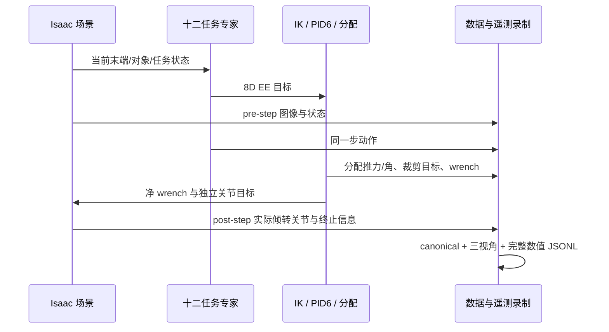

Canonical state 选择 `ee_pos(3)+ee_quat(4)+gripper_width(1)`，action 为 8D `ee_absolute`，保存任务 prompt、时间戳和三相机。Omni 的第八个 state 仍是夹爪角度；额外的六个倾转角、基座和控制输出放在专用遥测中，不改变模型训练契约。保存三相机不代表模型默认同时使用三相机。

入口：[scripted policies](source/ambench/ambench/policies/scripted/)、[示范录制器](scripts/data/record_demos_scripted.py)、[canonical 验证器](scripts/data/validate_lerobotdataset.py)。

### 4.2 同一 canonical 来源到三种模型

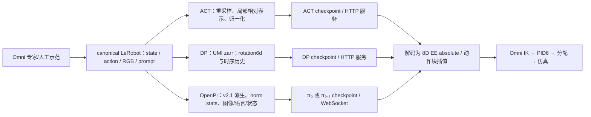

| 模型 | EE 输入 | 内部预测 | 本项目执行输出 |
| --- | --- | --- | --- |
| ACT | 8D EE state、checkpoint 指定相机；当前配置为 EE RGB 384² | `ee_local_relative` 动作块；当前 chunk16/执行8 | 解码成绝对 8D，以 20 Hz 逻辑动作插值为每动作 6 个物理步 |
| Diffusion Policy | 两帧 EE RGB 224²、末端姿态/夹爪历史 | 原始四元数 8D 转成轴角 7D，再用 rotation6d 的 10D；扩散去噪产生时序动作 | 恢复绝对 8D；下采样、horizon 和重规划频率读取实际 checkpoint |
| OpenPI π₀ / π₀.₅ | EE RGB、8D state、自然语言任务；base image 由训练配置决定 | 图像 224²、prompt token、state/action 补齐 32D；flow matching 预测动作轨迹 | 有效 8D 解码；执行选定前缀，随后再次请求 |

π₀ 的连续 state 位于模型后缀输入；π₀.₅ 的默认 state 先离散化并编入语言 token。**32D 是模型固定输入宽度的填充，不代表十二个飞行执行通道，也不代表高层预测六个推力和六个倾转角。** 本轮模型服务仍输出末端目标，倾转角来自 PID6 下游分配器。

ACT/DP 属于模仿学习；π₀/π₀.₅ 为视觉—语言—动作模型。自然语言表达任务，模型连续动作头输出轨迹；当前系统没有让聊天模型用自然语言工具调用直接控制倾转舵机。

默认 EE 模型没有显式读取六个倾转角或角速度；DP 默认 base 字段被 `ignore_by_policy` 忽略，ACT EE evaluator 固定选择八维状态。加入机体状态、倾转历史或双相机，需要同步更改训练输入、归一化、checkpoint 元数据和 evaluator，再重新训练验证。不同机型虽然接口维数相同，其相机视角、工具 frame、夹爪单位、可达范围与动力学并不相同。

源码：[动作语义](source/ambench_learn/ambench_learn/data/action_semantics.py)、[ACT](source/ambench_learn/ambench_learn/policies/act/)、[DP](source/ambench_learn/ambench_learn/policies/dp/)、[OpenPI evaluator](source/ambench_learn/ambench_learn/policies/pi/)、[远端协议](source/ambench_learn/ambench_learn/policies/remote/)。

### 4.3 强化学习目前只到环境接口

`DirectRLEnv` 提供 reset/step、观察、动作和 terminated/truncated 接口。十二任务 `_get_rewards()` 当前全部返回零，仓库没有现成 PPO、残差 RL 或对应训练器。Omni 的 `L1AdaptiveController` 是自适应控制器，不是强化学习 actor，更不是大模型。

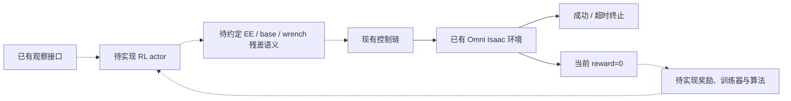

要接入 RL，必须定义非零奖励、actor 观察与动作、归一化、训练调度、checkpoint 和评估协议。若残差作用于倾转角，还必须让执行方向与实际角动态一致，否则 RL 可以利用现有仿真近似。本轮不把已运行的专家/IL 推理称作 RL 成绩。

## 5. 本地仿真与远端模型如何连接

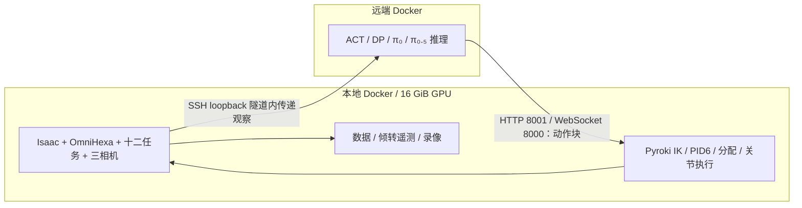

沿用 [note.md](note.md) 的镜像、挂载、免密 SSH 与隧道。本地同一时间只运行一个 Isaac GPU 进程；先检查 `nvidia-smi`，用一个环境和低分辨率外部相机。远端先检查全部 GPU，不能抢占已有程序；本轮 CPU 服务在 Docker 内设置 `CUDA_VISIBLE_DEVICES=-1`。宿主机只协调已有 Docker/Git/SSH/rsync 和 Python 标准库，不安装模型包或 Conda。

隧道在另一个终端保持运行。若 8000/8001 已由 SSH 监听，先核对它确实指向 `tencent-86` 的同名环回端口及当前模型容器；匹配时可复用已有隧道。本轮开始模型实验时，旧转发已退出；确认两端口没有监听后，新建了专用 SSH 隧道，关闭连接复用并记录进程身份。结束时只清理本轮拥有的隧道，不停止其他 SSH master。下面命令用于尚未建立转发的情况。

Omni 模型试次启动前要求至少 8 GiB 可用显存，并检查仿真容器中没有其他录制/评估 GPU 进程；每条试次保存真实 GPU 基线。其他项目进程继续保留，显存不足时验证器会停止启动并给出基线供检查。

```bash
docker compose -f docker/compose.sim.yml up -d
ssh -p 22 -o BatchMode=yes -o PasswordAuthentication=no \
  -o PreferredAuthentications=publickey \
  -o ControlMaster=no -o ControlPath=none -o ControlPersist=no \
  -o ExitOnForwardFailure=yes -N \
  -L 127.0.0.1:8001:127.0.0.1:8001 \
  -L 127.0.0.1:8000:127.0.0.1:8000 tencent-86
```

模型的“20 Hz”指动作块的仿真时间采样率。远端 CPU、网络和渲染会延长墙钟时间；同步请求下仿真可等待，不能用这个闭环证明真机实时控制带宽。服务日志与进程 argv 单独确认模型的 CPU/GPU 设备，evaluator 的 `--device cuda:0` 只是本地 Isaac 物理设备。

## 6. 完整实验的设计、判定与复现

本轮重新录制 Omni 自身十二任务，不借用前一轮 UAQuad 或旧 Omni 原片作为新证据。每条独立 `trial_id` 含 task/profile/seed/原生时限/扰动条件/数据和视频 SHA，三个相机来自同一次 episode。成功、任务超时与基础设施故障分开记录；超时 attempt 保留数据和录像，禁止只统计成功示范。

### 6.1 独立试次、不同初始化与三个视角

| 组 | 设计目的 | 解读方式 |
| --- | --- | --- |
| Omni 十二任务，各 seed61/62 | 正式主动倾转机型全部任务 | 按任务原始时限和 `_get_success` 评价 |
| Omni PressButton，限幅 | 对比 0～23 N 推力界限 | 与默认组分开，不能混入默认成功率 |
| Omni PressButton，限幅+气动+世界 X 方向 1 N 风力 | 对比组合扰动 | 气动/方向近似见第 3.4 节 |
| FAHexa PressButton，同两个 seed | 重新录制固定倾角参考 | 不计入主动倾转成功率 |
| ACT/DP/π₀/π₀.₅，旧 EE 权重迁移 | 完整跨容器模型接口复测 | 明确标记数据来源为 EE |
| ACT/DP，Omni 数据一步训练 | 专项数据→checkpoint→仿真链复测 | 只验证链路，不代表训练收敛 |

固定全景相机不能保证任意失败轨迹中的机体全程可见，机载和末端相机也会随机体转动并出现自遮挡。三视角应结合完整位置/姿态记录解读；网页曲线是采样展示，人工抽帧只覆盖所列时刻，不能用这些画面连续解释失败的因果。失败录像与原始记录均保留。

外部全景用于看机体姿态、电机臂和对象接触；机载视角用于看接近、遮挡与背景运动；末端视角用于看工具对齐和接触。固定几何任务即使换 seed，也不能称为两个随机布局；保存实际 reset observation 才能证明具体目标差异。

例如 NDT 的检测目标由配置固定为 `(1.77, 0, 7)`，换 seed 不会自动改变检测点。PushSlider 的 `slider_pos` 是滑块沿轨道的关节位移，reset 均为 `−0.5 m`；这不是物体的世界坐标。它的 reset event 仍会随机移动墙体以及墙上的滑块，因此两个相同的 `slider_pos` 也不能证明两个场景布局相同。比较初始化时，应分开核对目标世界位置、物体根姿态与关节状态；观察中未保存的几何量不能由 seed 或成功时间推断。

脚本数据与遥测按 120 Hz 保存，原片通常按每四步一帧、30 FPS 编码。本轮压缩 MP4/GIF 将原片首尾之间均匀抽样为 6 秒，再额外停留末帧 1 秒，共 7 秒；网页播放秒数与仿真秒数不同。曲线用逐帧来源时间映射，末帧停留不会使仿真时间继续增加。左上角 SUCCESS/TIMEOUT 是整条试次的最终判定，不表示该帧已经达到成功条件。多相机计为多条观察证据，不增加独立试次数。默认模型只看 EE，相机其他视角用于复核。

### 6.2 成功条件与原生时限

| 任务 | 原生时限 s | 最终成功条件 | 代码 |
| --- | --- | --- | --- |
| PressButton | 20 | 按钮直线关节位移 ≥4 mm | [按钮](source/ambench/ambench/tasks/press_button/) |
| PullLever | 20 | 拉杆角度 >40° | [拉杆](source/ambench/ambench/tasks/pull_lever/) |
| PushSlider | 26 | 滑块关节位置 ≥0.45 m | [滑块](source/ambench/ambench/tasks/push_slider/) |
| RotateValve | 20 | 阀门角度 ≥170° | [阀门](source/ambench/ambench/tasks/rotate_valve/) |
| OpenDoor | 15 | 门关节角度 >20° | [开门](source/ambench/ambench/tasks/open_door/) |
| PegInHole | 20 | 杆尖在孔局部坐标中 X>0、Y/Z 位于横截面内 | [插孔](source/ambench/ambench/tasks/peg_in_hole/) |
| TossBall | 10 | 球进入容器、离工具尖端 ≥0.12 m、机体 X 至少位于容器后方 0.7 m | [投球](source/ambench/ambench/tasks/toss_ball/) |
| LemonHarvesting | 30 | 柠檬在容器区域且原始夹爪字段 >0.0898；Omni 角度适配边界见第 2.2 节 | [采摘](source/ambench/ambench/tasks/lemon_harvesting/) |
| CabinetPickPlace | 60 | 罐体高于柜顶 0～5 cm，速度 <0.1 m/s | [柜体取放](source/ambench/ambench/tasks/cabinet_pick_place/) |
| FrameAssembly | 30 | 框中心与销中心 X 误差 <0.1 m、YZ 距离 <0.05 m | [框架](source/ambench/ambench/tasks/frame_assembly/) |
| WipeWindow | 20 | 所有污点可见性状态为 false | [擦窗](source/ambench/ambench/tasks/wipe_window/) |
| NDT | 20 | 末端 X 误差 <0.03 m、YZ 距离 <0.08 m，保持 100 步 | [检测](source/ambench/ambench/tasks/ndt/) |

柜体最终判定没有 XY 柜顶范围要求，插孔没有独立角度阈值，NDT 是位置保持而非真实探伤测量质量。任务名称不自动提供这些业务验收；分阶段子任务成功也不自动构成最终成功。

### 6.3 先录制一条完整按钮试次

使用新的空输出目录，避免覆盖历史证据。下面的 20 s 是任务仿真时限；外层 timeout 是 15 分钟墙钟上限。

```bash
docker exec -w /workspace/ambench ambench-sim-research \
  timeout --kill-after=20s 900s python scripts/data/record_demos_scripted.py \
  --task PressButton-Am-OmniHexa-Abs-PID-Direct-v0 \
  --num_envs 1 --seed 61 --headless --device cuda:0 --step_hz 120 \
  --dataset_root /workspace/ambench/outputs/research/tilting-new/press \
  --num_demos 1 --max_episodes 1 --env_length_s 20 \
  --state_keys ee_pos ee_quat gripper_width --task_prompt "press the button" \
  --camera_names scene_camera base_camera ee_camera \
  --scene_camera_width 480 --scene_camera_height 320 \
  --scene_camera_position -2.5 -3 2.2 --scene_camera_look_at 1.4 0 1.1 \
  --video --telemetry --save_failed_episodes
```

`--num_demos 1` 单独使用可能一直重试直到保存一次成功；`--max_episodes 1` 才限定独立 attempt。完成后核对 metadata/episode 数/数据验证、结束原因、步数、完整遥测与三个原片。任务超时可用退出码 1 表示 attempt 未成功，只有报告证明仿真完整结束并保存有效数据时才能解释为任务失败；外层 timeout 或模型加载错误不是同一结果。

### 6.4 一次运行本轮所有专家配置

```bash
docker exec -w /workspace/ambench ambench-sim-research \
  python scripts/research/record_usage_variants.py \
  --specs-json /workspace/ambench/usage_assets/tilting/recording_specs.json \
  --output-dir /workspace/ambench/outputs/research/tilting-new/experts \
  --timeout-s 1800
```

入口串行启动各 task/seed，按配置保存原生时限、相机、限幅和风力。单条复测可用 `--name` 选择配置中的唯一试次名，输出使用新的目录。`--saturation` 只开限幅；`--disturbance --wind_force 1 0 0` 打开限幅、气动与常量世界风力。NDT 的全景位置需要覆盖实际检测高度，准确参数来自录制配置与保存的运行 cfg。

这里显式给每个采集/校验子进程 1800 秒墙钟预算，任务原生仿真时限仍按表格执行。Omni 三相机的渲染和 canonical 编码较慢，柜体任务的 60 秒仿真不能直接按 60 秒墙钟估算；外层预算耗尽属于基础设施未完成，须保留日志并用足够预算重跑。

校验时的数值列读取也会影响墙钟时间。本轮确认 LeRobot 的 HF 自定义格式会在遍历动作/状态列时连带解码三路 RGB；现已先选择单个数值列，再使用独立 Torch 格式视图，避免这些无关解码。完整 Cabinet 的 7199 行动作与状态逐元素等于原 Parquet，原 dataset 格式和文件 SHA 不变；输入输出、任务与仿真条件保持一致。本轮部分早期校验使用旧读取路径，后续子进程使用新路径。

本轮实际保留首条按钮试次及旧批次已完整结束的 15 条记录。发现旧 900 秒墙钟预算不足后，停止了一次尚未结束的 Cabinet seed61 采集；它留下 5608 步原始遥测和日志，`episodes` 仍为空，没有 success、任务 timeout 或可推断的任务成绩。剩余 14 条配置在新目录按 1800 秒预算执行，原生任务时限、控制器和成功条件保持一致。最终正式矩阵只纳入完整的 30 条专家与 12 条模型试次，中断的基础设施记录单独保留。

NDT 的全景镜位在第一次 Omni NDT 启动前已按检测高度纠正。旧 UAQuad NDT 画面只用于发现取景问题；本轮不存在需要剔除的旧镜位 Omni NDT 录制。新镜位的两个 seed 都按原任务判定保留，不能因结果不同再挑选镜位或试次。

<!-- BEGIN TILTING RESULTS -->

### 6.5 本轮十二任务的真实结果

**2026-10-09：30/30 个新脚本试次完成 canonical 数据、单 episode、完整遥测与三视角来源核验。** OmniHexa 默认十二任务×seed61/62 共 24 次：14 次成功、10 次超时，至少一次成功的任务族为 7/12；另外四次限幅/组合扰动与两次新 FAHexa 参考独立列出。

表中时间为实际执行步数×1/120 秒；超时可能比配置时限少一个物理步。GIF 将完整过程均匀抽样压缩到 6 秒，再停留末帧 1 秒，共 7 秒预览，不是实时速度录像。点击 GIF 查看同步三视角、基于完整 120 Hz 记录的统计与采样曲线。机载/末端相机固定挂载，转身与贴近物体时会出现局部遮挡，结合全景查看。两个 seed 不构成充分的成功率统计；NDT 等固定几何任务不能据此声称两种随机布局。

采集审计共记录 43 次启动，其中 42 次完成正式 episode。另一次柜内取放在 5608 步时因采集墙钟预算不足而中断，原始文件保留，既不记为成功，也不记为任务超时；随后以 1800 秒预算重跑全部 14 个未完成配置。此前完成的 16 条脚本试次保留原数据。NDT 的全景镜位在本轮首次录制前调整，以覆盖 7 米高目标；任务、动作、初始条件和成功判据保持原配置。完整采集来源见[验证记录](usage_assets/tilting/validation.json)。

| 任务 / 实测 GIF | seed61 | seed62 | seed61 三视角 | seed62 三视角 |
| --- | --- | --- | --- | --- |
| PressButton<br>[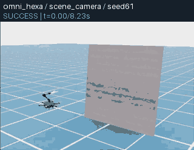](https://zipengdai.com/ambench/tilting/#tilting_pressbutton) | 成功 · 8.283s | 成功 · 8.325s | [全景](usage_assets/animations/tilting_pressbutton_seed61_scene_camera.mp4) / [机载](usage_assets/animations/tilting_pressbutton_seed61_base_camera.mp4) / [末端](usage_assets/animations/tilting_pressbutton_seed61_ee_camera.mp4) | [全景](usage_assets/animations/tilting_pressbutton_seed62_scene_camera.mp4) / [机载](usage_assets/animations/tilting_pressbutton_seed62_base_camera.mp4) / [末端](usage_assets/animations/tilting_pressbutton_seed62_ee_camera.mp4) |
| PullLever<br>[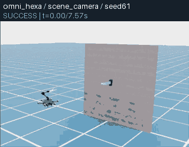](https://zipengdai.com/ambench/tilting/#tilting_pulllever) | 成功 · 7.617s | 成功 · 7.617s | [全景](usage_assets/animations/tilting_pulllever_seed61_scene_camera.mp4) / [机载](usage_assets/animations/tilting_pulllever_seed61_base_camera.mp4) / [末端](usage_assets/animations/tilting_pulllever_seed61_ee_camera.mp4) | [全景](usage_assets/animations/tilting_pulllever_seed62_scene_camera.mp4) / [机载](usage_assets/animations/tilting_pulllever_seed62_base_camera.mp4) / [末端](usage_assets/animations/tilting_pulllever_seed62_ee_camera.mp4) |
| PushSlider<br>[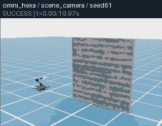](https://zipengdai.com/ambench/tilting/#tilting_pushslider) | 成功 · 11.033s | 成功 · 11.033s | [全景](usage_assets/animations/tilting_pushslider_seed61_scene_camera.mp4) / [机载](usage_assets/animations/tilting_pushslider_seed61_base_camera.mp4) / [末端](usage_assets/animations/tilting_pushslider_seed61_ee_camera.mp4) | [全景](usage_assets/animations/tilting_pushslider_seed62_scene_camera.mp4) / [机载](usage_assets/animations/tilting_pushslider_seed62_base_camera.mp4) / [末端](usage_assets/animations/tilting_pushslider_seed62_ee_camera.mp4) |
| RotateValve<br>[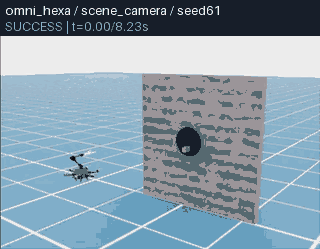](https://zipengdai.com/ambench/tilting/#tilting_rotatevalve) | 成功 · 8.300s | 成功 · 8.317s | [全景](usage_assets/animations/tilting_rotatevalve_seed61_scene_camera.mp4) / [机载](usage_assets/animations/tilting_rotatevalve_seed61_base_camera.mp4) / [末端](usage_assets/animations/tilting_rotatevalve_seed61_ee_camera.mp4) | [全景](usage_assets/animations/tilting_rotatevalve_seed62_scene_camera.mp4) / [机载](usage_assets/animations/tilting_rotatevalve_seed62_base_camera.mp4) / [末端](usage_assets/animations/tilting_rotatevalve_seed62_ee_camera.mp4) |
| OpenDoor<br>[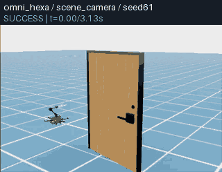](https://zipengdai.com/ambench/tilting/#tilting_opendoor) | 成功 · 3.200s | 成功 · 3.292s | [全景](usage_assets/animations/tilting_opendoor_seed61_scene_camera.mp4) / [机载](usage_assets/animations/tilting_opendoor_seed61_base_camera.mp4) / [末端](usage_assets/animations/tilting_opendoor_seed61_ee_camera.mp4) | [全景](usage_assets/animations/tilting_opendoor_seed62_scene_camera.mp4) / [机载](usage_assets/animations/tilting_opendoor_seed62_base_camera.mp4) / [末端](usage_assets/animations/tilting_opendoor_seed62_ee_camera.mp4) |
| PegInHole<br>[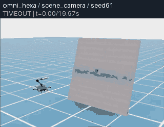](https://zipengdai.com/ambench/tilting/#tilting_peginhole) | 超时失败 · 19.992s | 超时失败 · 19.992s | [全景](usage_assets/animations/tilting_peginhole_seed61_scene_camera.mp4) / [机载](usage_assets/animations/tilting_peginhole_seed61_base_camera.mp4) / [末端](usage_assets/animations/tilting_peginhole_seed61_ee_camera.mp4) | [全景](usage_assets/animations/tilting_peginhole_seed62_scene_camera.mp4) / [机载](usage_assets/animations/tilting_peginhole_seed62_base_camera.mp4) / [末端](usage_assets/animations/tilting_peginhole_seed62_ee_camera.mp4) |
| TossBall<br>[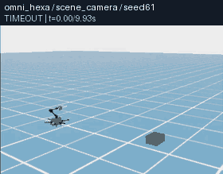](https://zipengdai.com/ambench/tilting/#tilting_tossball) | 超时失败 · 9.992s | 超时失败 · 9.992s | [全景](usage_assets/animations/tilting_tossball_seed61_scene_camera.mp4) / [机载](usage_assets/animations/tilting_tossball_seed61_base_camera.mp4) / [末端](usage_assets/animations/tilting_tossball_seed61_ee_camera.mp4) | [全景](usage_assets/animations/tilting_tossball_seed62_scene_camera.mp4) / [机载](usage_assets/animations/tilting_tossball_seed62_base_camera.mp4) / [末端](usage_assets/animations/tilting_tossball_seed62_ee_camera.mp4) |
| LemonHarvesting<br>[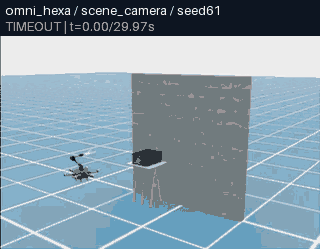](https://zipengdai.com/ambench/tilting/#tilting_lemonharvesting) | 超时失败 · 29.992s | 超时失败 · 29.992s | [全景](usage_assets/animations/tilting_lemonharvesting_seed61_scene_camera.mp4) / [机载](usage_assets/animations/tilting_lemonharvesting_seed61_base_camera.mp4) / [末端](usage_assets/animations/tilting_lemonharvesting_seed61_ee_camera.mp4) | [全景](usage_assets/animations/tilting_lemonharvesting_seed62_scene_camera.mp4) / [机载](usage_assets/animations/tilting_lemonharvesting_seed62_base_camera.mp4) / [末端](usage_assets/animations/tilting_lemonharvesting_seed62_ee_camera.mp4) |
| CabinetPickPlace<br>[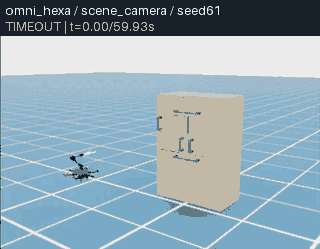](https://zipengdai.com/ambench/tilting/#tilting_cabinetpickplace) | 超时失败 · 59.992s | 超时失败 · 59.992s | [全景](usage_assets/animations/tilting_cabinetpickplace_seed61_scene_camera.mp4) / [机载](usage_assets/animations/tilting_cabinetpickplace_seed61_base_camera.mp4) / [末端](usage_assets/animations/tilting_cabinetpickplace_seed61_ee_camera.mp4) | [全景](usage_assets/animations/tilting_cabinetpickplace_seed62_scene_camera.mp4) / [机载](usage_assets/animations/tilting_cabinetpickplace_seed62_base_camera.mp4) / [末端](usage_assets/animations/tilting_cabinetpickplace_seed62_ee_camera.mp4) |
| FrameAssembly<br>[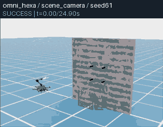](https://zipengdai.com/ambench/tilting/#tilting_frameassembly) | 成功 · 24.925s | 成功 · 24.925s | [全景](usage_assets/animations/tilting_frameassembly_seed61_scene_camera.mp4) / [机载](usage_assets/animations/tilting_frameassembly_seed61_base_camera.mp4) / [末端](usage_assets/animations/tilting_frameassembly_seed61_ee_camera.mp4) | [全景](usage_assets/animations/tilting_frameassembly_seed62_scene_camera.mp4) / [机载](usage_assets/animations/tilting_frameassembly_seed62_base_camera.mp4) / [末端](usage_assets/animations/tilting_frameassembly_seed62_ee_camera.mp4) |
| WipeWindow<br>[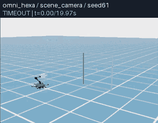](https://zipengdai.com/ambench/tilting/#tilting_wipewindow) | 超时失败 · 19.992s | 超时失败 · 19.992s | [全景](usage_assets/animations/tilting_wipewindow_seed61_scene_camera.mp4) / [机载](usage_assets/animations/tilting_wipewindow_seed61_base_camera.mp4) / [末端](usage_assets/animations/tilting_wipewindow_seed61_ee_camera.mp4) | [全景](usage_assets/animations/tilting_wipewindow_seed62_scene_camera.mp4) / [机载](usage_assets/animations/tilting_wipewindow_seed62_base_camera.mp4) / [末端](usage_assets/animations/tilting_wipewindow_seed62_ee_camera.mp4) |
| NDT<br>[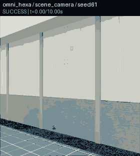](https://zipengdai.com/ambench/tilting/#tilting_ndt) | 成功 · 10.050s | 成功 · 10.092s | [全景](usage_assets/animations/tilting_ndt_seed61_scene_camera.mp4) / [机载](usage_assets/animations/tilting_ndt_seed61_base_camera.mp4) / [末端](usage_assets/animations/tilting_ndt_seed61_ee_camera.mp4) | [全景](usage_assets/animations/tilting_ndt_seed62_scene_camera.mp4) / [机载](usage_assets/animations/tilting_ndt_seed62_base_camera.mp4) / [末端](usage_assets/animations/tilting_ndt_seed62_ee_camera.mp4) |

超时表示原生时限内未满足本任务的成功条件，完整失败 episode 仍保留；它与采集或基础设施错误分别核验。未改变任务、控制器或成功阈值来使结果通过。

**seed61 与 seed62 的已记录初态比较**：下表逐字段比较原始 `initial_observation`，绝对容差 1e-5，列出超过容差的字段。字段相同只说明已保存的这部分数值相同，不代表全部场景、材料、接触求解状态相同；两个 seed 的实录和三视角仍独立保留。

| 默认任务 | 有差异的初始数值字段 |
| --- | --- |
| PressButton | `goal_pos` |
| PullLever | `lever_pos` |
| PushSlider | 已记录字段相同 |
| RotateValve | `goal_pos` |
| OpenDoor | `door_pos` |
| PegInHole | `goal_pos` |
| TossBall | `target_pos` |
| LemonHarvesting | `lemon_pos` |
| CabinetPickPlace | `can_pos` |
| FrameAssembly | `frame_pos`、`peg_center_pos` |
| WipeWindow | `stain_pos` |
| NDT | 已记录字段相同 |

### 6.6 限幅、组合扰动与固定倾角参考

| 条件 / 实测 GIF | seed61 | seed62 | 三视角 MP4 |
| --- | --- | --- | --- |
| OmniHexa：仅旋翼限幅<br>[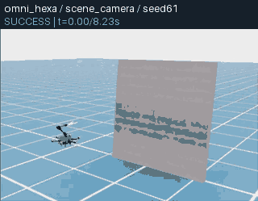](https://zipengdai.com/ambench/tilting/#tilting_pressbutton_saturation) | 成功 · 8.283s | 成功 · 8.325s | seed61：[全景](usage_assets/animations/tilting_pressbutton_saturation_seed61_scene_camera.mp4) / [机载](usage_assets/animations/tilting_pressbutton_saturation_seed61_base_camera.mp4) / [末端](usage_assets/animations/tilting_pressbutton_saturation_seed61_ee_camera.mp4)<br>seed62：[全景](usage_assets/animations/tilting_pressbutton_saturation_seed62_scene_camera.mp4) / [机载](usage_assets/animations/tilting_pressbutton_saturation_seed62_base_camera.mp4) / [末端](usage_assets/animations/tilting_pressbutton_saturation_seed62_ee_camera.mp4) |
| OmniHexa：限幅+气动+世界 X 方向 1 N 风力<br>[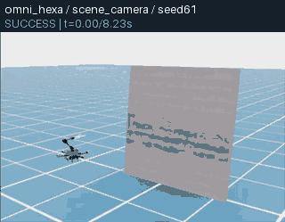](https://zipengdai.com/ambench/tilting/#tilting_pressbutton_wind) | 成功 · 8.275s | 成功 · 8.325s | seed61：[全景](usage_assets/animations/tilting_pressbutton_wind_seed61_scene_camera.mp4) / [机载](usage_assets/animations/tilting_pressbutton_wind_seed61_base_camera.mp4) / [末端](usage_assets/animations/tilting_pressbutton_wind_seed61_ee_camera.mp4)<br>seed62：[全景](usage_assets/animations/tilting_pressbutton_wind_seed62_scene_camera.mp4) / [机载](usage_assets/animations/tilting_pressbutton_wind_seed62_base_camera.mp4) / [末端](usage_assets/animations/tilting_pressbutton_wind_seed62_ee_camera.mp4) |
| FAHexa：固定倾角、默认未限幅参考<br>[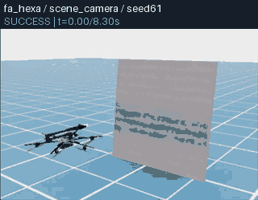](https://zipengdai.com/ambench/tilting/#tilting_reference_fahexa) | 成功 · 8.367s | 成功 · 8.400s | seed61：[全景](usage_assets/animations/tilting_reference_fahexa_seed61_scene_camera.mp4) / [机载](usage_assets/animations/tilting_reference_fahexa_seed61_base_camera.mp4) / [末端](usage_assets/animations/tilting_reference_fahexa_seed61_ee_camera.mp4)<br>seed62：[全景](usage_assets/animations/tilting_reference_fahexa_seed62_scene_camera.mp4) / [机载](usage_assets/animations/tilting_reference_fahexa_seed62_base_camera.mp4) / [末端](usage_assets/animations/tilting_reference_fahexa_seed62_ee_camera.mp4) |

| 按钮试次 | 推力范围 N | 超出配置推力界限的步数 | 最大绝对 pitch ° | 最大 command/post 实际角差 rad |
| --- | --- | --- | --- | --- |
| `tilting_pressbutton_seed61` | 1.668 ～ 23.989 | 1 / 994 | 10.003 | 3.098 |
| `tilting_pressbutton_seed62` | 0.860 ～ 16.067 | 0 / 999 | 8.909 | 1.646 |
| `tilting_pressbutton_saturation_seed61` | 1.596 ～ 23.000 | 1 / 994 | 10.002 | 3.100 |
| `tilting_pressbutton_saturation_seed62` | 0.860 ～ 16.067 | 0 / 999 | 8.909 | 1.646 |
| `tilting_pressbutton_wind_seed61` | 1.072 ～ 23.000 | 2 / 993 | 9.035 | 2.998 |
| `tilting_pressbutton_wind_seed62` | 0.705 ～ 15.885 | 0 / 999 | 8.801 | 2.246 |
| `tilting_reference_fahexa_seed61` | -143.580 ～ 61.176 | 5 / 1004 | 0.737 | 无主动倾转关节 |
| `tilting_reference_fahexa_seed62` | -105.357 ～ 46.957 | 4 / 1008 | 0.665 | 无主动倾转关节 |

“超出配置推力界限的步数”沿用共享统计的严格浮点比较，不加容差。仅限幅 seed61 的 1 步和组合扰动 seed61 的 2 步，记录的最大推力均为 23.000001907348633 N，比 23 N 高约 1.907×10⁻⁶ N；这些计数包含浮点尾差，不能解释为显著的 23 N 限幅失效。表中数值和原始记录完整保留。

全部 28 条 Omni 试次核对了六关节的分配角、soft-limit 裁剪目标、实际角和速度；终止/reset 的 command/post 数据不计作飞行响应。全轮数值为：

| 真实遥测量 | 全轮最大值 |
| --- | --- |
| 相邻目标差 / dt | 715.150 rad/s |
| 实际 joint_vel | 10.247128 rad/s |
| 目标与非终止 post-step 实际角的绝对差 | 3.100 rad |

目标跳变率不是舵机实际速度，角差不是以秒计的时延。实测最大速度超过 `velocity_limit_sim=5 rad/s` 配置值；具体非终止原始行见第 3.3 节，未将峰值归因于接触或求解器。第 3.3 节说明目标方向净 wrench 与关节动态响应分离，用于解读目标和实际角的差异。默认未限幅结果、组合扰动与 FAHexa 不同几何参考不能构成硬件性能排名。完整逐试次数值、源视频/遥测 SHA 和条件见[30 条实测摘要](usage_assets/tilting/trials.json)。

<!-- END TILTING RESULTS -->

## 7. 模型训练与推理的实验边界

模型实验必须使用本轮 Omni rollout，不把旧 UAQuad 视频重命名。四组 EE 旧权重与两组 Omni 数据一步权重分别标记训练机型、数据 SHA、优化步数、checkpoint SHA、环境 seed、推理 seed 和服务身份。模型调用成功不代表任务成功。

### 7.1 Omni 数据的一步训练

从已通过 canonical 验证且最终成功的本轮 session 选择训练源；保持失败 attempt 作为证据，不能把全部 attempt 混称成功示范。上传整个 session 时远端训练路径指向它的 `lerobot/` 子目录。以下命令在本地仓库根目录运行；`tilting-my-data` 与 `tilting-my-step1` 必须是尚未使用的新名称。

```bash
TILTING_SESSION="$(python3 - <<'PY'
import json
from pathlib import Path
report = json.loads(Path('outputs/research/tilting-new/experts/results.json').read_text())
row = next(r for r in report['results'] if r['spec']['name'] == 'tilting_pressbutton_seed61')
assert row['status'] == 'completed' and row['termination_reason'] == 'success'
path = Path(row['session_root'])
print(Path(*path.parts[path.parts.index('outputs'):]))
PY
)"
bash tools/research/sync_dataset.sh "$TILTING_SESSION" tilting-my-data
bash tools/research/train_tilting_cpu.sh --check \
  /data/datasets/tilting-my-data/lerobot /data/checkpoints/tilting-my-step1
bash tools/research/train_tilting_cpu.sh \
  /data/datasets/tilting-my-data/lerobot /data/checkpoints/tilting-my-step1
```

命令从真实完成报告提取指定按钮试次的 `session_root`，并要求它最终成功；若该 seed 在新一轮未成功，应选择另一条实际成功的 Omni 示范并重新记录训练来源。训练脚本复用已验证的 CPU 配方，明确以 `omni_hexa` 校验数据机型；不会把 UAQuad 来源当作 Omni 训练。本轮 CPU 烟测配置为 8 CPU、20 GiB、无 CUDA、每阶段墙钟上限 900 s、拒绝覆盖已有训练目录。

ACT 使用 EE state/RGB、20 Hz 逻辑重采样、随机 ResNet18、chunk16/执行8；DP 使用 EE 224² zarr、随机视觉骨干、小型 UNet 和少量烟测扩散步。训练入口完成 ACT 一步训练、DP 转换/验证/一步训练，在远端 run 目录保存 `act/`、`dp/`、`omnihexa_pressbutton_ee.zarr.zip`、各阶段 `logs/` 和 `sha256.txt`。

有限值前向是额外步骤，由 [verify_policy_cpu.py](scripts/research/verify_policy_cpu.py) 真实加载新权重；训练脚本本身不自动执行它。已有策略容器的源码挂载需要包含这个新文件。以下命令同步该文件，然后分别在对应 Python 环境中运行检查，保持 CPU、无网络与同样资源限额：

```bash
rsync -a -e 'ssh -p 22 -o BatchMode=yes -o PasswordAuthentication=no' \
  scripts/research/verify_policy_cpu.py \
  tencent-86:/diff/dzp_is_sb/ambench-research/source/scripts/research/
ssh -p 22 -o BatchMode=yes tencent-86 'bash -s' <<'REMOTE'
set -euo pipefail
RESEARCH_ROOT=/diff/dzp_is_sb/ambench-research
for family in act dp; do
  checkpoint=/data/checkpoints/tilting-my-step1/act/checkpoints/000001/pretrained_model
  if [[ "$family" == dp ]]; then
    checkpoint=/data/checkpoints/tilting-my-step1/dp/checkpoints/latest.ckpt
  fi
  timeout --signal=TERM --kill-after=30s 900s docker run --rm \
    --runtime=runc --network=none --cpus=8 --memory=20g --memory-swap=20g \
    -e CUDA_VISIBLE_DEVICES=-1 -e HF_HUB_OFFLINE=1 -e TRANSFORMERS_OFFLINE=1 \
    -e OMP_NUM_THREADS=8 -e OPENBLAS_NUM_THREADS=1 \
    --mount "type=bind,src=$RESEARCH_ROOT/source,dst=/workspace/ambench,readonly" \
    --mount "type=bind,src=$RESEARCH_ROOT/checkpoints,dst=/data/checkpoints,readonly" \
    --workdir /workspace/ambench --entrypoint "/opt/venvs/$family/bin/python" \
    ambench:research-policy scripts/research/verify_policy_cpu.py \
    --policy "$family" --checkpoint "$checkpoint"
done
REMOTE
```

本轮真实来源见 [training_provenance.json](usage_assets/tilting/training_provenance.json)：Omni PressButton seed61 成功示范有 994 个 120 Hz 帧，ACT 使用 165 个 20 Hz 逻辑帧；ACT 两次前向各返回有限 `1×8` 动作，DP 一次返回有限 `96×8` 动作。合成观察前向验证保存、重载和输出接口，没有达到收敛训练、泛化评估或正式性能比较的证据标准。OpenPI 本轮采用已保存的 EE 微调来源权重迁移，基础预训练与本轮 Omni 专项训练须分开解释。

### 7.2 成绩与指标如何解释

结束专家录制，确认仿真容器中的记录/评估进程及其 Isaac GPU 子进程已退出后，串行复现实际模型规格。它默认读取 [policy_specs.json](usage_assets/tilting/policy_specs.json) 的四组 EE 迁移和两组 Omni 一步训练，每组两个环境 seed，默认指向本轮已经生成的权重。使用新训练权重时，另存新的规格与 training provenance，记录实际 dataset 路径、parquet SHA、采集 seed、训练步数和 checkpoint SHA，并更新四条 Omni 自身试次的 `checkpoint`、`training_reference` 与 `source_dataset_sha256`。新规格需放在 `usage_assets/tilting/` 下，`training_reference` 用仓库相对路径指向 `usage_assets/` 内的新来源文件；通过 `--specs-json` 将同一份新规格传给记录与汇总入口。

```bash
python3 scripts/research/record_tilting_policies.py \
  --output-dir outputs/research/tilting-new/policy
python3 scripts/research/summarize_tilting_policies.py \
  --report-json outputs/research/tilting-new/policy/results.json \
  --output outputs/research/tilting-new/policy/policy_trials.json
```

这两个命令运行于本地宿主机，使用标准库协调 Docker/SSH；记录入口把 host 的 `outputs/` 自动换为容器绝对路径 `/workspace/ambench/outputs/`，不依赖仿真容器当前工作目录。`--name` 可以只选择一条试次，但严格汇总必须看到完整 12 条矩阵，单条调试结果不能发布为全矩阵验收。入口每次重启 CPU 模型服务，用本地 Docker 内公开 evaluator 执行一个 episode；基础设施故障停止批次，完整任务超时保留为失败试次。

Omni 入口逐试次交叉检查 `docker top` 与 `nvidia-smi` 的 PID 归属，并为单环境、三个相机的本地模型评估保留至少 8192 MiB 空闲显存。它不会停止其他应用；显存低于启动预算时停止批次，保存 `gpu-baseline-before.json` 的实际总量、已用/空闲量和其他计算进程，供复核资源情况。每条 evaluator 的墙钟预算为 1800 秒，原生按钮任务的仿真时限仍为 20 秒；墙钟预算耗尽不能计作完整任务超时。

本地 evaluator 保存真实 runtime cfg、eval summary、tracking、三个视频和任务终止；远端服务每次重启，并核对启动参数、CPU 环境、PID/启动时间和监听 socket 归属。旧 ACT 的视觉初始化、旧 DP 随机初始化与 OpenPI 基础预训练不同，迁移和一步训练也不同，不能由这些接口烟测做公平的模型排名。

tracking 为动作执行后的观察，脚本遥测有自己的 pre/post-step 时序；聚合器还会裁去末行并过滤非有限值，`executed_steps`、tracking 条数与指标样本数可能不同。若 evaluator 未保存 reset observation，不从第一条执行后状态伪造初始状态。

模型的六关节倾转记录包含分配角、限幅目标、实际关节角/速度和 soft limits，统一标为 `post_step_nonterminal`；不采集终止自动 reset 的观察。倾转范围和目标—实际 RMS 使用全部保存的非终止行，网页曲线则使用 80 个均匀点及各关节字段极值；它们与另行裁去末行的标准跟踪指标具有不同样本基数。实际关节测量不证明推力方向经过舵机延迟重算，力施加近似见第 3.3 节。

EE 误差是到当步命令目标的距离，不是到按钮或任务对象的距离。策略一直停留在附近可能跟踪误差很小却无法完成任务。`base_tilt_rad=sqrt(roll²+pitch²)` 不是推力轴夹角；`max_tilt_utilization` 是该原始角度最大值，未归一化。`saturation_rate` 包含触碰/越过推力边界和 actuator flag，即使没开 clipping 也可很高；它不是倾转舵机饱和率或真实 clipping 占比。

<!-- BEGIN TILTING POLICY RESULTS -->

### 7.3 十二条实际模型闭环结果

**12/12 真实模型试次完成本地 Isaac + 远端 Docker CPU 推理与三视角来源核验：0 次成功、12 次超时。** 所有远端 GPU 都有程序运行，实际推理设备为 CPU，推理 seed42；每条重新启动并核对同一模型服务 PID、start ticks、参数、checkpoint 和监听端口。

前八条使用旧 EE 数据的一步 checkpoint；后四条使用本轮 Omni 按钮 seed61 的一个优化步训练。seed61 出现在专项训练中；seed62 只有一次尝试，也不足以证明泛化。OpenPI 不在本轮重训。

| 模型 / 实测 GIF | seed61 | seed62 | seed61 三视角 | seed62 三视角 |
| --- | --- | --- | --- | --- |
| ACT：旧 EE 一步 checkpoint<br>[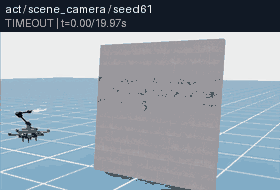](https://zipengdai.com/ambench/tilting/#tilting_policy_act_transfer) | 超时失败 · 19.992s | 超时失败 · 19.992s | [全景](usage_assets/animations/tilting_policy_act_transfer_seed61_scene_camera.mp4) / [机载](usage_assets/animations/tilting_policy_act_transfer_seed61_base_camera.mp4) / [末端](usage_assets/animations/tilting_policy_act_transfer_seed61_ee_camera.mp4) | [全景](usage_assets/animations/tilting_policy_act_transfer_seed62_scene_camera.mp4) / [机载](usage_assets/animations/tilting_policy_act_transfer_seed62_base_camera.mp4) / [末端](usage_assets/animations/tilting_policy_act_transfer_seed62_ee_camera.mp4) |
| Diffusion Policy：旧 EE 一步 checkpoint<br>[](https://zipengdai.com/ambench/tilting/#tilting_policy_dp_transfer) | 超时失败 · 19.992s | 超时失败 · 19.992s | [全景](usage_assets/animations/tilting_policy_dp_transfer_seed61_scene_camera.mp4) / [机载](usage_assets/animations/tilting_policy_dp_transfer_seed61_base_camera.mp4) / [末端](usage_assets/animations/tilting_policy_dp_transfer_seed61_ee_camera.mp4) | [全景](usage_assets/animations/tilting_policy_dp_transfer_seed62_scene_camera.mp4) / [机载](usage_assets/animations/tilting_policy_dp_transfer_seed62_base_camera.mp4) / [末端](usage_assets/animations/tilting_policy_dp_transfer_seed62_ee_camera.mp4) |
| π₀：旧 EE 一步微调 checkpoint<br>[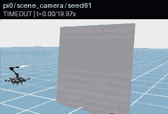](https://zipengdai.com/ambench/tilting/#tilting_policy_pi0_transfer) | 超时失败 · 19.992s | 超时失败 · 19.992s | [全景](usage_assets/animations/tilting_policy_pi0_transfer_seed61_scene_camera.mp4) / [机载](usage_assets/animations/tilting_policy_pi0_transfer_seed61_base_camera.mp4) / [末端](usage_assets/animations/tilting_policy_pi0_transfer_seed61_ee_camera.mp4) | [全景](usage_assets/animations/tilting_policy_pi0_transfer_seed62_scene_camera.mp4) / [机载](usage_assets/animations/tilting_policy_pi0_transfer_seed62_base_camera.mp4) / [末端](usage_assets/animations/tilting_policy_pi0_transfer_seed62_ee_camera.mp4) |
| π₀.₅：旧 EE 一步微调 checkpoint<br>[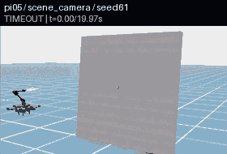](https://zipengdai.com/ambench/tilting/#tilting_policy_pi05_transfer) | 超时失败 · 19.992s | 超时失败 · 19.992s | [全景](usage_assets/animations/tilting_policy_pi05_transfer_seed61_scene_camera.mp4) / [机载](usage_assets/animations/tilting_policy_pi05_transfer_seed61_base_camera.mp4) / [末端](usage_assets/animations/tilting_policy_pi05_transfer_seed61_ee_camera.mp4) | [全景](usage_assets/animations/tilting_policy_pi05_transfer_seed62_scene_camera.mp4) / [机载](usage_assets/animations/tilting_policy_pi05_transfer_seed62_base_camera.mp4) / [末端](usage_assets/animations/tilting_policy_pi05_transfer_seed62_ee_camera.mp4) |
| ACT：本轮 Omni 示范一步训练<br>[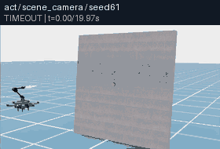](https://zipengdai.com/ambench/tilting/#tilting_policy_act_trained_step1) | 超时失败 · 19.992s | 超时失败 · 19.992s | [全景](usage_assets/animations/tilting_policy_act_trained_step1_seed61_scene_camera.mp4) / [机载](usage_assets/animations/tilting_policy_act_trained_step1_seed61_base_camera.mp4) / [末端](usage_assets/animations/tilting_policy_act_trained_step1_seed61_ee_camera.mp4) | [全景](usage_assets/animations/tilting_policy_act_trained_step1_seed62_scene_camera.mp4) / [机载](usage_assets/animations/tilting_policy_act_trained_step1_seed62_base_camera.mp4) / [末端](usage_assets/animations/tilting_policy_act_trained_step1_seed62_ee_camera.mp4) |
| Diffusion Policy：本轮 Omni 示范一步训练<br>[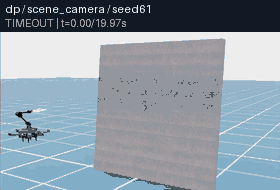](https://zipengdai.com/ambench/tilting/#tilting_policy_dp_trained_step1) | 超时失败 · 19.992s | 超时失败 · 19.992s | [全景](usage_assets/animations/tilting_policy_dp_trained_step1_seed61_scene_camera.mp4) / [机载](usage_assets/animations/tilting_policy_dp_trained_step1_seed61_base_camera.mp4) / [末端](usage_assets/animations/tilting_policy_dp_trained_step1_seed61_ee_camera.mp4) | [全景](usage_assets/animations/tilting_policy_dp_trained_step1_seed62_scene_camera.mp4) / [机载](usage_assets/animations/tilting_policy_dp_trained_step1_seed62_base_camera.mp4) / [末端](usage_assets/animations/tilting_policy_dp_trained_step1_seed62_ee_camera.mp4) |

| 真实试次 | 执行步数 | tracking / 指标样本数 | 平均末端跟踪误差 m | 平均基座跟踪误差 m | 6 关节 command/post RMS rad | 整条墙钟 s |
| --- | --- | --- | --- | --- | --- | --- |
| `tilting_policy_act_transfer_seed61` | 2399 | 2398 / 2397 | 0.1327 | 0.0351 | 0.7440 | 215.0 |
| `tilting_policy_act_transfer_seed62` | 2399 | 2398 / 2397 | 0.1320 | 0.0362 | 0.7429 | 209.0 |
| `tilting_policy_dp_transfer_seed61` | 2399 | 2398 / 2397 | 0.1703 | 0.2034 | 1.7459 | 169.6 |
| `tilting_policy_dp_transfer_seed62` | 2399 | 2398 / 2397 | 0.1960 | 0.2230 | 1.6827 | 170.0 |
| `tilting_policy_pi0_transfer_seed61` | 2399 | 2398 / 2397 | 0.1981 | 0.0586 | 0.6889 | 326.4 |
| `tilting_policy_pi0_transfer_seed62` | 2399 | 2398 / 2397 | 0.1931 | 0.0775 | 0.7437 | 287.2 |
| `tilting_policy_pi05_transfer_seed61` | 2399 | 2398 / 2397 | 0.2157 | 0.1674 | 0.8561 | 382.3 |
| `tilting_policy_pi05_transfer_seed62` | 2399 | 2398 / 2397 | 0.1952 | 0.1476 | 0.9637 | 464.0 |
| `tilting_policy_act_trained_step1_seed61` | 2399 | 2398 / 2397 | 0.0528 | 0.0301 | 0.5946 | 298.7 |
| `tilting_policy_act_trained_step1_seed62` | 2399 | 2398 / 2397 | 0.0551 | 0.0298 | 0.5678 | 193.0 |
| `tilting_policy_dp_trained_step1_seed61` | 2399 | 2398 / 2397 | 0.2134 | 0.2209 | 1.7319 | 195.9 |
| `tilting_policy_dp_trained_step1_seed62` | 2399 | 2398 / 2397 | 0.2074 | 0.2303 | 1.7202 | 134.0 |

这些跟踪误差比较控制目标与实测状态，不能替代按钮任务成功率；墙钟包含服务重启、模型与场景加载、推理、渲染与收尾，不能解释为单次推理时延或真机控制带宽。倾转统计采用全部非终止 post-step 记录，标准 tracking 指标另删最后一条输入，两者样本基数分别说明。

实际双 seed、三视角各三个时刻的 DP 迁移抽帧中，seed61 的中/末帧飞机已离开固定全景下缘；seed62 的中帧位于下缘、末帧在低处可见。base/EE 视线随机体转动并有自遮挡，两条 episode 最终均为 TIMEOUT。固定镜头不能保证任意失败轨迹中机体全程可见，应结合三视角和完整位置/姿态记录；网页曲线是采样展示，所选抽帧不能连续解释失败因果，也没有据此推断具体失效原因。原相机、完整失败片段和任务判据均保留。

完整成绩、六关节范围、服务身份和视频/报告 SHA 见[模型实测摘要](usage_assets/tilting/policy_trials.json)；实际训练数据、config、CPU Docker 与权重 SHA 见[训练来源](usage_assets/tilting/training_provenance.json)。本轮验证可运行接口，没有收敛训练或跨机型公平性能排名。

<!-- END TILTING POLICY RESULTS -->

## 8. 主动倾转平台的 real2sim2real 实现边界

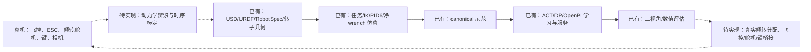

| 阶段 | 当前代码已有 | 真机仍需完成 |
| --- | --- | --- |
| real→sim 机体 | USD 刚体、质量/惯量读取、URDF FK、trim 转子方向和位置 | 实测质量、CoM、惯量、臂运动耦合、工具和负载；核对 URDF/USD 差异 |
| real→sim 旋翼 | 0～23 N 配置、k=0.02、可选归一化转速 lag/变化率 | 推力/反扭矩曲线、BLDC/ESC 延迟、电池、动态推力与空气相互作用 |
| real→sim 倾转 | 六个关节和隐式执行器、目标/实测遥测 | 实测角速度、加速度、扭矩、回差、零位、角度限位、舵机延迟与线缆限制 |
| sim 中分配 | 6×12 伪逆、幅值限幅、单圈 unwrap、trim 力臂 | 使用实际倾角和移动力臂、受限分配、零推力角连续性、舵机与 wrench 同步 |
| 感知/数据/学习 | 机载/末端相机、canonical、IL adapters | 相机标定、视觉/状态延迟、真实角度传感、足量示范与多场景训练 |
| sim→real | 8D 动作语义、IK/PID 和远端模型协议 | 实时飞控/ESC/舵机/机械臂适配、单位/坐标/时钟统一、失联与接管 |
| real 闭环回灌 | 本轮只有仿真实验 | 实机日志、真实任务成功、误差归因与重新标定/训练 |

仓库没有 Omni 的 PX4/MAVLink 飞控桥接、自动系统辨识或完成的真机 real2sim2real 闭环。第三方 UMI 的 `eval_real.py` 是地面机器人入口，不是倾转飞行平台部署证明。

与 UAQuad 相比，Omni 还需对六个方向执行器及移动转子几何建模；与固定倾角 FAHexa 相比，Omni 的控制可行域不仅受推力界限影响，还受舵机角度/速度/延迟影响。当前仿真让目标角立即作用于净 wrench，这一假设必须在硬件部署前改变并复测。不能从默认仿真成功推出真机轨迹可执行。

## 9. 欠驱动、固定倾角与主动倾转的代码共享

| 层次 | 三类平台共享 | UAQuad / UAHexa 独立 | FAHexa 独立 | OmniHexa 独立 |
| --- | --- | --- | --- | --- |
| 任务 | 十二任务对象、成功判定、专家与 reset 生命周期 | 对应 cfg/profile；部分 IK 覆盖 | 对应 cfg/profile | 对应 cfg/profile；转动夹爪判定适配需审查 |
| 机器人语义 | `RobotSpecCfg`、`RobotIO`、frame/gripper contract | 固定平行轴、四臂关节、各自资产/相机 | 固定非平行轴、四臂关节 | 六倾转关节、三臂关节、servo4 与专门工具 frame/相机 |
| IK | Pyroki floating-base 优化和 IK 输出协议 | roll/pitch 受限；Lemon 更严格 | 多数 profile 锁基座姿态 | 基座姿态全自由；非臂关节恢复默认 |
| 飞行控制 | ControllerOutput、desired/final/applied wrench、reset | PID4 位置外环/姿态内环、独立增益 | PID6/L1；现有 MPC 基线 | PID6 独立姿态增益；L1 profile 存在但未注册 |
| 分配 | 通用 inverse/forward allocation、反扭矩、推力参数 | 固定轴 rank4，带符号无约束推力 | 固定倾角 rank6，带符号无约束推力 | 6×12 cos/sin 伪逆、非负模长、atan2/unwrap、倾转目标 |
| 执行 | 基体合力/力矩、臂和夹爪位置执行、旋翼视觉动画 | 没有电机臂目标 | 没有电机臂目标 | 额外 motor-arm 目标；净 wrench 使用目标方向的近似 |
| 扰动 | 限幅、转子动态、气动、常量世界风力 | 固定轴方向路径 | 固定倾角方向路径 | 气动轴路径与倾转目标/实测区别需审查 |
| canonical/IL | 格式、8D EE action、模型家族、跨容器协议 | 专项数据/相机/归一化/权重 | 另有正式 12D BaseJoint 支持 | 夹爪 state 为角度；专项数据/权重；11D BaseJoint 未支持 |
| real2sim2real | 所有平台均需标定、时序和硬件驱动 | 欠驱动可行域与常规飞控模式 | 固定轴侧向推力与推力界限 | 额外倾转辨识、角/推力同步、移动力臂与受限分配 |

共享接口减少训练/场景代码重复，但不会自动统一不同平台的物理单位与可行域。复现应保持任务、机器人、控制器和策略适配职责独立；修改夹爪判定、角度动态或分配方法会改变基准条件，应另建对照和记录来源。

## 10. 技术总结与交付验收

1. **支持主动电机倾转的正式机型目前为 OmniHexa。** FAHexa 是固定倾角全驱动平台，UAQuad/UAHexa 是固定平行轴欠驱动平台。十二任务都需要按实际机型重新验证。
2. 高层输出末端目标，Pyroki 解基座与三臂关节，PID6 输出六维 wrench，分配器再输出六个推力和六个倾转角。模型 32D padding 与真实执行器数量无关。
3. 分配角、裁剪目标和实际角必须分别检查；当前净 wrench 使用目标角和 trim 力臂，不能从舵机录像直接推断施力方向。多视角与完整数值遥测共同解释成败。
4. canonical/IL/仿真评估接口已有实现；RL 训练器、受限真实倾转执行链、飞控桥接和硬件回灌仍缺少。一步训练与迁移烟测不构成正式学习性能或真机飞行成绩。

本专题使用普通 Git 的压缩文档预览。项目检查每个 Git blob **小于 100,000,000 B**，新 GIF/MP4 目标预算为每文件 192 KiB，全局单媒体硬上限 450 KiB；长原片、数据集与 checkpoint 留在忽略目录。GitHub 的单文件硬限制为 100 MiB，项目使用更严格的十进制上限。[GitHub 大文件规则](https://docs.github.com/en/repositories/working-with-files/managing-large-files/about-large-files-on-github)

完整实验站点还包含此前的实际媒体，人工发布预算为 **小于 200,000,000 B**；这是全站预算，与单 Git 文件限值不同。GitHub Pages 官方发布站点上限为 1 GB，因此全站超过 100 MB 不会自动触发单文件 LFS 问题；仍需逐文件检查和实际线上验收。[GitHub Pages 限制](https://docs.github.com/en/pages/getting-started-with-github-pages/github-pages-limits)

### 10.1 从完整试次生成独立报告、媒体与网页

完成第 6.4 节的 30 条专家和第 7.2 节的 12 条模型后，在仓库根目录执行以下命令。使用新的 `tilting-new` 目录；所有输出位于忽略目录，长原片和训练权重保持可追溯。模型规格和训练来源应对应实际使用的 checkpoint。若专家分多个批次执行，重复 `--report-json` 传入每个报告，要求恰好覆盖规格中的 30 个独立试次。

本轮归档的来源分成 `press-initial/results.json` 的首条记录，以及 `camera-correction/composite-results.json` 的其余 29 条；后者只逐对象拼接原 `experts/results.json` 的 15 条与 `budget-recovery/experts/results.json` 的 14 条，不修改原记录。汇总时应传入“首条＋composite”，或“首条＋原15＋恢复14”，不能同时传 composite 和它的组成报告，否则会重复计算。下方 `tilting-new` 示例采用一次完整新跑的 30 条报告；第 6.3 节的单条按钮命令用于独立调试，不重复加入同名正式试次。

```bash
python3 scripts/research/summarize_tilting_trials.py \
  --report-json outputs/research/tilting-new/experts/results.json \
  --expected-specs-json usage_assets/tilting/recording_specs.json \
  --output-summary outputs/research/tilting-new/trials.json \
  --output-trajectories outputs/research/tilting-new/trajectories.json \
  --require-complete
python3 scripts/research/summarize_tilting_policies.py \
  --report-json outputs/research/tilting-new/policy/results.json \
  --specs-json usage_assets/tilting/policy_specs.json \
  --output outputs/research/tilting-new/policy_trials.json
python3 scripts/research/build_tilting_media_specs.py \
  --results-json outputs/research/tilting-new/experts/results.json \
    outputs/research/tilting-new/policy/results.json \
  --output outputs/research/tilting-new/animation_specs.json
docker exec -e CUDA_VISIBLE_DEVICES=-1 -w /workspace/ambench ambench-sim-research \
  python scripts/research/export_usage_animations.py \
  --specs-json /workspace/ambench/outputs/research/tilting-new/animation_specs.json \
  --source-root /workspace/ambench \
  --output-dir /workspace/ambench/outputs/research/tilting-new/previews \
  --max-bytes 196608 --write-mp4
```

脚本摘要核对完整 120 Hz 遥测、终止/reset 相位和真实倾转关节；模型摘要核对服务器、checkpoint、训练来源、tracking 和运行配置。媒体规格共 126 路，分别引用原报告与原片 SHA。导出在现有容器内进行 CPU 编解码，拒绝非空输出目录，并核对压缩 MP4 的完整解码和原片首尾。

再创建全新的离线站点，将验证后的预览合入它自己的清单；该独立清单只含这一次重新运行的媒体。

```bash
python3 - <<'PY'
from pathlib import Path
media = Path('outputs/research/tilting-new/site/animations')
media.mkdir(parents=True, exist_ok=False)
(media / 'manifest.json').write_text('[]\n')
PY
python3 scripts/research/build_tilting_media_specs.py \
  --results-json outputs/research/tilting-new/experts/results.json \
    outputs/research/tilting-new/policy/results.json \
  --output outputs/research/tilting-new/animation_specs.json \
  --merge-previews outputs/research/tilting-new/previews \
  --media-dir outputs/research/tilting-new/site/animations
python3 scripts/research/build_tilting_gallery.py --strict \
  --manifest outputs/research/tilting-new/site/animations/manifest.json \
  --summary outputs/research/tilting-new/trials.json \
  --trajectories outputs/research/tilting-new/trajectories.json \
  --policy-summary outputs/research/tilting-new/policy_trials.json \
  --animation-specs outputs/research/tilting-new/animation_specs.json \
  --output outputs/research/tilting-new/site/tilting/index.html
python3 scripts/research/build_video_gallery.py \
  --manifest outputs/research/tilting-new/site/animations/manifest.json \
  --output outputs/research/tilting-new/site/index.html
```

`--strict` 要求 30 条脚本与 12 条模型均完成来源校验、42 个独立试次各有恰好三相机，且原报告、完整遥测/跟踪、采样轨迹和媒体元数据相符。任务超时作为完整失败试次保留；基础设施失败、缺录像或不匹配的来源会使报告构建失败。

使用现有 Chrome 做真实离线浏览器验收。下面的 Python 标准库只生成绝对 `file://` 地址；`--general-manifest` 指定这个独立站点自己的清单。宿主机不安装浏览器测试包。

```bash
TILTING_TOPIC_URL="$(python3 - <<'PY'
from pathlib import Path
print(Path('outputs/research/tilting-new/site/tilting/index.html').resolve().as_uri())
PY
)"
TILTING_GENERAL_URL="$(python3 - <<'PY'
from pathlib import Path
print(Path('outputs/research/tilting-new/site/index.html').resolve().as_uri())
PY
)"
python3 scripts/research/validate_tilting_gallery.py \
  --url "$TILTING_TOPIC_URL" --expected-records 126 --media \
  --general-url "$TILTING_GENERAL_URL" \
  --general-manifest outputs/research/tilting-new/site/animations/manifest.json \
  --output outputs/research/tilting-new/browser-offline.json
```

验收逐条加载 126 个真实 MP4、拖动至末段、解码并播放；同时检查模型流程切换、解析分配、任务/seed/来源筛选、三相机同步、真实倾转曲线与桌面/手机布局。结果、页面 SHA 和截图保存在该运行的输出目录。网页可直接打开，无外部 JavaScript 包或服务端依赖。

维护者发布本分支正式文档资产时，先完成 `usage_assets/tilting/` 与媒体清单的严格构建、普通 Git 大小检查、`research` 提交和推送，再使用发布入口。它从已提交的仓库资产构建包含历史专题的完整站点，保存逐文件哈希与来源提交；`--dry-run` 输出用于检查的静态目录，`--publish` 要求干净的 `research` 工作区并推送 `gh-pages`。

```bash
python3 tools/research/publish_video_pages.py --dry-run
python3 tools/research/publish_video_pages.py --publish
```

等待 [线上发布清单](https://zipengdai.com/ambench/release.json) 的 `research_commit` 与本次研究提交一致后，检查线上版本：

```bash
python3 scripts/research/validate_tilting_gallery.py \
  --url https://zipengdai.com/ambench/tilting/ --expected-records 126 --media \
  --general-url https://zipengdai.com/ambench/ \
  --general-manifest usage_assets/animations/manifest.json \
  --output outputs/research/tilting-new/browser-online.json
```

线上验收还应按 `release.json` 下载清单核对文件字节数/SHA、GIF/MP4 的响应类型和 MP4 `Range` 返回 `206`，并验证 GitHub 文档中的 GIF 可以直接访问。最终验收摘要分别记录本地页面、线上页面、媒体与研究提交的真实来源；只有完整门槛通过后才更新交付结论。

<!-- BEGIN TILTING DELIVERY -->

### 本轮交付与验收状态

**2026-10-09：本地、线上播放与匿名访问验收通过。** 完整状态见[验证快照](usage_assets/tilting/validation.json)。

- 重新完成 42 条正式试次：30 条脚本、12 条真实模型闭环；另保留一次采集预算中断，不记作任务成败。
- 126 个三视角 MP4 与对应 GIF；本页嵌入 21 个分组预览，并链接两个 seed 的全部视角。离线、线上分别通过全部 126 路原生加载、跳转和播放，以及 314 项界面/来源检查。
- 匿名下载核对 634 个站点载荷文件的字节数与 SHA，GitHub Markdown 与 21 个嵌入 GIF 的匿名访问通过；MP4 Range 请求返回 `206`，内容与源文件对应片段一致。
- 人工检查 21 组双 seed、三视角的首/中/末抽帧，共 378 个选定画面；这是抽帧审阅，不是逐帧连续因果标注。
- 原有 180 条媒体清单对象及 360 个媒体文件保持原内容，README 未改。252 个新媒体文件各不超过 192 KiB；原始长片、数据和权重留在忽略目录。
- 官方 main 于 2026-10-09 09:19 UTC 再次检查，仍为 `60bf5b73041df4eab571f7d9f0a297aeecbf2e0d`，已包含在本分支。

本轮默认任务为 14 次成功、10 次原生超时，六条条件/参考试次成功；十二条模型试次均原生超时。ACT/DP 专项训练各执行一个优化步，没有收敛、RL 训练或真实无人机飞行验证结论。

上述浏览器与全量匿名下载验收针对首轮已发布研究提交 `aea900e4000cb85d3e8f774108552ea2bb1b6282`。本次交付更新仅补充本节与验证快照，交互页面、实验清单和媒体字节保持一致。最新发布来源及逐文件 SHA 见[线上发布清单](https://zipengdai.com/ambench/release.json)；验证快照的自身新字节不计入它所记录的首轮发布验收。

<!-- END TILTING DELIVERY -->

扩展资料：[官方机器人指南](https://ambench.github.io/docs/extend/robot/)、[控制器指南](https://ambench.github.io/docs/extend/controller/)、[任务指南](https://ambench.github.io/docs/extend/task/)、[策略指南](https://ambench.github.io/docs/extend/policy/)、[工作流](https://ambench.github.io/docs/workflows/)。本文结论以本分支注册源码、保存的运行配置与实际报告为依据。
