# UAQuad：常规固定旋翼四旋翼加机械臂

面向熟悉 DJI 类常规四旋翼、希望先研究欠驱动空中操作的读者。本手册独立于项目 README；运行环境沿用 [note.md](note.md) 的双 Docker 配置。实验对象是项目的 **UAQuad / `quad_scorpion`**，四个旋翼方向固定，机身需要倾斜才能产生水平加速度，配有四自由度机械臂和双指夹爪。

**[在线交互流程与三视角实验](https://zipengdai.com/ambench/uaquad/)** · [离线交互页](usage_assets/uaquad/index.html) · [录制配置](usage_assets/uaquad/recording_specs.json)

交互页可以逐步查看观察、策略、IK、飞行控制和执行器之间传递的内容，比较不同 seed 的真实录像，并读取真实姿态与推力轨迹。它提供静态流程解释与实验回放；运行 Isaac 仿真使用下文的 Docker 命令。介绍组织借鉴了 [ARTEX README](https://github.com/mhtsec/ARTEX/blob/main/README.md) 的架构图、执行链与交互证据展示方式。

页面还提供四旋翼推力/倾角滑块：按真实 UAQuad 分配矩阵计算机体 wrench 和世界坐标合力，直观观察水平力为何来自机身倾斜。该解析演示没有重力、质量或动力学积分，不能当作 Isaac 仿真、真实悬停或实验数据。

阅读顺序：[机型辨认](#1-先找到最接近常规无人机的对象) → [控制流程](#2-一次动作怎样从目标变成飞行动作) → [模型与 RL](#3-脚本专家学习模型与强化学习分别在哪里) → [双 Docker](#4-双-docker-中实际运行的闭环) → [实验与判定](#5-实验设计与如何看视频) → [脚本复现](#6-完整复现脚本实验) → [模型训练与复现](#7-uaquad-的模型推理与训练范围) → [真机迁移边界](#8-本项目-real2sim2real-到了哪一步) → [共享代码](#9-欠驱动与全驱动哪些代码共享哪些需独立) → [技术总结](#10-技术总结与交付验收)。

## 1. 先找到最接近常规无人机的对象

| 项目机型 | 旋翼 | 基座驱动能力 | 机械臂 | 当前注册 ID 数 |
| --- | --- | --- | --- | --- |
| **UAQuad** | 4 个固定轴，全部沿机体 +Z | 欠驱动，分配矩阵秩 4 | yaw + 3 个 pitch 关节，双指夹爪 | **12** |
| UAHexa | 6 个固定轴，全部沿机体 +Z | 欠驱动，秩 4 | 4 个臂关节 | 12 |
| FAHexa | 6 个固定倾角旋翼 | 全驱动，线性分配矩阵秩 6 | 4 个臂关节 | 42 |
| OmniHexa | 6 个可转动电机臂 | 可变倾角分配；额外倾转执行器 | 3 个臂关节 | 12 |
| EE | 浮动末端参考模型 | 隔离飞行动力学的参考 | 夹爪 | 28 |

上表来自本分支 106 个任务注册 ID 与机器人配置；控制组合会增加 ID 数，因此这些数量不代表独立飞机数量。UAQuad 和 UAHexa 都已覆盖论文的 12 个任务族。原视频中出现较多 EE/FAHexa 的原因是此前用它们验证模型接口；本轮重新录制 UAQuad 自身的任务。

**“机身倾斜”与“旋翼主动倾转”是两种运动。** UAQuad 的四个推力轴相对机身不变，机身 roll/pitch 改变后，推力在世界坐标系中才有水平分量。FAHexa 的旋翼也没有主动倾转关节，但其固定轴彼此不平行，具有直接产生机体侧向力的能力。OmniHexa 才有单独控制的电机臂倾转关节。

代码入口：[UAQuad](source/ambench/ambench/robots/ua_quad.py)、[UAHexa](source/ambench/ambench/robots/ua_hexa.py)、[FAHexa](source/ambench/ambench/robots/fa_hexa.py)、[OmniHexa](source/ambench/ambench/robots/omni_hexa.py)、[控制配置](source/ambench/ambench/tasks/base/robot_profiles.py)。UAQuad 使用 [USD 物理资产](source/ambench/ambench/assets/robots/quad_scorpion.usd) 和 [URDF 运动学模型](source/ambench/ambench/assets/robots/urdf/quad_scorpion.urdf)，不是 DJI 飞控、SDK 或商品机的数字孪生。

### 1.1 为什么只能直接控制四个机体 wrench 分量

每个旋翼的推力方向都是 `dᵢ=(0,0,1)`，位置为 `(±s,±s,0.05)` 米，`s=0.3/√2`。推力与反扭矩形成分配矩阵：

```text
       Fz      [ 1   1   1   1  ]
       τx      [ s   s  -s  -s  ]
B₄ =   τy      [-s   s   s  -s  ]
       τz      [-k   k  -k   k  ], k=0.02 m
```

`det(B₄)=0.0144`，秩为 4；完整六维矩阵中的 `Fx/Fy` 两行均为零。因此公共控制器求解的是总推力和三个轴的力矩。位置控制器通过所需加速度计算目标倾角，再由姿态控制器跟踪。机械臂可以在其可达范围内补偿末端姿态，但不会增加基座缺少的机体侧向推力轴。

有风或气动效果时，最终施加的 wrench 还包含外力；这不会增加四个旋翼自身的可控推力方向。

这些是线性分配的结论。非负推力、推力上限、倾转速度、机械臂关节限位与接触约束还会缩小实际可行域。对应实现：[控制分配](source/ambench/ambench/controllers/utils/control_allocation.py)、[PID4](source/ambench/ambench/controllers/pid_4dof_ctrl.py)。

## 2. 一次动作怎样从目标变成飞行动作

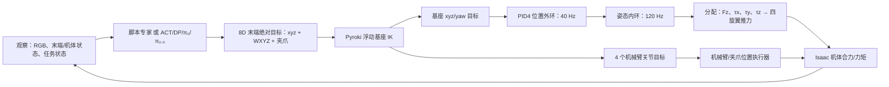

| 边界 | 输入 | 输出 | 需要理解的限制 |
| --- | --- | --- | --- |
| 高层动作 | 策略观察或专家读取的任务状态 | `[x,y,z,qw,qx,qy,qz,g]` | 8 维是末端接口，不是八个电机通道 |
| 位置/姿态表示 | xyz 相对各环境原点；四元数 WXYZ | 流水线转换为世界坐标与机器人末端 link 坐标 | UAQuad 有自己的末端朝向偏移和工具尖端偏移 |
| 夹爪 | `g∈[-1,1]` | `-1` 闭合、`+1` 张开，映射到手指关节 | 观察中的 `gripper_width` 是实际宽度，和动作标量不同 |
| IK | 末端位置、姿态与当前运动学状态 | 基座位姿与四个臂关节目标 | 默认固定基座 roll/pitch，自由 xyz/yaw；碰撞检查关闭 |
| PID4 外环 | 基座位置/速度与目标 | 总推力和期望姿态 | 横向位移要求机身倾斜 |
| PID4 内环 | 基座姿态/角速度与目标姿态 | 机体 Z 推力与三个轴力矩 | 不独立跟踪任意 roll/pitch 与位置组合 |
| 物理执行 | 合力/力矩、臂/夹爪关节目标 | 新状态、图像、接触和任务终止 | 当前通过机体净 wrench 模拟旋翼效果 |

物理步长 `dt=1/120 s`、环境 `decimation=1`。PID4 外环每 3 个物理步更新，姿态内环每步更新。上述频率是**仿真时间中的调度频率**，不是远程网络或真机的实测控制带宽。

UAQuad 使用专门的 URDF、PID 转动增益和相机安装配置；LemonHarvesting 另外将基座 yaw 也固定。IK 的位置/关节限制主要通过优化代价处理；求解异常会复用上一次解，因此“配置了界限”并不自动构成硬件安全保证。

对应实现：[ControlPipeline](source/ambench/ambench/controllers/control_pipeline.py)、[RobotIO](source/ambench/ambench/robots/robot_io.py)、[Pyroki IK](source/ambench/ambench/controllers/pyroki_ik_ctrl.py)、[LemonHarvesting 配置](source/ambench/ambench/tasks/lemon_harvesting/lemon_harvesting_env_cfg.py)。

## 3. 脚本专家、学习模型与强化学习分别在哪里

### 3.1 脚本专家：具有任务真值的状态机

脚本专家直接读取环境中的对象位置、接触或任务状态，按照任务阶段生成末端目标，经同一 IK/PID4 链执行。例如接近按钮、对齐夹爪、推进接触、检查是否完成。它具有仿真任务真值；不能把专家能读取的所有状态视为真实相机模型已经感知到的内容。

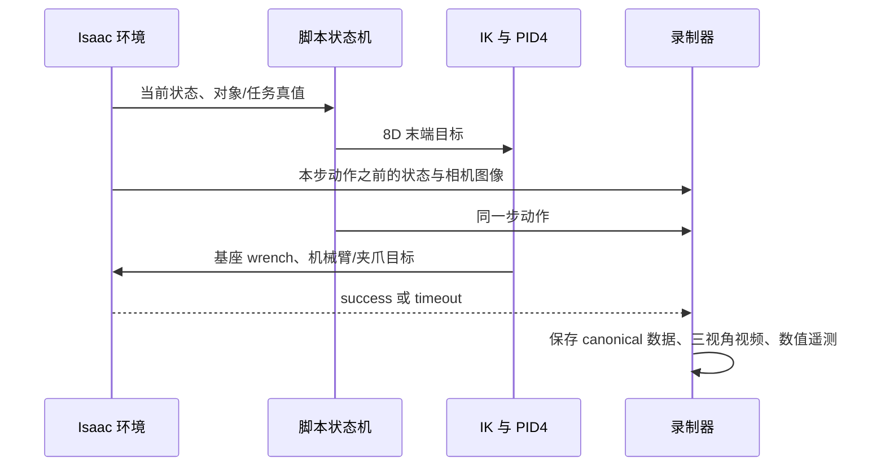

专家实现位于 [policies/scripted](source/ambench/ambench/policies/scripted/)，入口是 [record_demos_scripted.py](scripts/data/record_demos_scripted.py)。本轮每次调用仅允许一个 episode，同时保存超时尝试，避免只展示保存下来的成功 episode。

### 3.2 一份 canonical 数据，三种模型表示

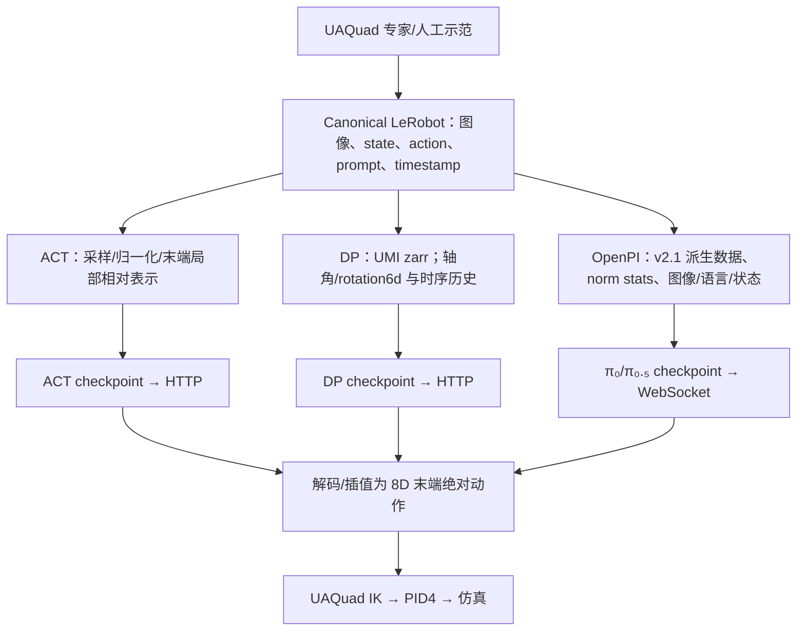

Canonical 示例的 `observation.state` 在本轮选择 `ee_pos(3)+ee_quat(4)+gripper_width(1)`，动作是 8 维 `ee_absolute`。相机同时记录 `scene_camera/base_camera/ee_camera`。**数据中保存三个相机，不意味着默认模型会读取三个相机。** 本轮专用数值遥测另外保存机体姿态、四臂关节和控制器输出，不改变 canonical 的 8 维训练契约。

| 方法 | 当前 EE 配置的输入 | 模型内部/输出表示 | 执行端 |
| --- | --- | --- | --- |
| ACT | 8D EE state、checkpoint 指定的相机；当前基线为 EE RGB 384×384 | 当前基线预测 16 个动作、执行前 8 个；`ee_local_relative` 相对轨迹 | 解码为绝对 8D；20 Hz 动作插值为每动作 6 个物理步 |
| Diffusion Policy | 两帧 EE 图像 224×224、末端位置/旋转/夹爪历史 | 源 8D 四元数动作转 7D 位置/轴角/夹爪；模型使用 10D 位置/rotation6d/夹爪 | 恢复绝对 8D；实际 checkpoint 的下采样与重规划频率从服务元数据读取 |
| OpenPI π₀/π₀.₅ | EE RGB、8D EE state、任务文本 prompt；base image 是否读取由训练配置决定 | 图像 224×224、prompt token、state/action 填充到 32D；flow matching 预测 50 步局部相对轨迹 | 每次执行选定前缀，再请求下一块；本轮 20 Hz、前缀 8 个策略动作 |

π₀ 将连续 state 放入模型后缀输入；π₀.₅ 将离散化 state 编入 token。两者都由数据适配器裁取/解码有效动作维度，执行端恢复 8D 末端动作；内部的 32D 填充不代表 UAQuad 增加了执行器。

ACT 和 DP 是本项目的模仿学习方法。π₀/π₀.₅ 是视觉—语言—动作模型（VLA）：输入任务语言与视觉/状态，输出连续机器人动作。这里的“大模型”没有把电机当自然语言工具调用，也没有由聊天模型直接按 120 Hz 操纵四个旋翼。飞行与接触稳定由下层控制链处理。

默认 EE 模型主要使用末端状态和 EE 相机。DP 的默认 base 状态字段被 `ignore_by_policy` 忽略；ACT 的 EE evaluator 固定选择 8D state；OpenPI EE 配置也有自己的输入变换。若要加入基座姿态、速度、四关节状态或双相机，需要成套修改训练输入、归一化、checkpoint 元数据与 evaluator，并重新训练验证。

入口：[ACT train/eval](source/ambench_learn/ambench_learn/policies/act)、[DP train/eval](source/ambench_learn/ambench_learn/policies/dp)、[OpenPI eval](source/ambench_learn/ambench_learn/policies/pi)、[动作语义](source/ambench_learn/ambench_learn/data/action_semantics.py)、[公共远程协议](source/ambench_learn/ambench_learn/policies/remote)。

### 3.3 强化学习：环境接口存在，训练闭环还需实现

`BaseEnv` 继承 Isaac Lab `DirectRLEnv`，但当前 12 个任务的 `_get_rewards()` 均返回零。本仓库的学习代码没有现成 PPO、残差策略或相应训练入口，因此本轮没有可报告的 RL 成绩。

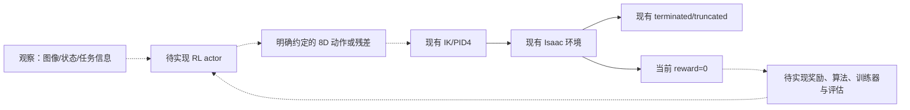

要接入 RL，先确定 actor 的观察和动作语义，再设计非零奖励、成功与失败终止、训练器、归一化和 checkpoint 管理。残差策略还要明确残差加在末端目标、基座控制目标还是 wrench 上，以及单位、幅度和限幅。不同位置会改变问题的动力学与稳定性，不能仅添加一个名为 PPO 的启动命令就声称已经完成。

代码证据：[BaseEnv](source/ambench/ambench/tasks/base/base_env.py)、[PressButton 的奖励与终止](source/ambench/ambench/tasks/press_button/press_button_env.py)。第三方 UMI 中的 `eval_real.py` 是地面双臂机器人入口，不能用来代表 UAQuad 的真机飞行。

## 4. 双 Docker 中实际运行的闭环

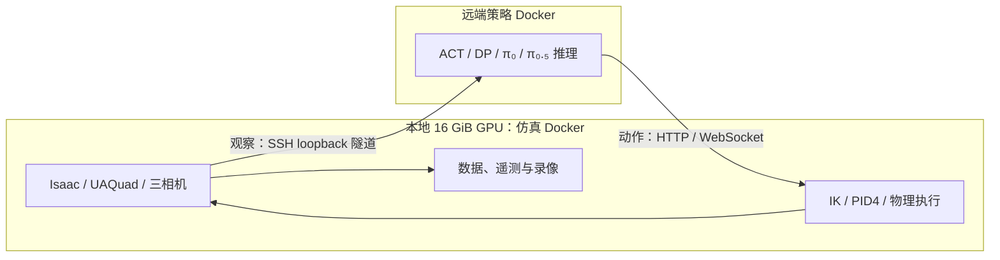

本地同时只运行一个 Isaac GPU 进程。本轮检查时远端全部 GPU 有其他任务，策略使用 Docker 内 CPU，`CUDA_VISIBLE_DEVICES=-1`，不叠加占用别人的卡。策略频率是动作序列的仿真时间尺度；同步网络请求耗时可能延长墙钟时间。该闭环验证跨容器策略接口，真机仍需要飞控适配与独立实时调度。

先按 [note.md](note.md) 获取 `research`、构建并启动两个镜像，建立免密 SSH 与隧道。宿主机使用现有 Docker、Git、SSH、rsync 和 Python 标准库协调命令，不新增包或 Conda；全部 Isaac 与模型包在容器中。

```bash
docker compose -f docker/compose.sim.yml up -d
bash tools/research/tunnel_policy.sh
```

隧道持续运行，另开终端执行下面的实验命令。若另一终端已有同样的 8000/8001 转发，复用它即可。

## 5. 实验设计与如何看视频

| 组别 | 对象和条件 | 目的 |
| --- | --- | --- |
| UAQuad 十二任务 | 各 seed 51/52；每次一条完整尝试，任务默认时限 | 逐任务验证常规欠驱动机器人；成功和超时均保留 |
| 推力限幅对照 | PressButton，两个 seed，仅启用 saturation | 分离标称 0–23 N 限制的影响 |
| 扰动组合 | PressButton，两个 seed，限幅+气动+世界 X 向 1 N 风力 | 验证组合扰动；结果不能单独归因于风 |
| FAHexa 参考 | 相同按钮任务和 seed，FAHexa PID | 观察控制链差异；机型、IK 与 PID 同时变化，非单因素消融 |
| 高层模型形态转移 | 现有 EE 一步 checkpoint 在 UAQuad 上评估 | 验证动作接口与迁移表现；不能标作 UAQuad 专门训练的性能 |
| UAQuad 数据学习接口 | ACT/DP 从本轮 UAQuad 成功数据、随机视觉骨干各做一步 CPU 优化 | 检查数据派生、训练、存档和闭环接口；一步仍不表示任务已学会 |

每条新的脚本试次同步记录三个相机，均使用同一 `trial_id`：

| 视角 | 看什么 | 条件 |
| --- | --- | --- |
| `scene_camera` | 整个四旋翼、机械臂、目标与飞行路径 | 普通任务为斜俯外部相机；NDT 另设高处全景 |
| `base_camera` | 机体倾斜与目标接近过程 | UAQuad 基座挂载相机，RGB 384×384 |
| `ee_camera` | 夹爪、对齐和接触 | UAQuad 末端挂载相机，RGB 384×384 |

两个 seed 对应两次分别启动的试次，具体初始差异以真实 `initial_observation` 为准；例如按钮目标的位置会变化。三个相机是同一试次的三段录像，**不能将三段录像算作三次成功**。NDT 使用固定场景几何，改变 seed 不代表生成了不同布局。视频和指标按独立 trial 统计。

原始脚本数据和数值遥测为 120 Hz；原始视频按 `frame_skip=4`、30 FPS 编码，末尾不足四步的部分可能未写入视频。网页 MP4 预览均匀采样完整源片段，保留首尾，约7秒播放完；GIF 的尺寸、颜色数、帧数与播放时长会按文件预算变化，并在末帧停留。预览播放秒数不是原始仿真秒数。同步播放使用各相机同一源片段的时间映射，遥测显示其自己的 pre-step 时间戳。完整原视频通过复现命令生成，来源清单记录了实际采样与 SHA。

### 5.1 默认推力限幅关闭：本轮实测的迁移限制

源码标称每旋翼推力范围为 `0–23 N`，但默认 `enable_saturation=False`。首个 PressButton seed51 成功试次的 1024 步遥测中，旋翼指令范围为 **−12.73～34.96 N**；27 步出现负值，28 步出现任意超限值，其中 4 步超过 23 N。四个旋翼的实际可实现范围必须单独检查。

该试次的基座 pitch 约 **−7.34°～9.03°**，说明水平移动确实伴随机身倾斜。末端 pre-step 目标位置误差 RMS 约 **2.50 cm**；此误差是动作之前的观察与当步目标之差，含正常轨迹跟踪滞后，不是终点接触误差。

这些数值来自完整真实 JSONL，不是从视频估计。开启限幅后的独立结果见下面的验收表；默认任务成功不能自动证明这条轨迹在真实四旋翼上可执行。

### 5.2 “成功”由什么判定

成绩采用任务原有 `_get_success()` 和 `_get_dones()`，保留原生时限。视频用于解释动作过程，不替代程序判定；命中某个中间子任务也不自动算最终成功。

| 任务 | 当前最终成功条件 | 源码 |
| --- | --- | --- |
| PressButton | 按钮直线关节位移 ≥4 mm | [按钮](source/ambench/ambench/tasks/press_button) |
| PullLever | 拉杆关节角度 >40° | [拉杆](source/ambench/ambench/tasks/pull_lever) |
| PushSlider | 滑块关节位置 ≥0.45 m | [滑块](source/ambench/ambench/tasks/push_slider) |
| RotateValve | 阀门角度 ≥170° | [阀门](source/ambench/ambench/tasks/rotate_valve) |
| OpenDoor | 门关节角度 >20° | [门](source/ambench/ambench/tasks/open_door) |
| PegInHole | 杆尖在孔坐标系中 X>0，Y/Z 位于孔横截面内 | [插孔](source/ambench/ambench/tasks/peg_in_hole) |
| TossBall | 球进入容器区域、与工具尖端距离 ≥0.12 m，机器人 X 在容器后方至少0.7 m | [投球](source/ambench/ambench/tasks/toss_ball) |
| LemonHarvesting | 柠檬在目标容器区域且夹爪宽度 >0.0898 m | [采摘](source/ambench/ambench/tasks/lemon_harvesting) |
| CabinetPickPlace | 罐体高于柜顶0～5 cm且速度 <0.1 m/s | [柜体取放](source/ambench/ambench/tasks/cabinet_pick_place) |
| FrameAssembly | 框中心相对销中心 X 误差 <0.1 m，YZ 距离 <0.05 m | [框架](source/ambench/ambench/tasks/frame_assembly) |
| WipeWindow | 所有污点的可见性状态均变为 false | [擦窗](source/ambench/ambench/tasks/wipe_window) |
| NDT | 末端相对目标 X 误差 <0.03 m、YZ 距离 <0.08 m，连续保持100步 | [检测](source/ambench/ambench/tasks/ndt) |

这些是当前代码的判定范围。例如柜体最终判定只检查高度和速度，没有额外要求 XY 位于柜顶内；插孔判定没有单独的角度阈值；NDT 判定是末端位置保持，没有真实探伤传感器的测量质量评分。迁移真机时，应按实际业务增加对应的几何、接触、稳定性与测量验收，并重新评估，不能直接复用同名成功率作为硬件合格证明。

<!-- BEGIN UAQUAD RESULTS -->

### 5.3 本轮十二任务的真实结果

**2026-10-09：30/30 脚本试次通过单 episode、canonical 数据、完整遥测与三视角来源核对。** 默认 UAQuad 十二任务×两个 seed 共 24 次：8 次成功、16 次超时，成功任务族为 4/12；另外限幅组 2/2、限幅+气动+风力组 2/2，FAHexa 对照 2/2。FAHexa 不计入 UAQuad 成功率。

下表时间是实际记录步数×1/120 秒，超时可能比配置时限少一个物理步。GIF 是覆盖首尾的压缩预览，点击进入该实验交互卡；各 seed 的三个 MP4 来自同一次实际试验。两个 seed 改变了随机目标初始化，不构成充分的统计评估；NDT 等固定几何任务不能据此声称两个随机布局。

| 任务 / 实测 GIF | seed51 | seed52 | seed51 三视角 | seed52 三视角 |
| --- | --- | --- | --- | --- |
| PressButton<br>[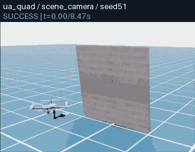](https://zipengdai.com/ambench/uaquad/#uaquad_pressbutton) | 成功 · 8.533s | 成功 · 8.442s | [全景](usage_assets/animations/uaquad_pressbutton_seed51_scene_camera.mp4) / [机载](usage_assets/animations/uaquad_pressbutton_seed51_base_camera.mp4) / [末端](usage_assets/animations/uaquad_pressbutton_seed51_ee_camera.mp4) | [全景](usage_assets/animations/uaquad_pressbutton_seed52_scene_camera.mp4) / [机载](usage_assets/animations/uaquad_pressbutton_seed52_base_camera.mp4) / [末端](usage_assets/animations/uaquad_pressbutton_seed52_ee_camera.mp4) |
| PullLever<br>[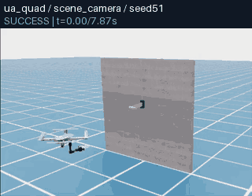](https://zipengdai.com/ambench/uaquad/#uaquad_pulllever) | 成功 · 7.908s | 成功 · 7.850s | [全景](usage_assets/animations/uaquad_pulllever_seed51_scene_camera.mp4) / [机载](usage_assets/animations/uaquad_pulllever_seed51_base_camera.mp4) / [末端](usage_assets/animations/uaquad_pulllever_seed51_ee_camera.mp4) | [全景](usage_assets/animations/uaquad_pulllever_seed52_scene_camera.mp4) / [机载](usage_assets/animations/uaquad_pulllever_seed52_base_camera.mp4) / [末端](usage_assets/animations/uaquad_pulllever_seed52_ee_camera.mp4) |
| PushSlider<br>[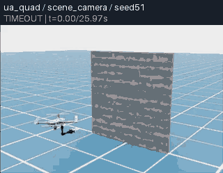](https://zipengdai.com/ambench/uaquad/#uaquad_pushslider) | 超时失败 · 25.992s | 超时失败 · 25.992s | [全景](usage_assets/animations/uaquad_pushslider_seed51_scene_camera.mp4) / [机载](usage_assets/animations/uaquad_pushslider_seed51_base_camera.mp4) / [末端](usage_assets/animations/uaquad_pushslider_seed51_ee_camera.mp4) | [全景](usage_assets/animations/uaquad_pushslider_seed52_scene_camera.mp4) / [机载](usage_assets/animations/uaquad_pushslider_seed52_base_camera.mp4) / [末端](usage_assets/animations/uaquad_pushslider_seed52_ee_camera.mp4) |
| RotateValve<br>[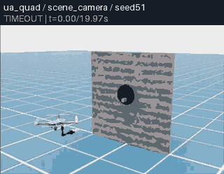](https://zipengdai.com/ambench/uaquad/#uaquad_rotatevalve) | 超时失败 · 19.992s | 超时失败 · 19.992s | [全景](usage_assets/animations/uaquad_rotatevalve_seed51_scene_camera.mp4) / [机载](usage_assets/animations/uaquad_rotatevalve_seed51_base_camera.mp4) / [末端](usage_assets/animations/uaquad_rotatevalve_seed51_ee_camera.mp4) | [全景](usage_assets/animations/uaquad_rotatevalve_seed52_scene_camera.mp4) / [机载](usage_assets/animations/uaquad_rotatevalve_seed52_base_camera.mp4) / [末端](usage_assets/animations/uaquad_rotatevalve_seed52_ee_camera.mp4) |
| OpenDoor<br>[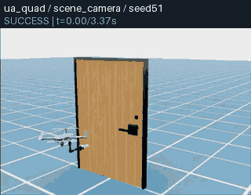](https://zipengdai.com/ambench/uaquad/#uaquad_opendoor) | 成功 · 3.408s | 成功 · 3.342s | [全景](usage_assets/animations/uaquad_opendoor_seed51_scene_camera.mp4) / [机载](usage_assets/animations/uaquad_opendoor_seed51_base_camera.mp4) / [末端](usage_assets/animations/uaquad_opendoor_seed51_ee_camera.mp4) | [全景](usage_assets/animations/uaquad_opendoor_seed52_scene_camera.mp4) / [机载](usage_assets/animations/uaquad_opendoor_seed52_base_camera.mp4) / [末端](usage_assets/animations/uaquad_opendoor_seed52_ee_camera.mp4) |
| PegInHole<br>[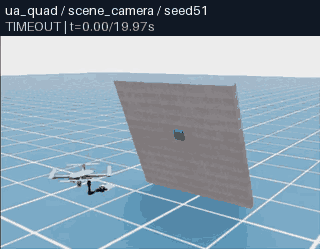](https://zipengdai.com/ambench/uaquad/#uaquad_peginhole) | 超时失败 · 19.992s | 超时失败 · 19.992s | [全景](usage_assets/animations/uaquad_peginhole_seed51_scene_camera.mp4) / [机载](usage_assets/animations/uaquad_peginhole_seed51_base_camera.mp4) / [末端](usage_assets/animations/uaquad_peginhole_seed51_ee_camera.mp4) | [全景](usage_assets/animations/uaquad_peginhole_seed52_scene_camera.mp4) / [机载](usage_assets/animations/uaquad_peginhole_seed52_base_camera.mp4) / [末端](usage_assets/animations/uaquad_peginhole_seed52_ee_camera.mp4) |
| TossBall<br>[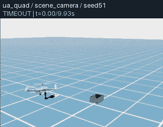](https://zipengdai.com/ambench/uaquad/#uaquad_tossball) | 超时失败 · 9.992s | 超时失败 · 9.992s | [全景](usage_assets/animations/uaquad_tossball_seed51_scene_camera.mp4) / [机载](usage_assets/animations/uaquad_tossball_seed51_base_camera.mp4) / [末端](usage_assets/animations/uaquad_tossball_seed51_ee_camera.mp4) | [全景](usage_assets/animations/uaquad_tossball_seed52_scene_camera.mp4) / [机载](usage_assets/animations/uaquad_tossball_seed52_base_camera.mp4) / [末端](usage_assets/animations/uaquad_tossball_seed52_ee_camera.mp4) |
| LemonHarvesting<br>[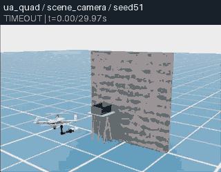](https://zipengdai.com/ambench/uaquad/#uaquad_lemonharvesting) | 超时失败 · 29.992s | 超时失败 · 29.992s | [全景](usage_assets/animations/uaquad_lemonharvesting_seed51_scene_camera.mp4) / [机载](usage_assets/animations/uaquad_lemonharvesting_seed51_base_camera.mp4) / [末端](usage_assets/animations/uaquad_lemonharvesting_seed51_ee_camera.mp4) | [全景](usage_assets/animations/uaquad_lemonharvesting_seed52_scene_camera.mp4) / [机载](usage_assets/animations/uaquad_lemonharvesting_seed52_base_camera.mp4) / [末端](usage_assets/animations/uaquad_lemonharvesting_seed52_ee_camera.mp4) |
| CabinetPickPlace<br>[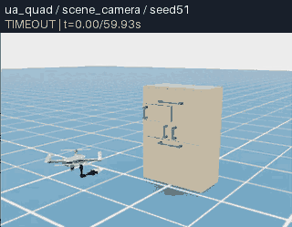](https://zipengdai.com/ambench/uaquad/#uaquad_cabinetpickplace) | 超时失败 · 59.992s | 超时失败 · 59.992s | [全景](usage_assets/animations/uaquad_cabinetpickplace_seed51_scene_camera.mp4) / [机载](usage_assets/animations/uaquad_cabinetpickplace_seed51_base_camera.mp4) / [末端](usage_assets/animations/uaquad_cabinetpickplace_seed51_ee_camera.mp4) | [全景](usage_assets/animations/uaquad_cabinetpickplace_seed52_scene_camera.mp4) / [机载](usage_assets/animations/uaquad_cabinetpickplace_seed52_base_camera.mp4) / [末端](usage_assets/animations/uaquad_cabinetpickplace_seed52_ee_camera.mp4) |
| FrameAssembly<br>[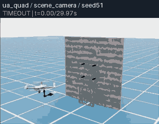](https://zipengdai.com/ambench/uaquad/#uaquad_frameassembly) | 超时失败 · 29.992s | 超时失败 · 29.992s | [全景](usage_assets/animations/uaquad_frameassembly_seed51_scene_camera.mp4) / [机载](usage_assets/animations/uaquad_frameassembly_seed51_base_camera.mp4) / [末端](usage_assets/animations/uaquad_frameassembly_seed51_ee_camera.mp4) | [全景](usage_assets/animations/uaquad_frameassembly_seed52_scene_camera.mp4) / [机载](usage_assets/animations/uaquad_frameassembly_seed52_base_camera.mp4) / [末端](usage_assets/animations/uaquad_frameassembly_seed52_ee_camera.mp4) |
| WipeWindow<br>[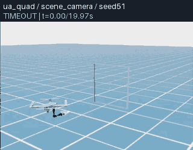](https://zipengdai.com/ambench/uaquad/#uaquad_wipewindow) | 超时失败 · 19.992s | 超时失败 · 19.992s | [全景](usage_assets/animations/uaquad_wipewindow_seed51_scene_camera.mp4) / [机载](usage_assets/animations/uaquad_wipewindow_seed51_base_camera.mp4) / [末端](usage_assets/animations/uaquad_wipewindow_seed51_ee_camera.mp4) | [全景](usage_assets/animations/uaquad_wipewindow_seed52_scene_camera.mp4) / [机载](usage_assets/animations/uaquad_wipewindow_seed52_base_camera.mp4) / [末端](usage_assets/animations/uaquad_wipewindow_seed52_ee_camera.mp4) |
| NDT<br>[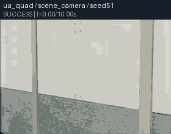](https://zipengdai.com/ambench/uaquad/#uaquad_ndt) | 成功 · 10.050s | 成功 · 10.083s | [全景](usage_assets/animations/uaquad_ndt_seed51_scene_camera.mp4) / [机载](usage_assets/animations/uaquad_ndt_seed51_base_camera.mp4) / [末端](usage_assets/animations/uaquad_ndt_seed51_ee_camera.mp4) | [全景](usage_assets/animations/uaquad_ndt_seed52_scene_camera.mp4) / [机载](usage_assets/animations/uaquad_ndt_seed52_base_camera.mp4) / [末端](usage_assets/animations/uaquad_ndt_seed52_ee_camera.mp4) |

超时表示在规定时限内未满足第 5.2 节的任务成功条件；它不表示采集、数据校验或视频导出故障。当前证据不足以把每项失败归因于某一个控制器或视觉因素。原始报告、退出码与完整失败 episode 均保留，不能将这些成绩改写成“所有任务已成功”。

### 5.4 限幅、风力与全驱动对照

| 条件 / 实测 GIF | seed51 | seed52 | 三视角 MP4 |
| --- | --- | --- | --- |
| UAQuad：仅旋翼限幅<br>[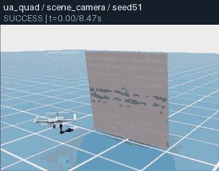](https://zipengdai.com/ambench/uaquad/#uaquad_pressbutton_saturation) | 成功 · 8.533s | 成功 · 8.442s | seed51：[全景](usage_assets/animations/uaquad_pressbutton_saturation_seed51_scene_camera.mp4) / [机载](usage_assets/animations/uaquad_pressbutton_saturation_seed51_base_camera.mp4) / [末端](usage_assets/animations/uaquad_pressbutton_saturation_seed51_ee_camera.mp4)<br>seed52：[全景](usage_assets/animations/uaquad_pressbutton_saturation_seed52_scene_camera.mp4) / [机载](usage_assets/animations/uaquad_pressbutton_saturation_seed52_base_camera.mp4) / [末端](usage_assets/animations/uaquad_pressbutton_saturation_seed52_ee_camera.mp4) |
| UAQuad：限幅+气动+世界X方向1N风力<br>[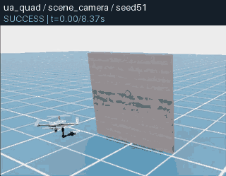](https://zipengdai.com/ambench/uaquad/#uaquad_pressbutton_wind) | 成功 · 8.417s | 成功 · 8.300s | seed51：[全景](usage_assets/animations/uaquad_pressbutton_wind_seed51_scene_camera.mp4) / [机载](usage_assets/animations/uaquad_pressbutton_wind_seed51_base_camera.mp4) / [末端](usage_assets/animations/uaquad_pressbutton_wind_seed51_ee_camera.mp4)<br>seed52：[全景](usage_assets/animations/uaquad_pressbutton_wind_seed52_scene_camera.mp4) / [机载](usage_assets/animations/uaquad_pressbutton_wind_seed52_base_camera.mp4) / [末端](usage_assets/animations/uaquad_pressbutton_wind_seed52_ee_camera.mp4) |
| FAHexa：默认未限幅<br>[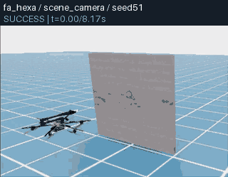](https://zipengdai.com/ambench/uaquad/#uaquad_reference_fahexa) | 成功 · 8.225s | 成功 · 8.125s | seed51：[全景](usage_assets/animations/uaquad_reference_fahexa_seed51_scene_camera.mp4) / [机载](usage_assets/animations/uaquad_reference_fahexa_seed51_base_camera.mp4) / [末端](usage_assets/animations/uaquad_reference_fahexa_seed51_ee_camera.mp4)<br>seed52：[全景](usage_assets/animations/uaquad_reference_fahexa_seed52_scene_camera.mp4) / [机载](usage_assets/animations/uaquad_reference_fahexa_seed52_base_camera.mp4) / [末端](usage_assets/animations/uaquad_reference_fahexa_seed52_ee_camera.mp4) |

| 按钮试次 | 单旋翼推力范围 N | 任意旋翼超出配置界限的步数 | 最大绝对 pitch ° |
| --- | --- | --- | --- |
| `uaquad_pressbutton_seed51` | -12.731 ～ 34.957 | 28 / 1024 | 9.026 |
| `uaquad_pressbutton_seed52` | -14.226 ～ 35.023 | 8 / 1013 | 6.624 |
| `uaquad_pressbutton_saturation_seed51` | 0.000 ～ 23.000 | 0 / 1024 | 8.705 |
| `uaquad_pressbutton_saturation_seed52` | 0.000 ～ 23.000 | 0 / 1013 | 6.379 |
| `uaquad_pressbutton_wind_seed51` | 0.000 ～ 23.000 | 0 / 1010 | 8.675 |
| `uaquad_pressbutton_wind_seed52` | 0.000 ～ 23.000 | 0 / 996 | 6.594 |
| `uaquad_reference_fahexa_seed51` | -130.214 ～ 59.957 | 4 / 987 | 0.781 |
| `uaquad_reference_fahexa_seed52` | -114.983 ～ 55.152 | 4 / 975 | 0.909 |

UAQuad 的界限为 `[0,23] N`，FAHexa 使用其自身的 `[0,23] N` 配置界限。所有 24 条默认 UAQuad 试次都至少出现一次超限指令；例如按钮 seed51 的 1024 步里有 27 步含负推力、28 步含超限，夹柜任务 seed52 的单旋翼指令极值达到 −565.034/588.266 N。这是默认未限幅仿真的输出，不能直接部署到电机。限幅按钮四次均记录到 0～23 N 且零超限；它们仍未覆盖电机迟滞、真实臂执行器与飞控时序。

限幅+气动+风力是组合条件，只用两个 seed 不能单独识别气动或风的因果贡献。FAHexa 的机体、增益与转子配置不同，这组按钮对照只用于观察控制形态，不能解释为硬件或策略性能排名。完整数值见[30 条实测摘要](usage_assets/uaquad/trials.json)，真实姿态/推力曲线可在[交互页](https://zipengdai.com/ambench/uaquad/)逐条选择。

<!-- END UAQUAD RESULTS -->

## 6. 完整复现脚本实验

本轮配置包含任务、seed、原生时限、三个相机、视角和扰动开关。`--max_episodes 1` 防止超时后悄悄持续采集直到成功；`--save_failed_episodes` 保留超时证据。

```bash
docker exec ambench-sim-research python scripts/research/record_usage_variants.py \
  --specs-json /workspace/ambench/usage_assets/uaquad/recording_specs.json \
  --output-dir /workspace/ambench/outputs/research/uaquad-new/experts --timeout-s 900
```

将 `uaquad-new` 换为新的运行名，目录必须为空。只跑一个最先容易理解的实验：

```bash
docker exec ambench-sim-research python scripts/research/record_usage_variants.py \
  --specs-json /workspace/ambench/usage_assets/uaquad/recording_specs.json \
  --output-dir /workspace/ambench/outputs/research/uaquad-new/press \
  --name uaquad_pressbutton_seed51 --timeout-s 900
```

也可以直接使用公共采集入口：

```bash
docker exec ambench-sim-research python scripts/data/record_demos_scripted.py \
  --task PressButton-Am-UAQuad-Abs-PID-Direct-v0 --num_envs 1 \
  --dataset_root /workspace/ambench/outputs/research/uaquad-new/manual-press \
  --state_keys ee_pos ee_quat gripper_width --task_prompt 'press the button' \
  --step_hz 120 --num_demos 1 --max_episodes 1 --save_failed_episodes --seed 51 \
  --env_length_s 20 --camera_names scene_camera base_camera ee_camera \
  --scene_camera_width 480 --scene_camera_height 320 \
  --scene_camera_position -2.5 -3 2.2 --scene_camera_look_at 1.4 0 1.1 \
  --telemetry --video --headless --device cuda:0
```

增加 `--saturation` 只打开旋翼限幅。增加 `--disturbance --wind_force 1 0 0` 打开限幅、气动与风力组合。风力单位是牛顿，不是风速 m/s。

如果想先观察更接近常规非负电机推力约束的一次闭环，可以用上面的单试次命令，将 `--name` 改为 `uaquad_pressbutton_saturation_seed51` 并使用新的输出目录。本轮该试次成功，四旋翼推力始终在 0～23 N。它仍是带理想化机械臂执行器的仿真；后续依次比较默认按钮、风力按钮与 FAHexa 按钮，最容易看清倾角、机械臂补偿与驱动形式之间的区别。

录制 session 保存 `episode_outcomes.json`、`env_cfg.yaml`、`telemetry.jsonl`、canonical `lerobot/` 以及三个 `videos/scripted-*-env0-eps0.mp4`。原始数据与长录像位于忽略目录，完整复现时通过配置重新生成。

Isaac 的退出码可能与任务结果不同。验收器要求有完整的单次 episode、正确任务和 seed、三个实际视频、canonical validator；超时保持 `termination_reason=timeout`。如果旧报告因超时退出码 0 被拒绝，可原样保留该报告并仅重验已保存的数据：

```bash
docker exec ambench-sim-research python scripts/research/record_usage_variants.py \
  --specs-json /workspace/ambench/usage_assets/uaquad/recording_specs.json \
  --revalidate-report /workspace/ambench/outputs/research/uaquad-new/experts/results.json \
  --output-dir /workspace/ambench/outputs/research/uaquad-new/revalidated --timeout-s 900
```

此命令不重新运行任务，不修改原始 episode 或录像；新报告保留原状态、原错误和原报告哈希。发生缺数据、非法终止或 canonical 无效时仍然拒绝通过。

### 6.1 真实遥测、来源清单和视频导出

```bash
python3 scripts/research/summarize_uaquad_trials.py \
  --report-json outputs/research/uaquad-new/experts/results.json \
  --output-summary usage_assets/uaquad/trials.json \
  --output-trajectories usage_assets/uaquad/trajectories.json --require-complete
```

摘要工具逐行校验初始状态、动作、时间戳、步数与终止标志，然后计算姿态、目标误差、路径和旋翼超限统计。轨迹图使用每 trial 最多 120 个真实采样点；统计使用全部原始行。多份报告可以重复传入 `--report-json`，同名试次重复或缺失会触发完整性门禁。

视频规格构建、容器内 CPU 导出、清单安全合并与页面嵌入的最终命令记录在下方发布验收段。首组三个视角的 GIF/MP4 最多 **240 KiB**，其余新预览最多 **192 KiB**，保留普通 Git 文件；整站额外执行 `<100,000,000 bytes` 门禁。完整 raw 视频、示范和 checkpoint 不进入 Git。

## 7. UAQuad 的模型推理与训练范围

将同样的 8D EE 接口接到 UAQuad 并不自动匹配训练分布。UAQuad 的相机安装、机体倾斜、机械臂和接触动态与 EE 参考模型不同。本轮保留现有一步 checkpoint 的来源，进行形态转移试验；模型结果独立于脚本专家统计。

在另一个终端建立隧道后，先启动 ACT CPU 服务：

```bash
bash tools/research/start_policy.sh --cpu act \
  /data/checkpoints/rebuild-20261007/act_press_button_smoke/checkpoints/000001/pretrained_model
bash tools/research/wait_policy.sh act 600
docker exec ambench-sim-research python -m ambench_learn.policies.act.eval \
  --task PressButton-Am-UAQuad-Abs-PID-Direct-v0 \
  --remote-url http://127.0.0.1:8001 --policy-id uaquad_act_ee_transfer_step1 \
  --num-rollouts 1 --num-envs 1 --seed 51 --episode-length-s 20 \
  --policy-target-hz 20 --n-action-steps 8 \
  --output-dir /workspace/ambench/outputs/research/uaquad-new/policy/act_seed51 \
  --save-video --video-camera-names scene_camera base_camera ee_camera \
  --progress-every 240 --headless --device cuda:0
```

把 seed 改为 52 时使用新输出目录，并重启服务恢复推理随机种子 42 的起点。其余模型使用相同机器人/时限/三个视角：

| 模型 | 服务 | checkpoint / 配置 | evaluator |
| --- | --- | --- | --- |
| DP | `start_policy.sh --cpu dp` | `/data/outputs/rebuild-20261007/press_button_dp_smoke/checkpoints/latest.ckpt` | `ambench_learn.policies.dp.eval`，HTTP 8001；节奏读 checkpoint |
| π₀ | `start_policy.sh --cpu pi CONFIG CHECKPOINT` | `pi0_am_bench_multitask_openpi_original_20hz_h50_ee_local_relative`，`/data/checkpoints/openpi-rebuild-20261007/CONFIG/rebuild-20261007/1` | `ambench_learn.policies.pi.eval`，WebSocket 8000，`--prompt 'press the button' --policy-target-hz 20 --n-action-steps 8` |
| π₀.₅ | 同上 | 将配置前缀改为 `pi05` | 同上 |

具体训练入口与 canonical→DP/OpenPI 派生步骤见 [usage.md 的双容器训练与推理说明](usage.md)。训练 UAQuad 专门的策略时必须将数据源换成本轮成功 UAQuad session、创建新的 stats/checkpoint/实验名。超时数据作为失败证据单列，不能混称成功示范；现有 EE checkpoint 不能改名后冒充 UAQuad 训练结果。

### 7.1 一次复现十二条模型试次

[模型配置](usage_assets/uaquad/policy_specs.json) 固定了六组 checkpoint、各两个环境 seed、推理随机种子 42 和训练来源。先结束脚本录制，确认没有 Isaac 子进程，再执行：

```bash
python3 scripts/research/record_uaquad_policies.py \
  --output-dir outputs/research/uaquad-new/policy
```

宿主入口只用 Python 标准库协调已有 Docker/SSH。它每条试次检查本地 GPU 计算进程并重启远端 CPU 服务，在本地 Docker 内通过 `timeout --kill-after=20s 900s` 启动公开 evaluator，保存精确 argv、服务日志、runtime cfg、tracking 与三个真实视频，并核对实际任务、seed、checkpoint 和完成状态。OpenPI 不在 API 元数据里返回 checkpoint，因此额外核对远端进程启动参数、CPU 环境和该进程实际持有的监听端口；请求前后 PID/启动时间必须相同。基础设施故障会停止批次；任务超时则作为完成但失败的试次保留。可用 `--name uaquad_policy_act_trained_step1_seed51` 单独选择一条，新输出目录防止覆盖证据。

这里 evaluator 的 `Device=cuda:0` 表示 **本地 Isaac 仿真设备**；远端日志单独记录 `REMOTE_INFERENCE_DEVICE=cpu`。两者分别运行在两个容器，不能用 evaluator 的设备字段推断模型占用了 GPU。

### 7.2 UAQuad 自己的数据训练与推理

本轮成功的 PressButton seed51 canonical 数据包含 1024 个 120 Hz 样本。将新采集的成功 session 按 [数据同步入口](tools/research/sync_dataset.sh) 上传到远端新目录，然后运行实际验证过的 CPU 训练配置：

```bash
UAQUAD_SESSION="$(python3 - <<'PY'
import json
from pathlib import Path
row = json.loads(Path('outputs/research/uaquad-new/press/results.json').read_text())['results'][0]
assert row['status'] == 'completed' and row['termination_reason'] == 'success'
path = Path(row['session_root'])
print(Path(*path.parts[path.parts.index('outputs'):]))
PY
)"
bash tools/research/sync_dataset.sh \
  "$UAQUAD_SESSION" uaquad-my-data
bash tools/research/train_uaquad_cpu.sh --check \
  /data/datasets/uaquad-my-data/lerobot /data/checkpoints/uaquad-my-step1
bash tools/research/train_uaquad_cpu.sh \
  /data/datasets/uaquad-my-data/lerobot /data/checkpoints/uaquad-my-step1
```

这里从单条按钮试次的真实报告提取 session，只接受已经完成且成功的记录；该数据此前经过 canonical validator。`sync_dataset.sh` 传输整个 session 并拒绝覆盖远端目录；本轮另外逐项核对输入文件 SHA256。训练脚本在已有远端 policy 镜像中运行，固定 8 CPU、20 GiB RAM、无网络、无 CUDA，每阶段最多 900 秒，拒绝覆盖已有输出。参数块与原始训练配置保存在脚本和[训练来源清单](usage_assets/uaquad/training_provenance.json)中。

ACT：只用 8D 末端状态和 384×384 EE 图像，120→20 Hz 重采样得到本轮 170 个逻辑样本；chunk16、执行8，随机 ResNet18，恰好一个优化步。DP：canonical→单 EE 图像 224² zarr 的 1 episode/1024 samples 校验通过；stride6、action horizon16，随机 ResNet18、小型 UNet、一个优化步，使用一步烟测专用的少量扩散步。两者都验证了有限值模型前向，不代表收敛、泛化或正式模型性能。

新运行训练结果的服务路径：

```bash
bash tools/research/start_policy.sh --cpu act \
  /data/checkpoints/uaquad-my-step1/act/checkpoints/000001/pretrained_model
bash tools/research/start_policy.sh --cpu dp \
  /data/checkpoints/uaquad-my-step1/dp/checkpoints/latest.ckpt
```

重跑后的权重路径与本轮存档路径不同；评估新权重时显式更新配置中的 checkpoint 和训练来源，再使用新的 rollout 输出目录。旧 EE ACT 使用 ImageNet 初始化视觉骨干，旧 EE DP 使用随机骨干，OpenPI 从基础预训练权重开始；本轮 UAQuad ACT/DP 两者使用随机视觉骨干。模型结构、初始化和数据来源均不同，六组烟测不能解释为公平的性能排名。

本轮 UAQuad 训练示范来自 seed51，因此 seed51 的后续 rollout 包含训练初始条件；seed52 改变了任务目标初始化，但只有一个训练示范和一步优化，仍不足以评价泛化。脚本专家与模型 evaluator 的外部相机配置不同，实际位姿/分辨率均在来源清单中保存；模型只读 EE 相机，外部相机用于观察。

模型的 tracking 与第 5 节的脚本遥测采用不同采样合同：tracking 记录动作执行后的观察，当前聚合器先去掉最后一条 tracking 记录，再按指标过滤非有限值。因此 `executed_steps`、tracking timestep 记录数和指标样本数可能不同，模型 evaluator 也未保存 reset observation；本文不从第一条执行后状态伪造初始状态。例如首条 ACT 转移试次执行 2399 步、tracking 为 2398 条 timestep，指标使用前 2397 条；指标的 `execution_time=19.975s` 与执行步数对应的 19.992s、墙钟 131s 分别计数。平均 EE 位置误差是相对该时刻命令目标的欧氏距离，不是到任务对象的距离，也不直接代表任务成功。

代码里的 `base_tilt_rad` 定义为 `sqrt(roll²+pitch²)`，并非推力轴相对世界竖直的夹角；`max_tilt_utilization` 保存其最大值，没有做归一化。`saturation_rate` 统计推力触碰/越过配置边界或 actuator flag 的样本，即使未开启限幅也会很高，不能解释为实际 clipping 比例。公开结果为这些字段保留原名称并附采样与定义说明。

<!-- BEGIN UAQUAD POLICY RESULTS -->

### 7.3 十二条真实模型闭环结果

**12/12 试次完整结束、0 次成功、12 次任务超时；没有仿真启动、模型加载、远程协议或视频采集故障。** 四组 EE 权重迁移与两组 UAQuad 一步训练各使用 seed51/52，实际部署 CPU 推理，推理种子均为 42，每条试次前重启服务。全部三视角与 tracking 原样保留。

| 模型 / 来源 / 实测 GIF | seed51 | seed52 | 平均 EE 命令跟踪误差 cm（51 / 52） | 三视角 MP4 |
| --- | --- | --- | --- | --- |
| ACT：EE 数据一步权重迁移<br>[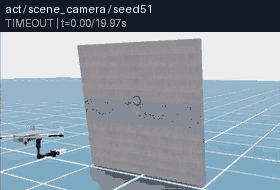](https://zipengdai.com/ambench/uaquad/#uaquad_policy_act_transfer) | 超时失败 · 19.992s | 超时失败 · 19.992s | 24.68 / 31.18 | seed51：[全景](usage_assets/animations/uaquad_policy_act_transfer_seed51_scene_camera.mp4) / [机载](usage_assets/animations/uaquad_policy_act_transfer_seed51_base_camera.mp4) / [末端](usage_assets/animations/uaquad_policy_act_transfer_seed51_ee_camera.mp4)<br>seed52：[全景](usage_assets/animations/uaquad_policy_act_transfer_seed52_scene_camera.mp4) / [机载](usage_assets/animations/uaquad_policy_act_transfer_seed52_base_camera.mp4) / [末端](usage_assets/animations/uaquad_policy_act_transfer_seed52_ee_camera.mp4) |
| DP：EE 数据一步权重迁移<br>[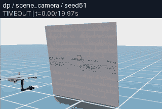](https://zipengdai.com/ambench/uaquad/#uaquad_policy_dp_transfer) | 超时失败 · 19.992s | 超时失败 · 19.992s | 28.35 / 30.51 | seed51：[全景](usage_assets/animations/uaquad_policy_dp_transfer_seed51_scene_camera.mp4) / [机载](usage_assets/animations/uaquad_policy_dp_transfer_seed51_base_camera.mp4) / [末端](usage_assets/animations/uaquad_policy_dp_transfer_seed51_ee_camera.mp4)<br>seed52：[全景](usage_assets/animations/uaquad_policy_dp_transfer_seed52_scene_camera.mp4) / [机载](usage_assets/animations/uaquad_policy_dp_transfer_seed52_base_camera.mp4) / [末端](usage_assets/animations/uaquad_policy_dp_transfer_seed52_ee_camera.mp4) |
| π₀：EE 数据一步微调权重迁移<br>[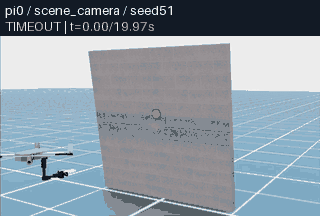](https://zipengdai.com/ambench/uaquad/#uaquad_policy_pi0_transfer) | 超时失败 · 19.992s | 超时失败 · 19.992s | 27.96 / 37.26 | seed51：[全景](usage_assets/animations/uaquad_policy_pi0_transfer_seed51_scene_camera.mp4) / [机载](usage_assets/animations/uaquad_policy_pi0_transfer_seed51_base_camera.mp4) / [末端](usage_assets/animations/uaquad_policy_pi0_transfer_seed51_ee_camera.mp4)<br>seed52：[全景](usage_assets/animations/uaquad_policy_pi0_transfer_seed52_scene_camera.mp4) / [机载](usage_assets/animations/uaquad_policy_pi0_transfer_seed52_base_camera.mp4) / [末端](usage_assets/animations/uaquad_policy_pi0_transfer_seed52_ee_camera.mp4) |
| π₀.₅：EE 数据一步微调权重迁移<br>[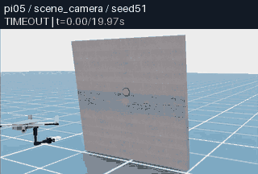](https://zipengdai.com/ambench/uaquad/#uaquad_policy_pi05_transfer) | 超时失败 · 19.992s | 超时失败 · 19.992s | 33.53 / 32.50 | seed51：[全景](usage_assets/animations/uaquad_policy_pi05_transfer_seed51_scene_camera.mp4) / [机载](usage_assets/animations/uaquad_policy_pi05_transfer_seed51_base_camera.mp4) / [末端](usage_assets/animations/uaquad_policy_pi05_transfer_seed51_ee_camera.mp4)<br>seed52：[全景](usage_assets/animations/uaquad_policy_pi05_transfer_seed52_scene_camera.mp4) / [机载](usage_assets/animations/uaquad_policy_pi05_transfer_seed52_base_camera.mp4) / [末端](usage_assets/animations/uaquad_policy_pi05_transfer_seed52_ee_camera.mp4) |
| ACT：UAQuad 数据一步 CPU 训练<br>[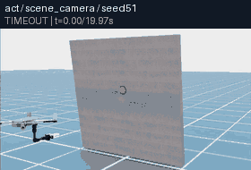](https://zipengdai.com/ambench/uaquad/#uaquad_policy_act_trained_step1) | 超时失败 · 19.992s | 超时失败 · 19.992s | 4.33 / 4.33 | seed51：[全景](usage_assets/animations/uaquad_policy_act_trained_step1_seed51_scene_camera.mp4) / [机载](usage_assets/animations/uaquad_policy_act_trained_step1_seed51_base_camera.mp4) / [末端](usage_assets/animations/uaquad_policy_act_trained_step1_seed51_ee_camera.mp4)<br>seed52：[全景](usage_assets/animations/uaquad_policy_act_trained_step1_seed52_scene_camera.mp4) / [机载](usage_assets/animations/uaquad_policy_act_trained_step1_seed52_base_camera.mp4) / [末端](usage_assets/animations/uaquad_policy_act_trained_step1_seed52_ee_camera.mp4) |
| DP：UAQuad 数据一步 CPU 训练<br>[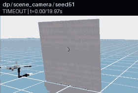](https://zipengdai.com/ambench/uaquad/#uaquad_policy_dp_trained_step1) | 超时失败 · 19.992s | 超时失败 · 19.992s | 30.98 / 38.05 | seed51：[全景](usage_assets/animations/uaquad_policy_dp_trained_step1_seed51_scene_camera.mp4) / [机载](usage_assets/animations/uaquad_policy_dp_trained_step1_seed51_base_camera.mp4) / [末端](usage_assets/animations/uaquad_policy_dp_trained_step1_seed51_ee_camera.mp4)<br>seed52：[全景](usage_assets/animations/uaquad_policy_dp_trained_step1_seed52_scene_camera.mp4) / [机载](usage_assets/animations/uaquad_policy_dp_trained_step1_seed52_base_camera.mp4) / [末端](usage_assets/animations/uaquad_policy_dp_trained_step1_seed52_ee_camera.mp4) |

这些平均误差描述下层对模型命令的跟踪；策略即使一直停留在初始位置附近，也可能得到较小跟踪误差而无法按下按钮。本轮没有足够训练和测试样本来判断模型是否掌握 UAQuad 操作，也不能据此做六组方法的性能排名。十二条均沿用默认未限幅条件，不能用这些接口试次证明硬件可部署。

| 真实试次 | 执行步数 | tracking timestep / 指标样本数 | 整条试次墙钟 s |
| --- | --- | --- | --- |
| `uaquad_policy_act_transfer_seed51` | 2399 | 2398 / 2397 | 131.1 |
| `uaquad_policy_act_transfer_seed52` | 2399 | 2398 / 2397 | 129.9 |
| `uaquad_policy_dp_transfer_seed51` | 2399 | 2398 / 2397 | 122.5 |
| `uaquad_policy_dp_transfer_seed52` | 2399 | 2398 / 2397 | 119.0 |
| `uaquad_policy_pi0_transfer_seed51` | 2399 | 2398 / 2397 | 277.9 |
| `uaquad_policy_pi0_transfer_seed52` | 2399 | 2398 / 2397 | 270.2 |
| `uaquad_policy_pi05_transfer_seed51` | 2399 | 2398 / 2397 | 299.2 |
| `uaquad_policy_pi05_transfer_seed52` | 2399 | 2398 / 2397 | 294.6 |
| `uaquad_policy_act_trained_step1_seed51` | 2399 | 2398 / 2397 | 136.0 |
| `uaquad_policy_act_trained_step1_seed52` | 2399 | 2398 / 2397 | 131.1 |
| `uaquad_policy_dp_trained_step1_seed51` | 2399 | 2398 / 2397 | 114.3 |
| `uaquad_policy_dp_trained_step1_seed52` | 2399 | 2398 / 2397 | 114.1 |

墙钟包含服务重启、权重与场景加载、推理、渲染和收尾验证，不能当作单次模型推理延迟。远端 CPU 推理与本地 Isaac 步进构成的是仿真时间中的闭环；这批记录没有验证真机实时控制带宽。

详细数值、训练来源、每条试次真实报告/视频/服务器身份 SHA 和指标定义保存在[模型实测摘要](usage_assets/uaquad/policy_trials.json)；实际权重来源保存在[训练清单](usage_assets/uaquad/training_provenance.json)与[模型规格](usage_assets/uaquad/policy_specs.json)。

<!-- END UAQUAD POLICY RESULTS -->

## 8. 本项目 real2sim2real 到了哪一步

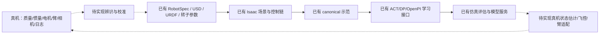

| 环节 | 当前已有 | 要完成真机迁移仍需补齐 |
| --- | --- | --- |
| real→sim 机体 | USD/URDF、质量/惯量读取、转子位置和方向、推力界限 | 用实测日志辨识质量/CoM/惯量、推力曲线、反扭矩系数、电机迟滞和电池影响 |
| real→sim 机械臂 | 刚体关节、夹爪、隐式位置执行器 | 实测扭矩/速度/延迟/回差、工具质量、接触与摩擦；核对 USD 与 URDF 参数 |
| real→sim 感知 | 配置相机内外参、观测与噪声接口 | 标定真实相机、状态估计、时间戳与延迟，处理遮挡/丢帧 |
| sim 中学习/验证 | 十二任务、专家、canonical 数据、IL 模型与 rollout | 足量 UAQuad 数据和训练、域随机化消融、匹配指标与多 seed 统计 |
| sim→real 动作 | 末端动作语义、IK/PID 与 remote policy 协议 | 飞控/臂驱动桥接、单位/坐标转换、实时环路、限幅、失联与接管逻辑 |
| real 闭环复测 | 当前没有本轮硬件试验 | 飞行日志、接触传感、硬件任务成功与回灌仿真校准 |

当前项目提供的是可组合的仿真和学习环节，仓库没有实现 UAQuad 的 PX4/MAVLink 飞行适配、自动系统辨识与真机迁移闭环。下列具体模型假设需要核对：

- 转子动态迟滞与变化率限制默认未配置；默认限幅、气动、风和噪声关闭。
- 仿真将合成后的净力/力矩施加到机体，再设置臂/夹爪关节目标；旋翼视觉旋转不等于 BLDC/ESC 的真实动态。
- UAQuad 运行时臂执行器配置的 effort limit 为 1000，而 URDF 的运动学描述中为 10；两者不能视为已校准的同一真机执行器。
- PID 使用仿真 articulation 的质量/惯量近似；相机和工具偏移来自作者的资产几何。它们需要真机测量证据。
- UAQuad 的非负推力与 roll/pitch—平移耦合必须进入硬件可行性检查；FAHexa 的 rank6 也仍受非负推力与推力上限约束。

对于常规四旋翼，可以在实机飞控的 position/yaw 或 attitude/thrust 接口处接入上层目标；具体接口取决于飞控模式和硬件。当前仓库没有实现该桥接，因此本文的 Docker/HTTP/WebSocket 命令用于仿真验证。

## 9. 欠驱动与全驱动：哪些代码共享，哪些需独立

| 层次 | 共享 | UAQuad 独立部分 | 全/过驱动独立部分 |
| --- | --- | --- | --- |
| 任务 | 十二族对象、场景、成功条件与专家状态机 | Task cfg 选择 UAQuad；少量任务 IK/工具覆盖 | 各 profile 的配置与接触行为 |
| 生命周期 | `BaseEnv` reset/step、`RobotIO`、`ControlPipeline` | UAQuad body/joint/EE 名称与末端转换 | 相应机型的句柄、末端和夹爪配置 |
| 运动学 | Pyroki/floating-base IK 实现 | `quad_scorpion.urdf`、四臂关节、roll/pitch 约束 | hexa/omni URDF、不同约束与关节数 |
| 飞行控制 | controller 公共输入输出与 reset | PID4、quad 增益、位置外环形成倾角 | PID6/L1；FAHexa MPC 专用模型/配置 |
| 分配与执行 | 通用 inverse/forward allocation、`ControllerOutput`、净 wrench 执行 | 平行固定轴，rank4 分支 | FAHexa 固定倾角 rank6；Omni 可变倾角与额外电机臂目标 |
| 数据与模型 | canonical 格式、动作语义、ACT/DP/OpenPI 框架与 transport | UAQuad 示范、相机、归一化、权重与专门评估 | 各机型数据/权重；FAHexa 的正式 BaseJoint 任务 |
| real2sim2real | 同一套参数/坐标/时序/硬件适配问题 | 四旋翼可行域、电机模型、状态估计、臂耦合与飞控桥接 | 额外侧向推力/倾转标定、执行器约束与分配器适配 |

UAQuad 当前正式注册的是 8D EE/PID 任务，**没有 UAQuad BaseJoint、UAQuad L1 或 UAQuad MPC 注册基线**。代码架构能够扩展这些组合，当前文档和成绩只覆盖实际注册/实测组合。UAHexa 与 UAQuad 共用 PID4 类，但 IK 运动学、机械臂轴向、转子数量与增益存在差异；换 profile 后仍需单独验证。

## 10. 技术总结与交付验收

1. 对常规无人机爱好者，UAQuad 是本项目最直接的入口；优先看外部全景理解倾斜与臂运动，再看机载/末端视角理解接近和接触。
2. 上层模型预测末端轨迹，下层 IK 和 PID4 将它变成受欠驱动约束的飞行动作。末端接口相同，机体可行域和相机分布仍然不同。
3. 多相机是同一次试验的观察证据；独立 `trial_id` 才计为不同试次，seed 与条件一并记录。本轮超时与成功都保留，默认未限幅与限幅/扰动组独立解释。
4. 当前数据/IL/仿真链可用；RL 训练器、真实飞控适配与自动 real2sim2real 闭环需要继续实现。实测负推力和超限指令直接揭示了默认仿真结果的硬件迁移限制。

### 10.1 为新一轮实验生成可离线播放的报告

完成第 6 节的 30 条专家和第 7.1 节的 12 条模型试次后，使用新的 `uaquad-new` 目录。模型规格与训练来源应对应实际使用的权重。下面的报告与媒体均写入忽略目录，已发布的历史录像保持其原始来源。

```bash
python3 scripts/research/summarize_uaquad_trials.py \
  --report-json outputs/research/uaquad-new/experts/results.json \
  --output-summary outputs/research/uaquad-new/trials.json \
  --output-trajectories outputs/research/uaquad-new/trajectories.json --require-complete
python3 scripts/research/summarize_uaquad_policies.py \
  --report-json outputs/research/uaquad-new/policy/results.json \
  --output outputs/research/uaquad-new/policy_trials.json
python3 scripts/research/build_uaquad_media_specs.py \
  --results-json outputs/research/uaquad-new/experts/results.json \
    outputs/research/uaquad-new/policy/results.json \
  --output outputs/research/uaquad-new/animation_specs.json
docker exec ambench-sim-research python scripts/research/export_usage_animations.py \
  --specs-json /workspace/ambench/outputs/research/uaquad-new/animation_specs.json \
  --source-root /workspace/ambench \
  --output-dir /workspace/ambench/outputs/research/uaquad-new/previews \
  --max-bytes 196608 --write-mp4
```

导出器在现有容器内只做 CPU 编解码，逐个核对源报告、视频首尾与完整 MP4 解码。它拒绝非空输出目录，不能用不同来源覆盖同名已发布证据。创建一个全新的离线站点目录，再安全合并这些预览：

```bash
python3 - <<'PY'
from pathlib import Path
media = Path('outputs/research/uaquad-new/site/animations')
media.mkdir(parents=True, exist_ok=False)
(media / 'manifest.json').write_text('[]\n')
PY
python3 scripts/research/build_uaquad_media_specs.py \
  --results-json outputs/research/uaquad-new/experts/results.json \
    outputs/research/uaquad-new/policy/results.json \
  --output outputs/research/uaquad-new/animation_specs.json \
  --merge-previews outputs/research/uaquad-new/previews \
  --media-dir outputs/research/uaquad-new/site/animations
python3 scripts/research/build_uaquad_gallery.py --strict \
  --manifest outputs/research/uaquad-new/site/animations/manifest.json \
  --summary outputs/research/uaquad-new/trials.json \
  --trajectories outputs/research/uaquad-new/trajectories.json \
  --animation-specs outputs/research/uaquad-new/animation_specs.json \
  --output outputs/research/uaquad-new/site/uaquad/index.html
python3 scripts/research/build_video_gallery.py \
  --manifest outputs/research/uaquad-new/site/animations/manifest.json \
  --output outputs/research/uaquad-new/site/playback.html
```

浏览器打开 `outputs/research/uaquad-new/site/uaquad/index.html`，即可在无服务端、无外部 JavaScript 包的情况下查看新一轮的三个同步视频和真实轨迹。严格构建要求 30 条脚本、12 条模型、126 路视频的来源与条件一致；未完成或来源不符时不会发布一份“全部通过”的页面。

<!-- BEGIN UAQUAD DELIVERY -->

**交付验收完成。** 本轮共 42 个独立仿真试次、126 路三视角录像；每条 MP4 都完成了线上加载、拖动到末段、解码与播放检查。桌面 1440 px、手机 390 px 的流程、筛选、推力滑块与同步播放通过检查。初次验收发现的外部 favicon 404 已用内嵌图标修复，最终页面 JavaScript 与资源错误均为零。图标修订只改变一个 `<head>` 标签，正文、脚本、录像与实验来源保持原样。

GitHub 上本手册的 21 个内嵌 GIF 可直接访问；373 个发布内容文件及发布清单完成字节数与 SHA256 下载校验，MP4 分段请求返回 `206`，支持拖动播放。详见 [验收摘要](usage_assets/uaquad/validation.json)、[在线交互页](https://zipengdai.com/ambench/uaquad/) 和记录最新研究提交及逐文件哈希的 [发布清单](https://zipengdai.com/ambench/release.json)。

README 保持原样。媒体使用普通 Git，全局单媒体文件最大 460,604 B，完整静态发布约 82.3 MB，低于 100 MB；原有 108 个媒体文件的哈希保留。长原片、数据集、权重和运行日志留在忽略目录，使用第 6、7、10.1 节命令重建。ACT/DP 专项训练各一个优化步；模型超时、推力超限与未实现的 RL/真实飞控闭环均已保留说明，没有真机飞行或收敛性能成绩。

<!-- END UAQUAD DELIVERY -->

官方扩展资料：[机器人](https://ambench.github.io/docs/extend/robot/)、[控制器](https://ambench.github.io/docs/extend/controller/)、[策略](https://ambench.github.io/docs/extend/policy/)、[工作流](https://ambench.github.io/docs/workflows/)。复现以本分支代码、保存的运行配置和真实实验报告为准。
