# AM-Bench 功能复现与验证记录

本手册对应 [AM-Bench 公开文档](https://ambench.github.io/docs/) 的任务、机型、控制器、扰动、脚本专家、数据集和 ACT / Diffusion Policy / OpenPI 工作流。Docker 构建、远端策略容器和 SSH 隧道先按 [note.md](note.md) 完成。宿主机命令从仓库根目录执行；标有“容器内”的仿真命令先执行 `docker exec -it ambench-sim-research bash`，在默认的可写 `/workspace/ambench-run` 下运行。这个目录链接到只读源码和可写数据目录，并为 MPC 保留可写的 acados 生成路径；命令中的 `scripts/...` 相对路径保持不变。远端策略容器仍以 `/workspace/ambench` 为工作目录。


图片是仓库自带的项目总览。下文的验证表只记录实际运行结果；静态注册检查、仿真 reset/step、脚本任务成功和模型评估分别记录，不能互相代替。

## 先看动作与结果

下面是同一 PressButton 场景的真实闭环：π₀.₅ 完成按压，ACT 到达 20 秒时限仍未完成。画面来自已验收的 2026-10-07 Docker 录像，结果读取对应评估报告；不是根据画面猜测成败。

| π₀.₅：成功，1/1 | ACT：超时未完成，0/1 |
| --- | --- |
| [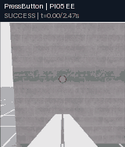](https://zipengdai.com/ambench/#policy_pi05_ee) | [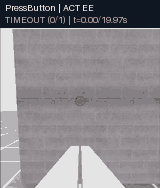](https://zipengdai.com/ambench/#policy_act_ee) |

本次发布共 **23 个实验组、54 段视频**；每组有 2–3 段记录。十二任务有 EE 与场景视角，四种飞机各有 EE、基座与外部全景，四个模型各保留旧基线及新试次的双视角。

**[直接打开在线实验视频总览](https://zipengdai.com/ambench/)**：点击下文任意 GIF，会定位到对应实验组；可播放、暂停、拖动、调速，展开“比较 seed 与视角”查看补充记录与技术详情。Markdown 中的 GIF 仍自动循环。网络不可用时，下载或克隆仓库后用浏览器打开[离线播放页](usage_assets/playback.html)，同时保留 `usage_assets/animations/` 目录。

下文 GIF 和原有结果表对应 2026-10-07、seed 42 的基线。在线实验组还收录 2026-10-08 的独立补录：十二任务的新场景视角、四种物理飞机的基座/外部场景相机及 BaseJoint 的基座相机、上层模型的双视角，以及两项相机/控制检查。新脚本采集固定 seed 43、每次调用只运行一个 episode，任务失败也保留；基础设施异常后的重跑作为独立试次标明。NDT 使用固定几何，seed 变化不代表布局发生变化。新模型的环境 seed 为 43、推理 seed 保持 42，推理设备由远端 GPU 改为 CPU；训练仍沿用 seed 42 的一步 checkpoint。每段实际结果和条件以[来源清单](usage_assets/animations/manifest.json)与在线卡片为准，不同 seed 独立统计，同一 `trial_id` 的多相机录像属于同一次试验。

这些预览保留原记录首尾，均匀采样、缩放并压缩，末帧停留约 1 秒，播放速度不等于实时速度。画面上的 `t` 是源记录时间：canonical 数据用仿真时间戳，MP4 用视频帧率计时，两者不一定相等。`SUCCESS` / `TIMEOUT` 是整段实验的最终结果，不表示第一帧已成功；`SMOKE` 只表示构造/reset/step 检查通过。完整原始录像、数据和 checkpoint 留在忽略目录；[动画来源清单](usage_assets/animations/manifest.json)记录源报告、源文件、预览文件的 SHA-256 与采样位置。导出步骤见第 6.1 节。

## 阅读路线

| 目标 | 章节 | 可得到的结果 |
| --- | --- | --- |
| 首次运行 Docker 仿真 | `note.md`、第 0–1 节 | 容器启动、106 个注册 ID 与第一个有界场景 |
| 检查五种机型及全部任务 | 第 1–3 节 | 控制组合、12 族场景、相机与扰动的逐项记录 |
| 采集示范并核验数据 | 第 4 节 | 脚本专家、遥操作入口与 canonical LeRobot 校验 |
| 训练及运行高层模型 | 第 5–6 节 | ACT、DP、π₀、π₀.₅ 的远端训练、服务和闭环评估 |
| 判断本分支已实际验证什么 | 第 7 节 | 测试产物、通过项和仍需完成的环节 |

## 0. 复现范围与证据

| 层级 | 通过条件 | 结果位置 |
| --- | --- | --- |
| 注册 | Isaac Sim 启动后 Gym registry 恰好含 106 个 AM-Bench ID，12 个任务族且各有脚本专家入口 | `list_envs.py` 输出、矩阵 JSON |
| 场景与低层 | 每个 ID 能构造、reset、执行至少 8 步；进程按上限退出 | `outputs/research/rebuild-20261007/matrix_verified.json` 与逐 ID 日志 |
| 脚本专家 | 对应任务生成至少 1 个完成成功判定的 episode | `<session>/lerobot/meta/episodes/` 与图像帧；使用 `--video` 时另存 MP4 |
| 数据 | canonical LeRobot validator 成功；DP/OpenPI 派生数据各自验证 | `<session>/lerobot/meta/info.json`、转换结果 |
| 模型 | 匹配 checkpoint 经过远端服务完成闭环 rollout | `eval_summary.json` 中 `status: "completed"` 和足量 rollout |

`zero_agent` 的成功只证明场景与控制流水线能推进。它不预示脚本专家必定成功，也不代表论文任务成功率。完整模型复现需要任务数据和 checkpoint；本仓库不提交这些生成物。[验证快照](usage_assets/validation_snapshot.json)保存最终 106 个 ID、12 个成功专家和四种高层模型 20 秒闭环的摘要，并记录本机原始报告的 SHA-256；大日志和模型权重仍留在忽略目录。

## 1. 环境注册与命名

```text
<Task>-Am-<Robot>-<Action>-<Controller>-Direct-v0
<Task>-Am-FAHexa-BaseJoint-Abs-<Controller>-Direct-v0
```

所有 12 族都注册下面 8 种基础配置，额外配置见表后。`EE` 是悬浮末端执行器的任务逻辑 oracle；物理飞行器是 UAQuad、UAHexa、FAHexa 和 OmniHexa。

| 机型 | 控制与动作 | 单族基础 ID 后缀 |
| --- | --- | --- |
| EE | 6 DoF PID、L1；EE 绝对位姿 | `EE-Abs-PID`、`EE-Abs-L1` |
| UAQuad | 4 DoF PID + Pyroki IK；EE 绝对位姿 | `UAQuad-Abs-PID` |
| UAHexa | 4 DoF PID + Pyroki IK；EE 绝对位姿 | `UAHexa-Abs-PID` |
| FAHexa | 6 DoF PID、L1 + Pyroki IK；另有 whole-body MPC | `FAHexa-Abs-PID`、`FAHexa-Abs-L1`、`FAHexa-Abs-MPC` |
| OmniHexa | 6 DoF PID + Pyroki IK；EE 绝对位姿 | `OmniHexa-Abs-PID` |

`PressButton`、`PushSlider`、`RotateValve` 各有 FAHexa BaseJoint PID/L1 两个额外 ID；这三个任务和 `LemonHarvesting` 各有一个 `EE-Abs-PID-Direct-Fast-v0`。合计 `12×8 + 3×2 + 4 = 106`。真实注册表永远由运行时 Gym registry 判定，不要靠字符串拼出未注册组合。

容器内执行：

```bash
python scripts/environments/list_envs.py
python scripts/research/verify_environment.py --list-json outputs/research/registry.json --headless
```

### 1.1 五种机型与三类控制器

下面每条命令各验证一个不同的实体或控制路径。单卡 16 GB 上每次只开一个 Isaac Sim 进程、`--num_envs 1`；若某个物理机型要首次生成 MPC 代码，应保留该项完整日志。

```bash
python scripts/research/verify_matrix.py --task-id PressButton-Am-EE-Abs-PID-Direct-v0 --steps 8 --timeout-s 180 --output-dir outputs/research/ee
python scripts/research/verify_matrix.py --task-id PressButton-Am-UAQuad-Abs-PID-Direct-v0 --steps 8 --timeout-s 180 --output-dir outputs/research/uaquad
python scripts/research/verify_matrix.py --task-id PressButton-Am-UAHexa-Abs-PID-Direct-v0 --steps 8 --timeout-s 180 --output-dir outputs/research/uahexa
python scripts/research/verify_matrix.py --task-id PressButton-Am-FAHexa-Abs-PID-Direct-v0 --steps 8 --timeout-s 180 --output-dir outputs/research/fahexa
python scripts/research/verify_matrix.py --task-id PressButton-Am-OmniHexa-Abs-PID-Direct-v0 --steps 8 --timeout-s 180 --output-dir outputs/research/omnihexa
python scripts/research/verify_matrix.py --task-id PressButton-Am-FAHexa-Abs-L1-Direct-v0 --steps 8 --timeout-s 180 --output-dir outputs/research/l1
python scripts/research/verify_matrix.py --task-id PressButton-Am-FAHexa-Abs-MPC-Direct-v0 --steps 8 --timeout-s 240 --output-dir outputs/research/mpc
python scripts/research/verify_matrix.py --task-id PressButton-Am-FAHexa-BaseJoint-Abs-PID-Direct-v0 --steps 8 --timeout-s 180 --output-dir outputs/research/basejoint
```

控制器公共契约在 `source/ambench/ambench/controllers/`，机型与动作组合在 `source/ambench/ambench/tasks/base/robot_profiles.py`。Pyroki 求逆运动学，PID/L1/MPC 负责低层控制。BaseJoint 动作绕过 IK，直接给基座位姿和关节目标。

## 2. 十二个任务与全部 106 种场景配置

| 任务前缀 | 时限 | 成功信号 | 额外配置 | 新成功示范帧数（120 Hz） |
| --- | ---: | --- | --- | ---: |
| `CabinetPickPlace` | 60 s | 罐体进抽屉指定高度且速度低于阈值 | 无 | 2755 |
| `FrameAssembly` | 30 s | 框架中心落在 peg 容差内 | 无 | 2995 |
| `LemonHarvesting` | 30 s | 柠檬进入容器且夹爪打开 | EE Fast | 1739 |
| `NDT` | 20 s | 末端在检测点保持指定步数 | 无 | 1213 |
| `OpenDoor` | 15 s | 门关节超过开启角 | 无 | 390 |
| `PegInHole` | 20 s | peg 尖端穿过孔坐标系的深度与横向边界 | 无 | 1043 |
| `PressButton` | 20 s | 按钮关节达到阈值 | BaseJoint PID/L1、EE Fast | 994 |
| `PullLever` | 20 s | 杠杆关节超过最小角度 | 无 | 916 |
| `PushSlider` | 26 s | 滑块关节达到目标 | BaseJoint PID/L1、EE Fast | 1353 |
| `RotateValve` | 20 s | 阀门关节达到目标角 | BaseJoint PID/L1、EE Fast | 1039 |
| `TossBall` | 10 s | 球在容器内释放、机体保持在要求区域 | 无 | 615 |
| `WipeWindow` | 20 s | 每个污渍满足接触清除条件 | 无 | 2239 |

表中示范均来自本次 seed 42 的 EE PID 采集，每族一个成功 episode，全部通过 canonical validator；来源为 `outputs/research/rebuild-20261007/scripted12_verified.json`。

WipeWindow 的公开评估时限是 20 秒。修正夹持并缩短后续局部擦拭轨迹后，EE PID 脚本专家已在该默认时限内完成四处污点清除：2026-10-07 重建后 seed 42 的成功示范为 2239 帧、120 Hz（约 18.7 秒），canonical LeRobot validator 通过。研究分支在 WipeWindow 场景中用固定关节保持海绵工具的夹持，因为原实现接触窗面时会脱手；这会改变工具动力学，跨分支比较成功率时应使用相同实现。此前 seed 未固定的 1747 帧示范和 40 秒测试保留在历史报告中，本次汇总只使用重建后的新结果。

固定工具关节还在本次重建后以 seed 42 通过双环境克隆检查：`outputs/research/rebuild-20261007/wipe_two_envs/results.json` 完成 8 步、动作形状 `(2, 8)`，两个环境均含接触传感器与 EE 相机。

先按每族 EE PID 做独立 smoke；随后运行注册表驱动的全量矩阵，含物理机型、L1、MPC、BaseJoint 与 Fast。脚本为每个 ID 保存退出状态和日志，中途一个失败不会掩盖其他条目。当前矩阵入口默认 `--seed 42`，每个 child 和汇总报告都保存 seed；此前 2026-09-30 的无固定 seed 报告作为历史记录保留。

```bash
python scripts/research/verify_matrix.py \
  --all --steps 8 --seed 42 --timeout-s 600 \
  --video-family-representatives --video-steps 60 \
  --output-dir outputs/research/rebuild-20261007/matrix
```

已有矩阵输出时，按 `results.json` 中的失败 ID 用 `--task-id` 重跑；修复后重新执行全量命令并换一个空的 `--output-dir` 生成新记录。工具会拒绝非空输出目录，防止旧结果混入。`--family PressButton` 与 `--robot FAHexa` 可用于缩小范围。NDT 首次加载远端仓库资产时，本次单项超过 240 秒，因此冷启动的全量命令使用 600 秒上限。机器上只有一张仿真 GPU，不要同时跑多个矩阵任务。

2026-10-07 删除旧镜像、重新构建后，固定 seed 42 的整份矩阵一次通过 106/106；12 个 EE PID 代表各录制 60 步，其他 ID 各推进 8 步。下面的合并器读取这份新报告和每个 child JSON，逐项核对步数、退出状态、日志与来源 SHA-256，并记录 seed；在仿真容器内运行。以下输出目录是本次验收路径，重复运行应换成新的空目录。2026-09-30 的首轮失败及修复记录作为历史保留在 `outputs/research/combined-final/`，不混入本次复测：

```bash
python scripts/research/merge_matrix_results.py \
  outputs/research/rebuild-20261007/matrix/results.json \
  --output outputs/research/rebuild-20261007/matrix_verified.json \
  --expect-count 106 --expect-families 12
```

矩阵中每族 EE PID 的 60 步录像可提取成可追溯的中间帧；脚本会同时写出源 MP4 和 PNG 的 SHA-256。以下命令在仿真容器内执行，`output-dir` 必须是空目录：

```bash
python scripts/research/extract_scene_frames.py \
  --results-json outputs/research/rebuild-20261007/matrix/results.json \
  --output-dir outputs/research/rebuild-20261007/scene_frames
```

### 2.1 十二类任务的成功动作过程

下列动画来自 2026-10-07 重建后、seed 42 的 EE PID 脚本专家 **保存的成功 episode**，从 canonical LeRobot 的 120 Hz EE 相机序列提取，覆盖开始到结束。成功依据 recorder、validator 和 `scripted12_verified.json`，不是场景 smoke。TossBall 在保存这一成功 episode 前有一次超时尝试；这组展示不能解释为十二个任务都首次尝试成功。

点击[视频播放总览](https://zipengdai.com/ambench/)可看全彩版本并暂停查看末尾；每个任务的原始帧数见上表。此前 60 步场景烟测的静态帧及[帧清单](usage_assets/scenes/manifest.json)继续保留，动画来源与采样位置见[动画清单](usage_assets/animations/manifest.json)。

| CabinetPickPlace | FrameAssembly |
| --- | --- |
| [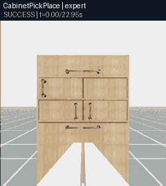](https://zipengdai.com/ambench/#expert_cabinetpickplace) | [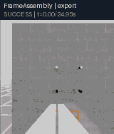](https://zipengdai.com/ambench/#expert_frameassembly) |
| LemonHarvesting | NDT |
| [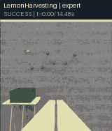](https://zipengdai.com/ambench/#expert_lemonharvesting) | [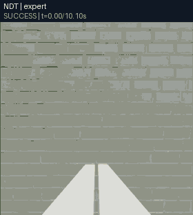](https://zipengdai.com/ambench/#expert_ndt) |
| OpenDoor | PegInHole |
| [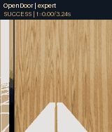](https://zipengdai.com/ambench/#expert_opendoor) | [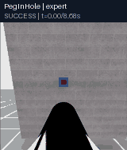](https://zipengdai.com/ambench/#expert_peginhole) |
| PressButton | PullLever |
| [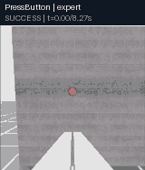](https://zipengdai.com/ambench/#expert_pressbutton) | [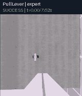](https://zipengdai.com/ambench/#expert_pulllever) |
| PushSlider | RotateValve |
| [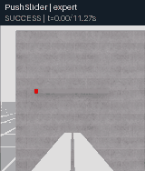](https://zipengdai.com/ambench/#expert_pushslider) | [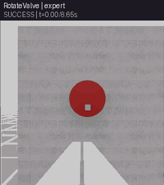](https://zipengdai.com/ambench/#expert_rotatevalve) |
| TossBall | WipeWindow |
| [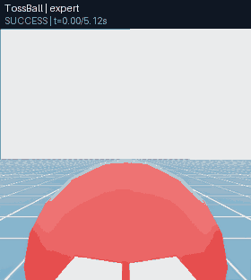](https://zipengdai.com/ambench/#expert_tossball) | [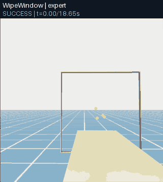](https://zipengdai.com/ambench/#expert_wipewindow) |

### 2.2 观察、动作、奖励与成功率

所有任务返回 Gymnasium 五元组 `obs, reward, terminated, truncated, info`。`obs["policy"]` 含末端位姿/速度、基座位姿/速度、夹爪宽度，物理机型还含机械臂关节状态；任务再添加目标与物体状态。四元数采用 WXYZ；位置相对各环境 origin。EE 绝对动作为位置 3 + 四元数 4 + 夹爪 1，共 8 维；BaseJoint 为基座位置 3 + 四元数 4 + 机械臂关节 4 + 夹爪 1，共 12 维。

当前任务 reward 为零。最终成功由 `terminated` 表示，时间上限由 `truncated` 表示。有命名子任务的场景在 `info["success_criteria"]` 中返回布尔状态；评估器记录每项是否曾达到。要比较模型，使用相同任务 ID、配置、seed、动作语义、策略频率、相机、扰动和 episode 上限。

## 3. 物理、扰动与相机

默认物理步长为 `1/120 s`。`BaseEnvCfg` 提供动作噪声、观察噪声、转子饱和、气动效应、风力五个独立开关；默认全关。气动效应包括地面、近墙与阻力，风向量由具体 robot spec 给出；只打开风力开关而保持默认零向量不会产生风。EE oracle 没有转子，因此不应用于飞行动力学结论。

一个不改注册表的扰动评估入口是模型 evaluator 的 `--disturbance`，它共同开启饱和、气动和风力开关。研究单个效应时，应在派生环境配置中只改变目标字段并注册新的 ID，记录完整 `env_cfg.yaml`。相机由机型 profile 配置，常用 `ee_camera`、`base_camera`；部分场景还可用 `scene_camera`。

要检查相机实际画面，容器内运行一个有界录像：

```bash
timeout --signal=INT 45s python scripts/environments/zero_agent.py \
  --task PressButton-Am-EE-Abs-PID-Direct-v0 \
  --num_envs 1 --video --camera_names ee_camera --headless --device cuda:0
```

这会在忽略目录 `videos/` 产生 MP4。`zero_agent.py` 是连续运行器，超时应发生在 scene/reset/step 已开始之后；检查子进程确实退出。该录像展示相机和场景，不代表专家动作。

下图保留 2026-09-30 的历史 Docker 实测：`PressButton-Am-EE-Abs-PID-Direct-v0`、`verify_matrix.py --task-id ... --video-task-id ... --video-steps 8`、单环境、EE 相机；8/8 步通过。帧取自 `outputs/research/press-ee-video-20260930T1744/` 的 MP4 中间帧，画面显示灰墙、红色按钮和白色夹爪。它是场景检查，不是按下按钮后的成功画面。

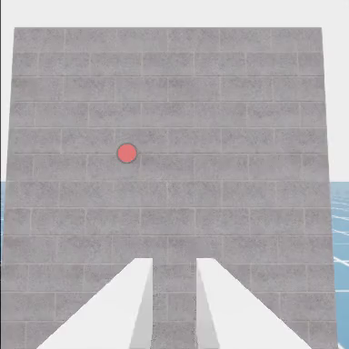

物理机型也已跑通独立相机：下面保留 2026-09-30 的历史画面，UAQuad PID 在 PressButton 场景用 `base_camera` 录制 30 步，取第 14 帧。容器内复现命令为：

```bash
python scripts/research/verify_matrix.py \
  --task-id PressButton-Am-UAQuad-Abs-PID-Direct-v0 \
  --video-task-id PressButton-Am-UAQuad-Abs-PID-Direct-v0 \
  --video-camera-name base_camera --video-steps 30 \
  --seed 42 --timeout-s 600 \
  --output-dir outputs/research/rebuild-20261007/uaquad_base_camera
```

[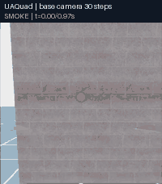](https://zipengdai.com/ambench/#uaquad_base_camera)

2026-10-07 重建后，UAQuad 相机检查再次以 seed 42 完成 30 步并保存 MP4，见 `outputs/research/rebuild-20261007/uaquad_base_camera/results.json`。

上面的动画使用这次新录像；源片段按 30 FPS 编码约 1 秒，为便于查看放慢播放。实际 30 个仿真步约 0.25 秒；此检查每步录一帧，录像时间不能直接作为仿真时间。[全彩相机视频](https://zipengdai.com/ambench/#uaquad_base_camera)和历史[静态帧](usage_assets/press_button_uaquad_base_camera.png)分别保留。

FAHexa PID 的扰动组合也已在本次重建后以 seed 42 执行 8 步，包括转子饱和、气动、1 N 的 X 向风、动作噪声和观察噪声；这些设置与实际测试一致：

```bash
python scripts/research/verify_matrix.py \
  --task-id PressButton-Am-FAHexa-Abs-PID-Direct-v0 \
  --disturbance --wind-force 1 0 0 --action-noise --observation-noise \
  --steps 8 --seed 42 --timeout-s 600 \
  --output-dir outputs/research/rebuild-20261007/fahexa_disturbance
```

MPC 的 acados 会在当前目录生成 C 代码和模型 JSON。仿真容器默认位于可写 `/workspace/ambench-run`，因此普通 `zero_agent.py` 和 ACT/DP 评估入口可直接使用 MPC 任务 ID，源码仍只读。GUI 遥操作的 X11 启动命令和无头恢复命令见 [note.md](note.md)。本分支的额外实测如下：

| 功能 | 有界实测结果 |
| --- | --- |
| MPC 相对结果与录像路径 | 最终镜像中 `verify_environment.py` 的相对 `--result-json` 与 `--video-dir` 均写入指定目录；seed 42、8/8 步，9 帧 384×384 MP4 可解码，acados 在新目录编译。来源 `outputs/research/rebuild-20261007/direct_mpc_relative/records/probe.json`。 |
| FAHexa MPC 普通入口 | 2026-10-07 最终镜像下的 `zero_agent.py --task PressButton-Am-FAHexa-Abs-MPC-Direct-v0 --num_envs 1 --headless --device cuda:0` 完成 reset 和 3,151 次步进，新 acados C 代码编译成功；75 秒上限 exit 124，生成物仅在 Docker 工作卷。来源 `outputs/research/rebuild-20261007/mpc_normal_cwd.log`；公共连续入口未固定 seed。 |
| 本地 X11 GUI 与键盘设备 | 最终镜像启动 Isaac Sim 5.1.0 窗口和 `Se3Keyboard`；向唯一匹配当前容器 teleop PID 的 X11 client 发送软件 `R` press/release，日志先后出现 `Reset triggered` 与 `Environment reset complete`。180 秒上限 exit 124 后子进程已回收并恢复无头 compose。来源 `outputs/research/rebuild-20261007/gui/teleop.log`；这是定向软件回调检查，未执行人工成功示范。 |

直接复现 MPC 相对产物路径检查，容器内运行：

```bash
timeout --signal=INT --kill-after=10s 600s python scripts/research/verify_environment.py \
  --task PressButton-Am-FAHexa-Abs-MPC-Direct-v0 --steps 8 --seed 42 \
  --result-json outputs/research/rebuild-20261007/direct_mpc_relative/records/probe.json \
  --video-dir outputs/research/rebuild-20261007/direct_mpc_relative/videos \
  --headless --device cuda:0
```

GUI 检查先通过只读 X11 查询匹配窗口标题、`_NET_WM_PID` 与当前容器的 teleop 进程，再仅向该 client 发送 `R`。第一次仅按标题查找发现两个同名窗口，因此拒绝发送；补充进程匹配后 public reset 回调通过。全过程没有向其他桌面窗口发送事件。SpaceMouse/gamepad 未连接，真实设备输入和人工任务成功示范仍未验证。

[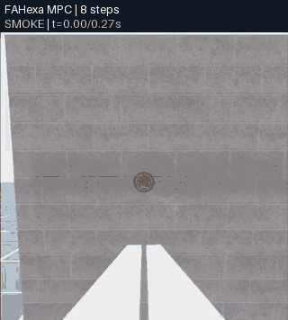](https://zipengdai.com/ambench/#mpc_smoke)

MPC 片段仅覆盖 8 步（实际约 0.067 仿真秒；源录像按 30 FPS 编码约 0.3 秒，预览放慢），标记为 `SMOKE`；它显示相机输出，不构成 MPC 专家成功证据。[全彩 MPC 预览](https://zipengdai.com/ambench/#mpc_smoke)。

## 4. 十二个脚本专家与 canonical 数据

每个注册 ID 都携带 `scripted_policy_entry_point`。脚本专家使用任务状态机，经当前机器人控制流水线执行；BaseJoint 录制器通过当前 profile 的 IK 配置把专家 EE 目标转换为基座与关节绝对命令。先在 EE PID 下为每族取一条成功示范，随后检查各机型上的适用性。

全部 12 族的有界采集和 canonical 验证已在重建镜像中逐项通过。可一次运行下面的整组命令；它与本次分批采集使用相同的 seed 42、默认时限和校验条件，输出目录应为空：

```bash
python scripts/research/verify_scripted.py \
  --seed 42 --timeout-s 600 --output-dir outputs/research/rebuild-20261007/scripted_all
python scripts/research/merge_scripted_results.py \
  outputs/research/rebuild-20261007/scripted_all/results.json \
  --output outputs/research/rebuild-20261007/scripted12_verified.json \
  --expect-families 12
```

先单独查一个任务可加 `--family PressButton` 并改用空的输出目录；给该单族测试加 `--video` 会保存额外 MP4，已在 PressButton 上实测。该脚本以每族 EE PID 作为任务逻辑基线；FAHexa BaseJoint PressButton 另有一条成功示范。四种物理飞行器的 PressButton PID 专家也均完成一条成功示范和 canonical validator，记录如下；这些单次结果不能推断其他任务的飞行专家成功率。

| PressButton 物理机型 | 成功示范数 | canonical 帧数（120 Hz） | recorder + validator |
| --- | ---: | ---: | --- |
| UAQuad PID | 1 | 1031 | 通过 |
| UAHexa PID | 1 | 1005 | 通过 |
| FAHexa PID | 1 | 999 | 通过 |
| OmniHexa PID | 1 | 992 | 通过 |

结果来自重建镜像的 `outputs/research/rebuild-20261007/scripted_press_physical/results.json`：四条新示范均在默认 20 秒 episode 内成功，seed 42，canonical validator 通过。验证脚本记录 seed 与 episode 上限；使用公共采集器时也需加 `--seed 42` 固定任务随机化与专家轨迹。此前无固定 seed 的补测保留为历史。

| UAQuad：PressButton 成功 | UAHexa：PressButton 成功 |
| --- | --- |
| [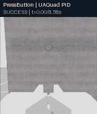](https://zipengdai.com/ambench/#physical_uaquad) | [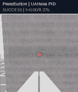](https://zipengdai.com/ambench/#physical_uahexa) |
| FAHexa：PressButton 成功 | OmniHexa：PressButton 成功 |
| [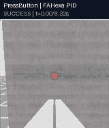](https://zipengdai.com/ambench/#physical_fahexa) | [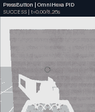](https://zipengdai.com/ambench/#physical_omnihexa) |

2026-10-08 补录的外部全景可同时看到飞机、机械臂、墙面和接触动作；下列 seed 43 记录各为一条成功 episode，均通过 canonical 校验。点击可与上面的 seed 42 EE 相机及同 seed 的另一条基座相机试次比较：

| UAQuad：外部全景 | UAHexa：外部全景 |
| --- | --- |
| [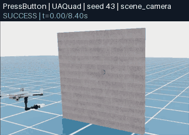](https://zipengdai.com/ambench/#physical_uaquad) | [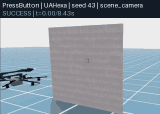](https://zipengdai.com/ambench/#physical_uahexa) |
| FAHexa：外部全景 | OmniHexa：外部全景 |
| [](https://zipengdai.com/ambench/#physical_fahexa) | [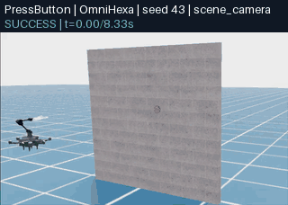](https://zipengdai.com/ambench/#physical_omnihexa) |

这些动画是四种物理机型经各自控制流水线完成按钮任务的 EE 相机记录；只支持本任务、各一条成功示范的结论。机器人外观和飞行轨迹未必都在末端相机视野内；点击 GIF 可在[视频总览](https://zipengdai.com/ambench/)选择同机型的 seed 43 基座或外部场景记录，查看近距离操作与整机飞行。这两个补充视角分别运行，使用不同 `trial_id`，结果逐段标记。seed 42 成功基线的复现命令：

```bash
python scripts/research/verify_scripted.py \
  --task-id PressButton-Am-UAQuad-Abs-PID-Direct-v0 \
  --task-id PressButton-Am-UAHexa-Abs-PID-Direct-v0 \
  --task-id PressButton-Am-FAHexa-Abs-PID-Direct-v0 \
  --task-id PressButton-Am-OmniHexa-Abs-PID-Direct-v0 \
  --seed 42 --timeout-s 600 --output-dir outputs/research/rebuild-20261007/scripted_press_physical
```

容器内运行单任务示例：

```bash
python scripts/data/record_demos_scripted.py \
  --task PressButton-Am-EE-Abs-PID-Direct-v0 \
  --dataset_root datasets/press_button_smoke \
  --repo_id am_bench/pressbutton_ee_absolute \
  --state_keys ee_pos ee_quat gripper_width \
  --task_prompt "press the button" \
  --step_hz 120 --num_envs 1 --num_demos 1 --env_length_s 20 --seed 42 \
  --camera_names ee_camera --video --headless --device cuda:0
```

脚本默认只保存成功 episode，`--num_demos 1` 的含义是一个成功 episode；失败的尝试不计数。调试失败可加 `--save_failed_episodes`，但这些 episode 不能算成功示范。录制成功后，在同一个容器终端定位最新 session 并用验证器检查：

```bash
SESSION_INFO=$(find datasets/press_button_smoke -type f -path '*/lerobot/meta/info.json' | sort | tail -n 1)
SESSION_ROOT=${SESSION_INFO%/lerobot/meta/info.json}
test -f "$SESSION_ROOT/lerobot/meta/info.json"
python scripts/data/validate_lerobotdataset.py \
  --dataset_root "$SESSION_ROOT" \
  --repo_id am_bench/pressbutton_ee_absolute --target_hz 20
```

PressButton EE 的完整成功过程见第 2.1 节；[全彩专家视频](https://zipengdai.com/ambench/#expert_pressbutton)来自本次重建后的 994 帧 canonical 序列。2026-09-30 的[历史成功帧](usage_assets/press_button_scripted_success_near_final.png)及[附加图像清单](usage_assets/evidence_manifest.json)保留作历史证据。

BaseJoint 数据应使用匹配 ID 和有序 state keys：

```bash
python scripts/data/record_demos_scripted.py \
  --task PressButton-Am-FAHexa-BaseJoint-Abs-PID-Direct-v0 \
  --dataset_root datasets/press_button_base_joint \
  --repo_id am_bench/press_button_base_joint_absolute \
  --state_keys base_pos base_quat arm_joint_pos gripper_width \
  --task_prompt "press the button" \
  --step_hz 120 --num_envs 1 --num_demos 1 --env_length_s 20 --seed 42 \
  --camera_names ee_camera \
  --headless --device cuda:0
```

这个 BaseJoint 配置已在 2026-10-07 重建镜像内用 seed 42 完整采集和校验，结果为 `outputs/research/rebuild-20261007/scripted_press_base_joint/results.json`：1 条成功 episode、999 帧、12 维 `observation.state` 与 `action`，`base_joint_absolute` 动作语义，默认时限 20 秒。独立结果不会计入 12 族 EE PID 汇总。第 5.0 节给出了这次 EE/BaseJoint fixture 的完整复现与上传命令。

[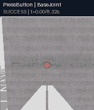](https://zipengdai.com/ambench/#expert_base_joint)

[全彩 BaseJoint 专家视频](https://zipengdai.com/ambench/#expert_base_joint)展示这条保存的成功 episode；这里展示的是脚本专家，四个学习模型的短 BaseJoint 接口烟测结果另见第 5.5 节。

合并器核对每条新示范的 recorder、validator、LeRobot metadata 和任务时限，并记录 seed。上面的整组采集命令可直接生成第 7 节需要的 `scripted12_verified.json`。本次实际运行先采集了第 5.0 节的 PressButton EE fixture，再采集其余 11 族；验收报告由 `scripted_press_ee/results.json` 与 `scripted_other11/results.json` 两份新报告合并，未混入历史结果。

人工遥操作使用 `python scripts/data/record_demos_teleop.py --task PressButton-Am-EE-Abs-PID-Direct-v0 --help` 查看设备选项；它需要可见的 Isaac Sim 窗口和受支持输入设备。与脚本录制相同，遥操作输出也是 canonical LeRobot 数据。

### 4.1 数据格式与派生格式

```text
<session-root>/
  env_cfg.yaml
  lerobot/meta/info.json
  lerobot/meta/episodes/
  lerobot/data/
  lerobot/images/ 或 lerobot/videos/
  videos/  # 可选
```

源数据 LeRobot 0.4.4 的帧含 `observation.state`、`action`、`task` 与 `observation.images.<camera>`。`meta/info.json` 中 `ambench.action_semantics` 必须为 `ee_absolute` 或 `base_joint_absolute`，`state_keys` 记录 state 拼接顺序。模型训练使用相对目标时，由策略适配器或导出脚本从绝对动作源计算，源数据仍保留绝对语义。

本次模型数据链使用第 5.0 节新采集的 seed 42 EE/BaseJoint canonical session，分别同步到远端 `/data/datasets/press_button_ee_rebuild_20261007/lerobot` 与 `/data/datasets/press_button_base_joint_rebuild_20261007/lerobot`。ACT 直接读取 canonical 数据；DP 的 zarr 转换与 validator 命令见第 5.2 节；OpenPI reader 所需的 v2.1 导出与 norm stats 命令见第 5.3 节。派生目录、repo ID、训练 checkpoint 和闭环评估都使用同一个 `rebuild-20261007` 运行名，重复时统一换为新的空目录。

多任务导出使用 `--task_prompt_map scripts/data/am_bench_language_instructions.json --require_task_prompt_map`，把各任务的 canonical session 一起传入。若已在本地仿真容器导出，也可用 `tools/research/sync_openpi_export.sh` 将 v2.1 repo 上传到远端相同布局；同步脚本拒绝覆盖已有目录。数据、配置和评估命令见下一节。

## 5. ACT、Diffusion Policy 与 OpenPI 的双容器闭环

远端策略 Docker 持有 checkpoint 和高层模型；本地 Isaac Docker 采集相机与状态、运行低层控制并保存评估。先按 [note.md](note.md) 部署两个镜像并建立 SSH 隧道。2026-10-07 重建使用新采集的 seed 42 PressButton canonical 数据；本节的训练各为 **1 步接口验证**，EE 使用 20 秒时限并允许成功提前结束，BaseJoint 评估 0.5 秒。此前 2026-09-30 的 OpenPI 两步训练和旧目录属于历史记录。

以下路径记录此次使用的独立新目录。再次复现时统一更换 `rebuild-20261007` 这个运行名，保留已有结果；实际训练与闭环结果见第 5.5 节。

### 5.0 同步本次 canonical 数据

在本地仿真容器分别采集并验证 EE 与 BaseJoint fixture，两个命令各执行一次：

```bash
python scripts/research/verify_scripted.py \
  --family PressButton --seed 42 --video --timeout-s 600 \
  --output-dir outputs/research/rebuild-20261007/scripted_press_ee
python scripts/research/verify_scripted.py \
  --task-id PressButton-Am-FAHexa-BaseJoint-Abs-PID-Direct-v0 \
  --seed 42 --video --timeout-s 600 \
  --output-dir outputs/research/rebuild-20261007/scripted_press_base_joint
```

本次 EE 得到 1 个成功 episode / 994 个 120 Hz 帧，state/action 为 8 维 `ee_absolute`；BaseJoint 为 1 个成功 episode / 999 帧、12 维 `base_joint_absolute`。两者均在默认 20 秒任务内成功，canonical validator 通过，`env_cfg.yaml` 记录 seed 42。从本地宿主机定位对应 session 并上传：

```bash
EE_INFO=$(find outputs/research/rebuild-20261007/scripted_press_ee -type f -path '*/lerobot/meta/info.json' | sort | tail -n 1)
BJ_INFO=$(find outputs/research/rebuild-20261007/scripted_press_base_joint -type f -path '*/lerobot/meta/info.json' | sort | tail -n 1)
EE_SESSION=${EE_INFO%/lerobot/meta/info.json}
BJ_SESSION=${BJ_INFO%/lerobot/meta/info.json}
test -f "$EE_SESSION/lerobot/meta/info.json"
test -f "$BJ_SESSION/lerobot/meta/info.json"
bash tools/research/sync_dataset.sh "$EE_SESSION" press_button_ee_rebuild_20261007
bash tools/research/sync_dataset.sh "$BJ_SESSION" press_button_base_joint_rebuild_20261007
```

上传脚本拒绝覆盖已有远端目录。已有本次数据和 checkpoint 时可直接从 5.4 加载服务；重新采集、导出和训练时，为整套命令统一换一个未占用的 run/session 前缀，包括两个同步名称、派生数据 home、stats、训练输出和 checkpoint 路径。下面路径记录此次实际验收配置。后续训练与导出命令均在**远端策略容器**执行：

```bash
ssh -t tencent-86 'docker exec -it -w /workspace/ambench ambench-policy-research bash'
```

### 5.1 ACT

ACT 直接读取 canonical LeRobot，在训练时从绝对源计算相对动作。EE 使用以下固定的 20 Hz、一训练步配置：

```bash
/opt/venvs/act/bin/python -m ambench_learn.policies.act.train \
  --dataset.repo_id=am_bench/pressbutton_ee_absolute \
  --dataset.root=/data/datasets/press_button_ee_rebuild_20261007/lerobot \
  --dataset.use_imagenet_stats=true \
  --policy.type=act --policy.chunk_size=16 --policy.n_action_steps=8 \
  --policy.device=cuda --policy.push_to_hub=false \
  --output_dir=/data/checkpoints/rebuild-20261007/act_press_button_smoke \
  --job_name=press_button_ee_act_rebuild --batch_size=8 --steps=1 --seed=42 \
  --num_workers=0 --save_freq=1 --wandb.enable=false --policy_target_hz=20 \
  --policy_action_representation=ee_local_relative
```

BaseJoint 的命令替换四项：

| 参数 | BaseJoint 值 |
| --- | --- |
| `--dataset.repo_id` | `am_bench/press_button_base_joint_absolute` |
| `--dataset.root` | `/data/datasets/press_button_base_joint_rebuild_20261007/lerobot` |
| `--output_dir` | `/data/checkpoints/rebuild-20261007/act_press_button_base_joint_smoke` |
| `--policy_action_representation` | `base_joint_relative` |

保持其余参数不变并用独立 job name。`benchmark_dataset_report.json` 记录实际逻辑帧数：EE 为 `994 // 6 = 165`，BaseJoint 为 `999 // 6 = 166`；不足一个完整采样间隔的尾部帧不进入训练。ACT 相对动作不能跨观测锚点做 temporal ensembling。

### 5.2 Diffusion Policy

本版本的 DP 训练使用仓库固定 UMI 源码内的 `train.py`；公共评估入口为 `python -m ambench_learn.policies.dp.eval`。

在远端容器从相同 canonical session 导出 UMI zarr 并验证：

```bash
/opt/venvs/dp/bin/python scripts/data/dp/lerobot_to_zarr.py \
  --input_path /data/datasets/press_button_ee_rebuild_20261007 \
  --output_path /data/datasets/press_button_ee_rebuild_20261007.zarr.zip --omit_base_image
/opt/venvs/dp/bin/python scripts/data/dp/validate_zarr.py \
  /data/datasets/press_button_ee_rebuild_20261007.zarr.zip --image_size 224
```

BaseJoint 导出使用同样命令，将两个 `press_button_ee_rebuild_20261007` 改为 `press_button_base_joint_rebuild_20261007`。下面一步训练使用随机初始化的 ResNet18，不下载默认视觉编码器权重；checkpoint 保存完整 Hydra config：

```bash
cd source/ambench_learn/ambench_learn/policies/dp/universal_manipulation_interface
WANDB_MODE=disabled /opt/venvs/dp/bin/python train.py \
  --config-name=train_diffusion_unet_timm_umi_workspace \
  task=umi_drone_ee_pos \
  task.dataset_path=/data/datasets/press_button_ee_rebuild_20261007.zarr.zip \
  task.obs_down_sample_steps=6 task.action_horizon=16 \
  task.pose_repr.obs_pose_repr=relative task.pose_repr.action_pose_repr=relative \
  policy.obs_encoder.model_name=resnet18 policy.obs_encoder.pretrained=false \
  policy.obs_encoder.feature_aggregation=avg policy.obs_encoder.transforms=null \
  'policy.down_dims=[64,128]' policy.diffusion_step_embed_dim=64 \
  policy.num_inference_steps=4 policy.noise_scheduler.num_train_timesteps=8 \
  training.num_epochs=1 training.max_train_steps=1 training.max_val_steps=1 \
  training.device=cuda:0 training.seed=42 \
  dataloader.batch_size=1 dataloader.num_workers=0 dataloader.persistent_workers=false \
  val_dataloader.batch_size=1 val_dataloader.num_workers=0 val_dataloader.persistent_workers=false \
  exp_name=press_button_dp_ee_rebuild logging.name=press_button_dp_ee_rebuild \
  logging.mode=disabled hydra.run.dir=/data/outputs/rebuild-20261007/press_button_dp_smoke
```

BaseJoint 使用 `task=umi_drone_base_joint`、对应 BaseJoint zarr、独立的 exp/logging name 和 `hydra.run.dir=/data/outputs/rebuild-20261007/press_button_dp_base_joint_smoke`。只有一个示范 episode 时，验证集为空；一步训练检查数据、优化和 checkpoint 保存。DP evaluator 当前每次运行一个环境。

### 5.3 OpenPI π₀ / π₀.₅

OpenPI 使用 `ext/openpi` 的固定版本和独立 Python 环境；训练入口是该上游版本的 `scripts.train_pytorch`，公共评估入口为 `python -m ambench_learn.policies.pi.eval`。两个模型共享 canonical 源；训练前分别准备配置、norm stats 和官方 base 权重。以下两个配置对应 EE：

| 模型 | 配置名 |
| --- | --- |
| π₀ | `pi0_am_bench_multitask_openpi_original_20hz_h50_ee_local_relative` |
| π₀.₅ | `pi05_am_bench_multitask_openpi_original_20hz_h50_ee_local_relative` |

先从**本地宿主机**执行校验和同步脚本；下载与文件校验在无 GPU 策略 Docker 内执行，已有有效缓存可复用：

```bash
bash tools/research/fetch_openpi_base.sh pi0
bash tools/research/fetch_openpi_base.sh pi05
```

远端策略容器的 ACT 环境将同一份 canonical 数据导出成固定 reader 的 LeRobot v2.1。此次使用独立的 dataset home 保存新导出，同时保留配置要求的 repo ID：

```bash
cd /workspace/ambench
/opt/venvs/act/bin/python scripts/data/export_lerobot_to_openpi.py \
  --dataset_roots /data/datasets/press_button_ee_rebuild_20261007 \
  --repo_id am_bench/multitask_openpi_original_20hz_ee_local_relative \
  --output_root /data/datasets/openpi-rebuild-20261007/am_bench/multitask_openpi_original_20hz_ee_local_relative \
  --target_hz 20 --omit_base_image --task_prompt 'press the button'
```

BaseJoint 替换源为 `/data/datasets/press_button_base_joint_rebuild_20261007`，repo ID 和 output root 末尾替换为 `am_bench/multitask_base_joint_openpi_original_20hz_base_joint_relative`。多任务导出把各任务 canonical session 传给 `--dataset_roots`，并用 `--task_prompt_map scripts/data/am_bench_language_instructions.json --require_task_prompt_map` 保持任务语言映射。

以下以 π₀.₅ EE 为例，转换在 CPU 上执行，norm stats 和训练读取新的 dataset home。运行 π₀ 时将开头的 `pi05` 改为 `pi0`：

```bash
cd /opt/openpi
export HF_LEROBOT_HOME=/data/datasets/openpi-rebuild-20261007
export JAX_PLATFORMS=cpu
PI_CONFIG=pi05_am_bench_multitask_openpi_original_20hz_h50_ee_local_relative
BASE_NAME=pi05_base
/opt/openpi/.venv/bin/python examples/convert_jax_model_to_pytorch.py \
  --checkpoint-dir "/data/cache/openpi/openpi-assets/checkpoints/$BASE_NAME" \
  --config-name "$PI_CONFIG" \
  --output-path "/data/checkpoints/openpi-rebuild-20261007/${BASE_NAME}_pytorch"
/opt/openpi/.venv/bin/python -m scripts.compute_norm_stats \
  --config-name "$PI_CONFIG" --assets-base-dir /data/assets/rebuild-20261007 \
  --repo-id am_bench/multitask_openpi_original_20hz_ee_local_relative --num-workers 2
/opt/openpi/.venv/bin/torchrun --standalone --nnodes=1 --nproc_per_node=1 \
  -m scripts.train_pytorch "$PI_CONFIG" --exp-name rebuild-20261007 \
  --pytorch-weight-path "/data/checkpoints/openpi-rebuild-20261007/${BASE_NAME}_pytorch" \
  --assets-base-dir /data/assets/rebuild-20261007 \
  --checkpoint-base-dir /data/checkpoints/openpi-rebuild-20261007 \
  --data.repo-id am_bench/multitask_openpi_original_20hz_ee_local_relative \
  --batch-size 1 --num-train-steps 1 --num-workers 0 --seed 42 \
  --save-interval 1 --no-resume --no-overwrite --no-wandb-enabled
```

`--pytorch-weight-path` 指向包含 `model.safetensors` 的目录。BaseJoint 使用 `pi0_am_bench_multitask_base_joint_openpi_original_20hz_h50_base_joint_relative` 或对应 `pi05_...` 配置、BaseJoint repo ID，并单独计算 norm stats 和训练；两个模型可复用各自已经转换的 base PyTorch 目录。数据 repo ID、配置、stats 和 checkpoint 必须匹配。

### 5.4 启动真实模型服务并运行 Isaac 闭环

从本地宿主机启动服务，等待健康检查完成。`start_policy.sh` 顶部显式配置 `INFERENCE_SEED=42`，在远端 Python 中设置 random、NumPy 和 Torch 的随机种子，日志输出 `REMOTE_INFERENCE_SEED=42`。每次启动会停止前一个高层服务；重启恢复远端随机推理的起点。ACT/DP 用 HTTP 8001，OpenPI 用 WebSocket 8000；SSH 隧道只向本地 loopback 转发。

先以 EE ACT 为例检查真实权重调用，再重新启动同一服务开始固定 seed 的评估：

```bash
bash tools/research/start_policy.sh act \
  /data/checkpoints/rebuild-20261007/act_press_button_smoke/checkpoints/last/pretrained_model
bash tools/research/wait_policy.sh act
docker exec ambench-sim-research python \
  source/ambench_learn/tests/policies/remote/smoke_remote_transport.py \
  --policy act --remote-url http://127.0.0.1:8001

bash tools/research/start_policy.sh act \
  /data/checkpoints/rebuild-20261007/act_press_button_smoke/checkpoints/last/pretrained_model
bash tools/research/wait_policy.sh act
docker exec ambench-sim-research python -m ambench_learn.policies.act.eval \
  --task PressButton-Am-EE-Abs-PID-Direct-v0 \
  --remote-url http://127.0.0.1:8001 --policy-id act_ee_rebuild_step1 \
  --num-rollouts 1 --num-envs 1 --seed 42 --n-action-steps 8 --policy-target-hz 20 \
  --episode-length-s 20 --output-dir outputs/research/rebuild-20261007/policy_rpc/act_isaac_full20s \
  --save-video --video-camera-names ee_camera --progress-every 240 --headless --device cuda:0
```

DP 对应的真实 checkpoint 与评估如下；可在评估前用 `smoke_remote_transport.py --policy dp` 做 HTTP 前向，再重启同一服务：

```bash
bash tools/research/start_policy.sh dp \
  /data/outputs/rebuild-20261007/press_button_dp_smoke/checkpoints/latest.ckpt
bash tools/research/wait_policy.sh dp
docker exec ambench-sim-research python -m ambench_learn.policies.dp.eval \
  --task PressButton-Am-EE-Abs-PID-Direct-v0 \
  --remote-url http://127.0.0.1:8001 --policy-id dp_ee_rebuild_step1 \
  --num-rollouts 1 --num-envs 1 --seed 42 --episode-length-s 20 \
  --output-dir outputs/research/rebuild-20261007/policy_rpc/dp_isaac_full20s \
  --save-video --video-camera-names ee_camera --progress-every 240 --headless --device cuda:0
```

OpenPI 从训练生成的一步目录加载；把下面 `pi05` 改为 `pi0`，即可运行另一模型。WebSocket 前向检查用 `smoke_openpi_transport.py --host 127.0.0.1 --port 8000`，随后重启服务再评估：

```bash
PI_CONFIG=pi05_am_bench_multitask_openpi_original_20hz_h50_ee_local_relative
bash tools/research/start_policy.sh pi "$PI_CONFIG" \
  "/data/checkpoints/openpi-rebuild-20261007/$PI_CONFIG/rebuild-20261007/1"
bash tools/research/wait_policy.sh pi
docker exec ambench-sim-research python -m ambench_learn.policies.pi.eval \
  --host 127.0.0.1 --port 8000 --task PressButton-Am-EE-Abs-PID-Direct-v0 \
  --prompt 'press the button' --policy-id pi05_ee_rebuild_step1 \
  --num-rollouts 1 --num-envs 1 --seed 42 --n-action-steps 8 --policy-target-hz 20 \
  --episode-length-s 20 --output-dir outputs/research/rebuild-20261007/policy_rpc/pi05_isaac_full20s \
  --save-video --video-camera-names ee_camera --progress-every 240 --headless --device cuda:0
```

BaseJoint 分别启动下表的真实一步权重，再用相应 `eval` 命令。共同替换环境为 `PressButton-Am-FAHexa-BaseJoint-Abs-PID-Direct-v0`，设置 `--seed 42 --episode-length-s 0.5 --progress-every 10`，保持相机录像和单环境。输出目录使用 `outputs/research/rebuild-20261007/policy_rpc/<model>_base_joint_isaac_step1`，policy ID 使用 `<model>_base_joint_rebuild_step1`：

| 模型 | BaseJoint checkpoint |
| --- | --- |
| ACT | `/data/checkpoints/rebuild-20261007/act_press_button_base_joint_smoke/checkpoints/last/pretrained_model` |
| DP | `/data/outputs/rebuild-20261007/press_button_dp_base_joint_smoke/checkpoints/latest.ckpt` |
| π₀ | `/data/checkpoints/openpi-rebuild-20261007/pi0_am_bench_multitask_base_joint_openpi_original_20hz_h50_base_joint_relative/rebuild-20261007/1` |
| π₀.₅ | `/data/checkpoints/openpi-rebuild-20261007/pi05_am_bench_multitask_base_joint_openpi_original_20hz_h50_base_joint_relative/rebuild-20261007/1` |

OpenPI 的 BaseJoint 服务配置也替换成表内 checkpoint 的配置名。模型名在路径中分别为 `act`、`dp`、`pi0`、`pi05`。HTTP/WS 前向检查的 BaseJoint 参数为 `--action-semantics base_joint_absolute`。

### 5.5 本次重建的策略结果

新策略镜像内的动作契约、导出、评估工具和协议测试已通过：ACT/shared 37 项、DP 10 项、OpenPI adapter 17 项。生产镜像没有开发测试依赖；重建后在**远端策略 Docker 内**安装以下固定测试包，再运行对应套件。首次 OpenPI 测试缺少 `pynvml`，下面的安装命令已包含修正；宿主机无需安装这些包。

```bash
cd /workspace/ambench
uv pip install --python /opt/venvs/act/bin/python pytest==8.4.2
uv pip install --python /opt/venvs/dp/bin/python pytest==8.4.2
uv pip install --python /opt/openpi/.venv/bin/python \
  pytest==8.4.2 pynvml==13.0.1 nvidia-ml-py==13.590.48
/opt/venvs/act/bin/python -m pytest -q \
  source/ambench_learn/tests/data/test_action_contract.py \
  source/ambench_learn/tests/data/test_openpi_export.py \
  source/ambench_learn/tests/policies/act/test_act_eval_utils.py \
  source/ambench_learn/tests/policies/act/test_se_relative_processor.py \
  source/ambench_learn/tests/policies/pi/test_pi_eval_utils.py \
  source/ambench_learn/tests/eval/test_eval_common.py \
  source/ambench_learn/tests/eval/test_eval_run.py \
  source/ambench_learn/tests/policies/remote/test_protocol.py
/opt/venvs/dp/bin/python -m pytest -q \
  source/ambench_learn/tests/data/test_dp_zarr_export.py \
  source/ambench_learn/tests/policies/dp/test_dp_eval_utils.py \
  source/ambench_learn/tests/policies/remote/test_protocol.py
cd /opt/openpi
JAX_PLATFORMS=cpu /opt/openpi/.venv/bin/python -m pytest -q src/openpi/policies/am_bench_policy_test.py
```

EE 与 BaseJoint 的 ACT、DP、π₀、π₀.₅ 共八个训练任务均完成一步优化和 checkpoint 保存。保存的 ACT train config、OpenPI metadata 和 DP Hydra config 均核对 seed 42；四套 OpenPI stats 与两个导出报告匹配新的 canonical 源。[训练验收快照](usage_assets/policy_training_snapshot.json)保留配置、原始日志和退出码的 SHA-256。完整报告为 `outputs/research/rebuild-20261007/policy_training/training_validation.json`，原始日志在其 `raw_gates/` 子目录，远端来源为 `/data/outputs/rebuild-20261007/policy-gates/`。

| 模型 | EE 训练 loss | BaseJoint 训练 loss | 训练步数 |
| --- | --- | --- | --- |
| ACT | 默认日志间隔未输出 | 默认日志间隔未输出 | 各 1 |
| DP | 1.060095 | 1.140075 | 各 1 |
| π₀ | 0.0930 | 0.1633 | 各 1 |
| π₀.₅ | 0.0547 | 0.0256 | 各 1 |

ACT 默认 `log_freq=200`，因此一步运行没有 loss 日志。八项 transport gate 已通过真实 checkpoint reload 与有限动作前向：ACT 返回 `(1, 8)` / `(1, 12)`，DP 返回插值后的 `(96, 8)` / `(96, 12)`，π₀ 和 π₀.₅ 返回 `(50, 8)` / `(50, 12)`。每项服务日志均记录 `REMOTE_INFERENCE_SEED=42`；闭环前再次重启服务以恢复随机推理起点。

八项 Isaac 闭环均 `completed`，完整产物与录像已逐项验收。EE 使用默认 20 秒任务时限，π₀ 和 π₀.₅ 在任务成功后提前结束；BaseJoint 为 0.5 秒接口烟测。两侧随机种子均为 42：

| 模型 | 模式 / 时限 | 仿真步数 | 任务成功 | MP4 解码帧 | 评估耗时（秒） |
| --- | --- | --- | --- | --- | --- |
| ACT | EE / 20 s | 2399 | 0/1 | 600 | 83.135 |
| DP | EE / 20 s | 2399 | 0/1 | 600 | 65.298 |
| π₀ | EE / 20 s | 443 | 1/1 | 110 | 7.825 |
| π₀.₅ | EE / 20 s | 298 | 1/1 | 75 | 5.868 |
| ACT | BaseJoint / 0.5 s | 59 | 0/1 | 14 | 3.562 |
| DP | BaseJoint / 0.5 s | 59 | 0/1 | 14 | 3.336 |
| π₀ | BaseJoint / 0.5 s | 59 | 0/1 | 14 | 2.757 |
| π₀.₅ | BaseJoint / 0.5 s | 59 | 0/1 | 14 | 2.702 |

[闭环产物验收快照](usage_assets/policy_artifact_snapshot.json)记录所有 summary、完整 env config、results、tracking/analysis、checkpoint、服务日志、调用顺序与视频的来源和 SHA-256；原始报告为 `outputs/research/rebuild-20261007/policy_rpc/artifact_validation.json`。下列动画覆盖四个 EE rollout 的录像首尾，成功以环境终止条件判定。ACT 和 DP 的 `completed` 表示闭环执行完毕，两者实际均超时，任务成功为 0/1。

| π₀：443 步成功 | π₀.₅：298 步成功 |
| --- | --- |
| [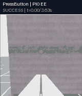](https://zipengdai.com/ambench/#policy_pi0_ee) | [](https://zipengdai.com/ambench/#policy_pi05_ee) |
| ACT：20 秒超时，0/1 | DP：20 秒超时，0/1 |
| [](https://zipengdai.com/ambench/#policy_act_ee) | [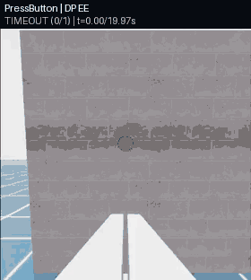](https://zipengdai.com/ambench/#policy_dp_ee) |

全彩预览：[ACT](https://zipengdai.com/ambench/#policy_act_ee)、[DP](https://zipengdai.com/ambench/#policy_dp_ee)、[π₀](https://zipengdai.com/ambench/#policy_pi0_ee)、[π₀.₅](https://zipengdai.com/ambench/#policy_pi05_ee)；也可在[视频总览](https://zipengdai.com/ambench/)暂停、拖动或调速比较。两条成功录像的原始静态帧仍见[帧提取记录](usage_assets/policy_success_frames_manifest.json)。

本次训练和 rollout 使用同一个 seed 的单条 PressButton 示范；π₀/π₀.₅ 的各一次成功不能推断多任务成绩或泛化成功率。一步训练与短 BaseJoint 烟测不能作为论文性能复现。

## 6. 评估记录与可视化

三个公共 evaluator 均保存解析后的完整 `env_cfg.yaml`、`results.txt`、`eval_summary.json`、tracking JSONL 和 `tracking/analysis.json`。ACT/DP 的远端 checkpoint 路径记录在 summary 的 `metadata.Server metadata`；OpenPI 的来源按服务配置、实际启动参数和 checkpoint 哈希核对。第 5 节原始基线评估显式指定 seed 42；第 6.2 节补录使用环境 seed 43，并单独记录推理 seed 与设备。

验收一个评估目录时，同时检查 `status: "completed"`、rollout 数、步骤、环境 ID、seed、动作语义、服务来源和 checkpoint。保存录像时用 `--save-video --video-camera-names ee_camera`，还要实际解码 MP4 并确认帧数大于零。进程 exit 0 而缺少 summary 不算通过；本次曾遇到长期运行的旧容器失去 GPU 访问，恢复方法见 [note.md](note.md)。

EE 20 秒评估与 BaseJoint 0.5 秒评估分别记录。任务成功以环境的终止条件判定，视频仅提供画面证据；`completed` 本身不能推断任务成功。原始录像、checkpoint、示范和日志保持在忽略目录；经核验的代表帧、短预览及小型结果摘要放到 `usage_assets/`，并记录出处与哈希。

### 6.1 从真实实验重新导出 GIF 与视频

本页预览来自 2026-10-07 的基线和 2026-10-08 的补录。先完成第 6.2 节的真实运行，再按[导出配置](usage_assets/animation_specs.json)生成 GIF 和全彩 MP4。导出器使用现有仿真 Docker 中的 Pillow、OpenCV、PyArrow 与 PyAV，CPU 运行，不启动 Isaac Sim；源为 MP4 或 canonical Parquet 的相机图像。每项配置指定源报告、单个 episode、最终结果字段，以及 seed、相机、试次等条件；它不补造中间帧，也不将多个 episode 拼接成一次运行。

从仓库根目录在**宿主机**执行；输出目录必须为空，重复导出请更改目录名：

```bash
docker exec ambench-sim-research python scripts/research/export_usage_animations.py \
  --specs-json usage_assets/animation_specs.json \
  --source-root /workspace/ambench \
  --output-dir outputs/research/usage-animations-repeat-01 \
  --write-mp4
```

脚本逐项读取真实报告中的最终结果，保留源图像序列首尾，并完整解码验证导出的 GIF/MP4。每段文件最多 450 KiB；GIF 根据内容减少颜色或尺寸，全彩 MP4 保留采样序列。`manifest.json` 写入结果字段、源报告与源文件 SHA-256、采样帧/时间、播放参数和每个预览的 SHA-256。模型超时会标记 `TIMEOUT (0/1)`，不会因 evaluator 正常退出而改标成功。

核验输出后，可在**宿主机**更新本页预览：

```bash
cp outputs/research/usage-animations-repeat-01/*.gif usage_assets/animations/
cp outputs/research/usage-animations-repeat-01/*.mp4 usage_assets/animations/
cp outputs/research/usage-animations-repeat-01/manifest.json usage_assets/animations/
python3 scripts/research/build_video_gallery.py \
  --manifest usage_assets/animations/manifest.json \
  --output usage_assets/playback.html
python3 scripts/research/check_media_release.py --history-ref all
```

最后两个 `python3` 命令只用宿主机现有 Python 标准库生成静态文件、核验哈希和 Git 历史，不安装任何包。生成器把清单嵌入 HTML，离线与在线均无需 `fetch`。发布检查读取预览文件及所有本地 refs 的完整历史，要求 GIF/MP4 为普通 Git 文件、每段不超过 450 KiB、可达 Git blob 小于 100,000,000 字节；媒体解码由导出器完成。

换一次新的实验运行时，把配置里的 `rebuild-20261007` / `multiview-20261008` 报告和视频路径统一改成新运行名，保留 `experiment_id` 作为实验组锚点，并为独立运行指定新的 `trial_id`。同一运行的两个视角使用相同 `trial_id`、结果与条件。专家 session 从报告读取，无须手填时间戳目录；重排报告时同步修改 `session_root_path`、`outcome_path` 和 `metadata_paths` 的 selector。显式条件放在 `metadata`，可从原始报告读取的条件用 `metadata_paths`，避免只凭文件名推断 seed。生成器更新结果、时长、条件和总数，逐项与原报告核对后发布。原始大录像和数据仍不提交；`usage_assets/animations/.gitattributes` 将小预览作为普通 Git 文件保存，离线克隆无需下载 LFS 内容。

### 6.2 单次尝试、不同 seed 与多相机的真实补录

在线总览按 `experiment_id` 把原始记录与新记录放在同一实验组；每段独立标记条件和结果。下面各层证明的范围保持一致：

| 实验组 | seed 42 基线 | 2026-10-08 补录 | 解释方式 |
| --- | --- | --- | --- |
| 十二任务专家 | 保存的 EE PID 成功 episode、EE 相机 | seed 43，每次调用一条尝试，场景相机；超时或失败也保存 | 新 seed 是独立 episode；NDT 固定几何；基础设施重跑独立标记 |
| 四种物理飞机 | PressButton 成功 episode、EE 相机 | seed 43，基座与外部场景相机各独立运行一次 | 仅覆盖按钮任务；两种视角为不同 trial，逐段判断成败 |
| FAHexa BaseJoint 专家 | 12D 绝对动作、成功 episode、EE 相机 | seed 43，单次尝试、基座相机 | 保持 `base_joint_absolute`，不与 8D EE 动作混用 |
| ACT、DP、π₀、π₀.₅ | seed 42、远端 GPU 推理、EE 相机 | 环境 seed 43、远端 CPU 推理，同一 rollout 的 EE 与场景相机 | 推理 seed 与训练 seed 均为 42；seed 和设备同时变化，不能单独归因 |
| 相机与 MPC | 有界 SMOKE | 补充另一相机的有界记录 | 展示构造/reset/step，任务成功未验证 |

这组专家补录用于验证与可视化，相机选择不会替换第 5 节的训练数据。模型继续使用原 EE 相机的 canonical 数据和一步 checkpoint；双视角评估中的 `scene_camera` 只负责录像，推理输入仍为 `ee_camera`。

**脚本专家补录。** 从宿主机运行下面的驱动；它按[录制配置](usage_assets/variant_recording_specs.json)在本地单 GPU 上串行执行，输出目录必须为空。本次原始运行名是 `multiview-20261008`；重复运行用下例的新目录，再相应更新导出配置：

```bash
docker exec ambench-sim-research python scripts/research/record_usage_variants.py \
  --specs-json usage_assets/variant_recording_specs.json \
  --output-dir outputs/research/multiview-repeat-01/experts \
  --timeout-s 600
```

单项复现可增加 `--name expert_pressbutton_seed43_scene` 或 `--name physical_uaquad_seed43_scene` 并使用另一个空输出目录。驱动使用公共录制器的 `--max_episodes 1 --save_failed_episodes`，每个完成的 session 恰好一条完整尝试；`episode_outcomes.json` 记录成功/超时、步数与初始数值观测，canonical validator 核验保存的数据。驱动报告的 `completed` 表示录制与校验完成，任务成绩仍以 `termination_reason` 为准；录制器超时 episode 的退出码为 1，驱动会按这一结果核对并保存，而不会追加尝试直到成功。FrameAssembly 首轮日志在任务 success 后退出但未完整保存，原因未确认；它不计入可展示的成功记录。相同 seed 的重跑已完成采集与校验，使用独立目录与试次标签，原失败日志保留；保存异常不作为任务失败率。

物理飞机的基座相机接近墙面时可能遮挡整机外观，因此另补外部场景相机记录。两个视角分别启动独立 episode，即使 seed 相同也使用不同 `trial_id`；它们用于观察近距离操作与整机飞行，不能当作同一次试验的同步视角。模型的 EE / 场景双录像则来自同一个 evaluator rollout，共享 `trial_id`。

需要自己控制两个相机时，可在仿真容器内直接使用公共入口：

```bash
python scripts/data/record_demos_scripted.py \
  --task PressButton-Am-EE-Abs-PID-Direct-v0 \
  --dataset_root outputs/research/multiview-repeat-01/public_press \
  --repo_id am_bench/pressbutton_ee_absolute \
  --state_keys ee_pos ee_quat gripper_width --task_prompt 'press the button' \
  --step_hz 120 --num_envs 1 --num_demos 1 \
  --max_episodes 1 --save_failed_episodes --env_length_s 20 --seed 43 \
  --camera_names ee_camera scene_camera \
  --scene_camera_width 640 --scene_camera_height 384 \
  --scene_camera_position -2 -2.5 1.6 --scene_camera_look_at 2 0 1 \
  --video --headless --device cuda:0
```

两段录像来自同一次尝试，导出时使用同一个 `trial_id`。NDT 的检测点/环境几何是固定配置，新 seed 仅重置随机状态；需要不同视角时按录制配置调整相机位置，不能把它描述成新布局。场景相机预览保留原始横纵比；在线页面从清单读取视频宽高，避免裁掉机器人或目标。

**模型 CPU 补录。** 远端 GPU 在本次补录时均忙，服务在远端策略 Docker 内用 CPU 运行，仿真仍在本地 Docker。`--cpu` 隐藏该服务的 CUDA 设备；`start_policy.sh` 仍设置 `INFERENCE_SEED=42`。从本地宿主机启动服务和第 5.4 节的 SSH 隧道，等待服务就绪后只执行一次双视角 rollout：

```bash
bash tools/research/start_policy.sh --cpu act \
  /data/checkpoints/rebuild-20261007/act_press_button_smoke/checkpoints/last/pretrained_model
bash tools/research/wait_policy.sh act 600
docker exec ambench-sim-research python -m ambench_learn.policies.act.eval \
  --task PressButton-Am-EE-Abs-PID-Direct-v0 \
  --remote-url http://127.0.0.1:8001 --policy-id act_ee_seed43_cpu \
  --num-rollouts 1 --num-envs 1 --seed 43 --n-action-steps 8 --policy-target-hz 20 \
  --episode-length-s 20 --output-dir outputs/research/multiview-repeat-01/policy/act \
  --save-video --video-camera-names ee_camera scene_camera \
  --progress-every 240 --headless --device cuda:0
```

DP 和 OpenPI 依次使用以下 CPU 服务；每启动另一种服务，都先结束上一个评估。DP evaluator 用第 5.4 节的 DP 命令，改为 `--seed 43 --video-camera-names ee_camera scene_camera` 和新的空目录 `outputs/research/multiview-repeat-01/policy/dp`。OpenPI evaluator 同样替换 seed、两相机与对应模型目录；推理频率、动作块和时限保持第 5.4 节设置：

```bash
bash tools/research/start_policy.sh --cpu dp \
  /data/outputs/rebuild-20261007/press_button_dp_smoke/checkpoints/latest.ckpt
bash tools/research/wait_policy.sh dp 600

PI_CONFIG=pi05_am_bench_multitask_openpi_original_20hz_h50_ee_local_relative
bash tools/research/start_policy.sh --cpu pi "$PI_CONFIG" \
  "/data/checkpoints/openpi-rebuild-20261007/$PI_CONFIG/rebuild-20261007/1"
bash tools/research/wait_policy.sh pi 600
```

将最后一组服务和 evaluator 的 `pi05` 替换为 `pi0` 即运行 π₀；各服务和评估顺序执行。CPU 可能增加服务加载及推理的墙钟时间，20 秒仍是仿真时限。新旧录像同时改变环境 seed 和推理设备，存在设备因素；一次成功或超时不能说明模型因布局变化而改善/退化，也不能作为泛化率。专家 sidecar 额外保存初始数值观测；模型初始画面由源视频首帧保留。实际步数、推理设备、checkpoint 和最终结果按 trial 保存在清单与原始报告中。

2026-10-08 的实际补录结果见[多视角验收快照](usage_assets/multiview_validation_snapshot.json)：21 条专家录制均完成并通过 canonical 校验；相机与 MPC 两项检查通过。四个模型各进行一条 seed 43 / CPU rollout，每条产生两段同步视角，结果均为超时；这八段视频代表四条 rollout。

| 模型 | seed 42 / GPU 基线 | seed 43 / CPU 补录 | 新记录 |
| --- | --- | --- | --- |
| ACT | 20 秒超时，0/1 | 2399 步，超时，0/1 | [EE 与场景双视角](https://zipengdai.com/ambench/#policy_act_ee) |
| Diffusion Policy | 20 秒超时，0/1 | 2399 步，超时，0/1 | [EE 与场景双视角](https://zipengdai.com/ambench/#policy_dp_ee) |
| π₀ | 443 步成功，1/1 | 2399 步，超时，0/1 | [EE 与场景双视角](https://zipengdai.com/ambench/#policy_pi0_ee) |
| π₀.₅ | 298 步成功，1/1 | 2399 步，超时，0/1 | [EE 与场景双视角](https://zipengdai.com/ambench/#policy_pi05_ee) |

两组条件同时改变了环境 seed 和推理设备，表中变化不能单独归因。所有模型仍为一步训练的接口验证 checkpoint；成功与超时都保留，不能作为论文成绩或泛化率。

**两项 SMOKE 的另一相机。** 第 3 节的 UAQuad 30 步命令可换成 `--video-camera-name ee_camera --seed 43` 并使用新目录；MPC 8 步命令同样可换成 `base_camera`。每段仍标记 `SMOKE`，实际仿真秒数由步数乘以 `1/120` 得到，源 MP4 的编码秒数按其 FPS 计算。把结果报告与录像作为新的导出项，记录对应相机和独立 `trial_id`。

### 6.3 核验并发布在线播放页

在线入口为 **[https://zipengdai.com/ambench/](https://zipengdai.com/ambench/)**；每个实验组的锚点使用原有名称，例如 [PressButton 专家](https://zipengdai.com/ambench/#expert_pressbutton)、[ACT](https://zipengdai.com/ambench/#policy_act_ee)。页面和仓库中的离线页使用同一份内嵌清单，因此可直接对照 seed、相机、结果、动作语义、初始观测与来源哈希。

在宿主机先生成页面、检查媒体并暂存可审阅的发布文件：

```bash
python3 scripts/research/build_video_gallery.py
python3 scripts/research/check_media_release.py --history-ref all
python3 tools/research/publish_video_pages.py --dry-run
```

`--dry-run` 只在忽略目录 `outputs/research/pages-<timestamp>/` 生成静态站点，不修改 GitHub。检查该目录的 `index.html`、预览和 `release.json`；发布清单记录 research commit、每个发布文件哈希和站点总大小，动画清单保留试次来源与条件，整个 artifact 须小于 100,000,000 字节。站点仅包含播放器、短预览和校验清单，完整数据/模型/原始录像保留在实验目录。

将要发布的源码、文档、预览和清单提交到 `research`、推送该分支并确认工作区干净后运行：

```bash
python3 tools/research/publish_video_pages.py --publish
```

发布器创建并推送 `gh-pages` 的正常提交，无需切换当前 research 工作区。在仓库 Settings → Pages 中选择 `gh-pages`、根目录 `/` 作为来源；本站沿用账号的自定义域名 `zipengdai.com`，项目路径为 `/ambench/`。等待 Pages 构建结束后，在在线站点实测至少一段视频能播放、暂停、拖动和调速，验证实验锚点、比较展开、过滤、技术条件与本地清单一致；HTTP 200 或看到封面还不足以证明视频可播放。网络暂不可用时仍可用仓库中的[离线页](usage_assets/playback.html)。

## 7. 本分支验证记录

本节以 2026-10-07 删除旧研究镜像、重新构建后的结果为主要证据。下面的矩阵、脚本采集和模型训练统一 seed 42；公共 `zero_agent.py` / teleop 连续 smoke 保留默认 seed 未设置，单独注明。2026-10-08 新 seed / 新视角 / CPU 推理记录按第 6.2 节和在线清单独立解释；表内基线成绩对应原始验收报告。此前 2026-09-30 及未固定 seed 的报告保留为历史，不参与本次合并。在**本地主机的仓库根目录**从原始报告生成[验证快照](usage_assets/validation_snapshot.json)：

```bash
python3 scripts/research/snapshot_validation.py \
  --matrix outputs/research/rebuild-20261007/matrix_verified.json \
  --scripted outputs/research/rebuild-20261007/scripted12_verified.json \
  --policy-root outputs/research/rebuild-20261007/policy_rpc \
  --require-base-joint \
  --output usage_assets/validation_snapshot.json
```

| 项目 | 状态 | 证据或原因 |
| --- | --- | --- |
| 仿真镜像与无源码挂载导入 | 通过 | 最终镜像 `sha256:09bb607e…`、源码 `02d1499`；Isaac Sim 5.1.0、Python 3.11、Torch 2.7.0+cu128，独立容器不挂载仓库也可导入包及查看 CLI；实际运行容器 CUDA/NVML 正常 |
| 策略镜像、部署与单元测试 | 通过 | 最终本地镜像 `sha256:3c5858e7…`、远端实际 ID `ba710cfc…`，内容指纹一致、源码 `02d1499`；仅映射最小空闲 GPU 0，8000/8001 仅绑定 loopback。ACT/shared 37 项、DP 10 项、OpenPI adapter 17 项通过，详见第 5.5 节与[重建快照](usage_assets/rebuild_snapshot.json) |
| 106/106 注册与 reset/step | 通过（全新单轮） | `outputs/research/rebuild-20261007/matrix_verified.json`：106/106、12 族、5 个机器人标签，逐 ID child JSON/退出码/步数核对；12 类 EE PID 各 60 步及 MP4，其余各 8 步；全部 seed 42 |
| MPC 新 solver 生成 | 通过 | 全量矩阵的 12 个 MPC ID 在各自新 `matrix/mpc_build/<task>` 下重新编译 acados C 代码并完成步进，源码目录只读 |
| 12/12 EE PID 脚本专家 | 通过（每族一条成功示范） | `outputs/research/rebuild-20261007/scripted12_verified.json`；全部默认任务时限、seed 42、成功 episode 与 canonical validator；帧数见第 2 节，WipeWindow 为 2239 帧/约 18.7 秒，20 秒时限内成功 |
| 四种物理机型 PressButton 专家 | 通过（每机型一条） | `outputs/research/rebuild-20261007/scripted_press_physical/results.json`：UAQuad 1031、UAHexa 1005、FAHexa 999、OmniHexa 992 帧，seed 42、20 秒默认时限、四条成功示范和 validator 均通过 |
| FAHexa BaseJoint 专家 | 通过（单任务） | `outputs/research/rebuild-20261007/scripted_press_base_joint/results.json`：999 帧、20 秒默认时限、seed 42、成功 episode、12 维 state/action、`base_joint_absolute`、validator exit 0 |
| UAQuad base_camera | 通过 | `outputs/research/rebuild-20261007/uaquad_base_camera/results.json`：seed 42、30/30 步与可解码 MP4 |
| FAHexa 扰动组合 | 通过 | `outputs/research/rebuild-20261007/fahexa_disturbance/results.json`：seed 42、8/8 步；饱和、气动、X 向 1 N 风、动作和观察噪声共同启用 |
| WipeWindow 双环境克隆 | 通过 | `outputs/research/rebuild-20261007/wipe_two_envs/results.json`：seed 42、两个环境、8/8 步、动作形状 `(2, 8)`、接触传感器与 EE 相机 |
| canonical → DP/OpenPI 派生数据 | 通过（EE 与 BaseJoint） | 新 994/999 帧 canonical 源分别转换、校验和生成 OpenPI stats；两种动作语义共用 canonical 格式，见第 4.1、5.0–5.3 节及训练快照 |
| 八个模型一步训练 | 通过（模型训练接口） | EE 与 BaseJoint 的 ACT、DP、π₀、π₀.₅ 均完成一步优化与 checkpoint 保存，seed 42；[训练快照](usage_assets/policy_training_snapshot.json)记录源报告及 SHA-256 |
| 八个真实模型跨机前向与闭环 | 通过 | 最终镜像上八项真实权重前向与八个 seed 42 rollout 均通过。EE 20 秒时限：ACT/DP 各 2399 步、0/1；π₀ 443 步、π₀.₅ 298 步成功提前终止，各 1/1。四项 BaseJoint 0.5 秒均 59 步、0/1。配置、服务来源、tracking 和全部 MP4 已核验；[产物快照](usage_assets/policy_artifact_snapshot.json)记录哈希。同 seed 单次成功不代表泛化性能 |
| MPC 普通入口与相对输出路径 | 通过 | 最终镜像：普通入口 3,151 个步进输出、75 秒 exit 124、fresh acados 编译；相对结果与 video 路径均正确、8/8 步与可解码 MP4；详见第 3 节 |
| GUI 键盘初始化与软件 reset | 通过（软件事件） | 最终镜像出现 Isaac 窗口，`Se3Keyboard` 初始化、teleop 启动；仅向当前容器唯一 client 发送 `R`，两个 public reset 日志标记均出现，180 秒上限退出后无 Isaac 子进程并恢复无头容器，详见第 3 节 |
| SpaceMouse / gamepad 真实输入 | 未执行（无硬件） | 本机 USB 与 `/dev/input/by-id` 检查未发现 SpaceMouse 或 gamepad；缺少设备，不能验证真实输入 |
| 人工遥操作成功示范 | 未执行 | 本次只验证 GUI、键盘接口和定向软件事件，不将其计为人工任务成功示范 |

[附加验证快照](usage_assets/additional_validation_snapshot.json)保存四种物理专家、BaseJoint、相机/扰动/双环境、MPC 路径与 GUI 软件 reset 的 11 项摘要及原始文件 SHA-256，来源为 `outputs/research/rebuild-20261007/additional_gates.json`。

场景 smoke、单条专家示范与单步训练分别验证对应软件链路。论文性能、物理机器人在全部任务上的成功率，以及真实遥操作硬件输入仍需匹配数据、训练和设备后单独评估。
