# AM-Bench 功能复现与验证记录

本手册对应 [AM-Bench 公开文档](https://ambench.github.io/docs/) 的任务、机型、控制器、扰动、脚本专家、数据集和 ACT / Diffusion Policy / OpenPI 工作流。Docker 构建、远端策略容器和 SSH 隧道先按 [note.md](note.md) 完成。宿主机命令从仓库根目录执行；标有“容器内”的仿真命令先执行 `docker exec -it ambench-sim-research bash`，在默认的可写 `/workspace/ambench-run` 下运行。这个目录链接到只读源码和可写数据目录，并为 MPC 保留可写的 acados 生成路径；命令中的 `scripts/...` 相对路径保持不变。远端策略容器仍以 `/workspace/ambench` 为工作目录。


图片是仓库自带的项目总览。下文的验证表只记录实际运行结果；静态注册检查、仿真 reset/step、脚本任务成功和模型评估分别记录，不能互相代替。

## 阅读路线

| 目标 | 章节 | 可得到的结果 |
| --- | --- | --- |
| 首次运行 Docker 仿真 | `note.md`、第 0–1 节 | 容器启动、106 个注册 ID 与第一个有界场景 |
| 检查五种机型及全部任务 | 第 1–3 节 | 控制组合、12 族场景、相机与扰动的逐项记录 |
| 采集示范并核验数据 | 第 4 节 | 脚本专家、遥操作入口与 canonical LeRobot 校验 |
| 训练及运行高层模型 | 第 5–6 节 | ACT、DP、π₀、π₀.₅ 的远端训练、服务和闭环评估 |
| 判断本分支已实际验证什么 | 第 7 节 | 测试产物、通过项和仍需完成的环节 |

## 0. 复现范围与证据

| 层级 | 通过条件 | 结果位置 |
| --- | --- | --- |
| 注册 | Isaac Sim 启动后 Gym registry 恰好含 106 个 AM-Bench ID，12 个任务族且各有脚本专家入口 | `list_envs.py` 输出、矩阵 JSON |
| 场景与低层 | 每个 ID 能构造、reset、执行至少 8 步；进程按上限退出 | `outputs/research/combined-final/verified_106_after_wipe_fix.json` 与逐 ID 日志 |
| 脚本专家 | 对应任务生成至少 1 个完成成功判定的 episode | `<session>/lerobot/meta/episodes/` 与图像帧；使用 `--video` 时另存 MP4 |
| 数据 | canonical LeRobot validator 成功；DP/OpenPI 派生数据各自验证 | `<session>/lerobot/meta/info.json`、转换结果 |
| 模型 | 匹配 checkpoint 经过远端服务完成闭环 rollout | `eval_summary.json` 中 `status: "completed"` 和足量 rollout |

`zero_agent` 的成功只证明场景与控制流水线能推进。它不预示脚本专家必定成功，也不代表论文任务成功率。完整模型复现需要任务数据和 checkpoint；本仓库不提交这些生成物。[验证快照](usage_assets/validation_snapshot.json)保存最终 106 个 ID、12 个成功专家和四种高层模型 20 秒闭环的摘要，并记录本机原始报告的 SHA-256；大日志和模型权重仍留在忽略目录。

## 1. 环境注册与命名

```text
<Task>-Am-<Robot>-<Action>-<Controller>-Direct-v0
<Task>-Am-FAHexa-BaseJoint-Abs-<Controller>-Direct-v0
```

所有 12 族都注册下面 8 种基础配置，额外配置见表后。`EE` 是悬浮末端执行器的任务逻辑 oracle；物理飞行器是 UAQuad、UAHexa、FAHexa 和 OmniHexa。

| 机型 | 控制与动作 | 单族基础 ID 后缀 |
| --- | --- | --- |
| EE | 6 DoF PID、L1；EE 绝对位姿 | `EE-Abs-PID`、`EE-Abs-L1` |
| UAQuad | 4 DoF PID + Pyroki IK；EE 绝对位姿 | `UAQuad-Abs-PID` |
| UAHexa | 4 DoF PID + Pyroki IK；EE 绝对位姿 | `UAHexa-Abs-PID` |
| FAHexa | 6 DoF PID、L1 + Pyroki IK；另有 whole-body MPC | `FAHexa-Abs-PID`、`FAHexa-Abs-L1`、`FAHexa-Abs-MPC` |
| OmniHexa | 6 DoF PID + Pyroki IK；EE 绝对位姿 | `OmniHexa-Abs-PID` |

`PressButton`、`PushSlider`、`RotateValve` 各有 FAHexa BaseJoint PID/L1 两个额外 ID；这三个任务和 `LemonHarvesting` 各有一个 `EE-Abs-PID-Direct-Fast-v0`。合计 `12×8 + 3×2 + 4 = 106`。真实注册表永远由运行时 Gym registry 判定，不要靠字符串拼出未注册组合。

容器内执行：

```bash
python scripts/environments/list_envs.py
python scripts/research/verify_environment.py --list-json outputs/research/registry.json --headless
```

### 1.1 五种机型与三类控制器

下面每条命令各验证一个不同的实体或控制路径。单卡 16 GB 上每次只开一个 Isaac Sim 进程、`--num_envs 1`；若某个物理机型要首次生成 MPC 代码，应保留该项完整日志。

```bash
python scripts/research/verify_matrix.py --task-id PressButton-Am-EE-Abs-PID-Direct-v0 --steps 8 --timeout-s 180 --output-dir outputs/research/ee
python scripts/research/verify_matrix.py --task-id PressButton-Am-UAQuad-Abs-PID-Direct-v0 --steps 8 --timeout-s 180 --output-dir outputs/research/uaquad
python scripts/research/verify_matrix.py --task-id PressButton-Am-UAHexa-Abs-PID-Direct-v0 --steps 8 --timeout-s 180 --output-dir outputs/research/uahexa
python scripts/research/verify_matrix.py --task-id PressButton-Am-FAHexa-Abs-PID-Direct-v0 --steps 8 --timeout-s 180 --output-dir outputs/research/fahexa
python scripts/research/verify_matrix.py --task-id PressButton-Am-OmniHexa-Abs-PID-Direct-v0 --steps 8 --timeout-s 180 --output-dir outputs/research/omnihexa
python scripts/research/verify_matrix.py --task-id PressButton-Am-FAHexa-Abs-L1-Direct-v0 --steps 8 --timeout-s 180 --output-dir outputs/research/l1
python scripts/research/verify_matrix.py --task-id PressButton-Am-FAHexa-Abs-MPC-Direct-v0 --steps 8 --timeout-s 240 --output-dir outputs/research/mpc
python scripts/research/verify_matrix.py --task-id PressButton-Am-FAHexa-BaseJoint-Abs-PID-Direct-v0 --steps 8 --timeout-s 180 --output-dir outputs/research/basejoint
```

控制器公共契约在 `source/ambench/ambench/controllers/`，机型与动作组合在 `source/ambench/ambench/tasks/base/robot_profiles.py`。Pyroki 求逆运动学，PID/L1/MPC 负责低层控制。BaseJoint 动作绕过 IK，直接给基座位姿和关节目标。

## 2. 十二个任务与全部 106 种场景配置

| 任务前缀 | 时限 | 成功信号 | 额外配置 |
| --- | ---: | --- | --- |
| `CabinetPickPlace` | 60 s | 罐体进抽屉指定高度且速度低于阈值 | 无 |
| `FrameAssembly` | 30 s | 框架中心落在 peg 容差内 | 无 |
| `LemonHarvesting` | 30 s | 柠檬进入容器且夹爪打开 | EE Fast |
| `NDT` | 20 s | 末端在检测点保持指定步数 | 无 |
| `OpenDoor` | 15 s | 门关节超过开启角 | 无 |
| `PegInHole` | 20 s | peg 尖端穿过孔坐标系的深度与横向边界 | 无 |
| `PressButton` | 20 s | 按钮关节达到阈值 | BaseJoint PID/L1、EE Fast |
| `PullLever` | 20 s | 杠杆关节超过最小角度 | 无 |
| `PushSlider` | 26 s | 滑块关节达到目标 | BaseJoint PID/L1、EE Fast |
| `RotateValve` | 20 s | 阀门关节达到目标角 | BaseJoint PID/L1、EE Fast |
| `TossBall` | 10 s | 球在容器内释放、机体保持在要求区域 | 无 |
| `WipeWindow` | 20 s | 每个污渍满足接触清除条件 | 无 |

WipeWindow 的公开评估时限是 20 秒。修正夹持并缩短后续局部擦拭轨迹后，EE PID 脚本专家已在该默认时限内完成四处污点清除：成功示范为 1747 帧、120 Hz（约 14.6 秒），canonical LeRobot validator 通过。研究分支在 WipeWindow 场景中用固定关节保持海绵工具的夹持，因为原实现接触窗面时会脱手；这会改变工具动力学，跨分支比较成功率时应使用相同实现。此前 40 秒测试保留在合并报告的尝试历史中。

固定工具关节还通过双环境克隆检查：`outputs/research/wipe-fixed-two-envs-20260930T2044/results.json` 完成 8 步、动作形状 `(2, 8)`，两个环境均含接触传感器与 EE 相机。

先按每族 EE PID 做独立 smoke；随后运行注册表驱动的全量矩阵，含物理机型、L1、MPC、BaseJoint 与 Fast。脚本为每个 ID 保存退出状态和日志，中途一个失败不会掩盖其他条目。当前矩阵入口默认 `--seed 42`，每个 child 和汇总报告都保存 seed；此前 2026-09-30 的无固定 seed 报告作为历史记录保留。

```bash
python scripts/research/verify_matrix.py \
  --all --steps 8 --timeout-s 600 \
  --video-family-representatives --video-steps 60 \
  --output-dir outputs/research/full_matrix
```

已有矩阵输出时，按 `results.json` 中的失败 ID 用 `--task-id` 重跑；修复后重新执行全量命令并换一个空的 `--output-dir` 生成新记录。工具会拒绝非空输出目录，防止旧结果混入。`--family PressButton` 与 `--robot FAHexa` 可用于缩小范围。NDT 首次加载远端仓库资产时，本次单项超过 240 秒，因此冷启动的全量命令使用 600 秒上限。机器上只有一张仿真 GPU，不要同时跑多个矩阵任务。

本次首轮的 3 个失败在修正后逐 ID 复测通过。擦窗夹持修复后又重跑了该任务全部 8 个 ID。下面的合并器读取三份报告和每个 child JSON，逐项核对步数、退出状态、日志与来源 SHA-256，同时保留先前尝试；在仿真容器内运行：

```bash
python scripts/research/merge_matrix_results.py \
  outputs/research/full-matrix-20260930T1748/results.json \
  outputs/research/matrix-retry-final-20260930T1845/results.json \
  outputs/research/wipe-fixed-all-eight-20260930T2000/results.json \
  --output outputs/research/combined-final/verified_106_after_wipe_fix.json \
  --expect-count 106 --expect-families 12
```

矩阵中每族 EE PID 的 60 步录像可提取成可追溯的中间帧；脚本会同时写出源 MP4 和 PNG 的 SHA-256。以下命令在仿真容器内执行，`output-dir` 必须是空目录：

```bash
python scripts/research/extract_scene_frames.py \
  --results-json outputs/research/full_matrix/results.json \
  --output-dir outputs/research/full_matrix/scene_frames
```

### 2.1 十二类场景的实测相机帧

下图均来自本分支在 Isaac Sim 5.1 Docker 中运行的 EE PID 场景录像。每类运行 60 步，从 MP4 提取中间帧；[帧清单](usage_assets/scenes/manifest.json)记录源录像路径、帧位置和文件 SHA-256。它们证明场景和相机可运行，不表示任务成功。

| CabinetPickPlace | FrameAssembly |
| --- | --- |
| 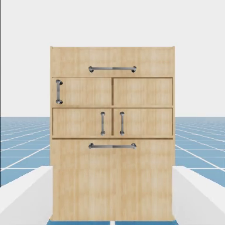 | 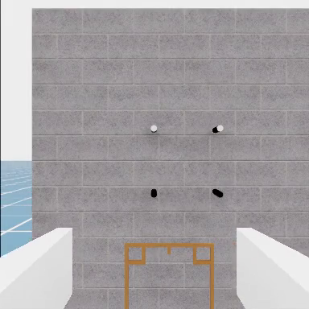 |
| LemonHarvesting | NDT |
| 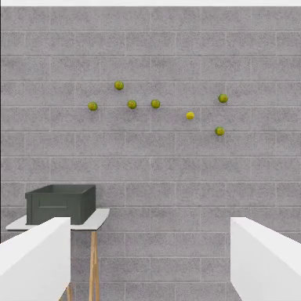 |  |
| OpenDoor | PegInHole |
| 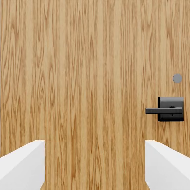 | 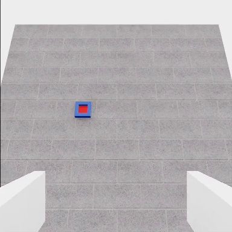 |
| PressButton | PullLever |
| 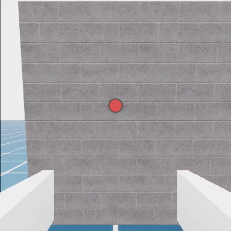 | 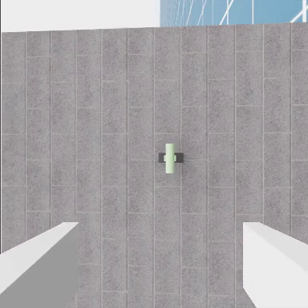 |
| PushSlider | RotateValve |
| 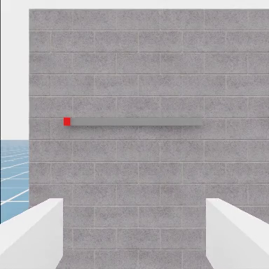 | 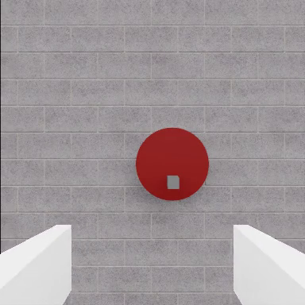 |
| TossBall | WipeWindow |
|  | 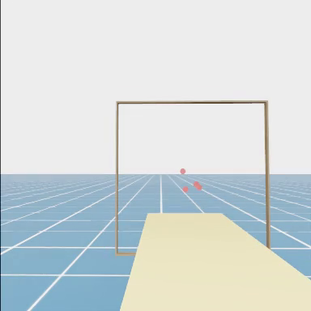 |

### 2.2 观察、动作、奖励与成功率

所有任务返回 Gymnasium 五元组 `obs, reward, terminated, truncated, info`。`obs["policy"]` 含末端位姿/速度、基座位姿/速度、夹爪宽度，物理机型还含机械臂关节状态；任务再添加目标与物体状态。四元数采用 WXYZ；位置相对各环境 origin。EE 绝对动作为位置 3 + 四元数 4 + 夹爪 1，共 8 维；BaseJoint 为基座位置 3 + 四元数 4 + 机械臂关节 4 + 夹爪 1，共 12 维。

当前任务 reward 为零。最终成功由 `terminated` 表示，时间上限由 `truncated` 表示。有命名子任务的场景在 `info["success_criteria"]` 中返回布尔状态；评估器记录每项是否曾达到。要比较模型，使用相同任务 ID、配置、seed、动作语义、策略频率、相机、扰动和 episode 上限。

## 3. 物理、扰动与相机

默认物理步长为 `1/120 s`。`BaseEnvCfg` 提供动作噪声、观察噪声、转子饱和、气动效应、风力五个独立开关；默认全关。气动效应包括地面、近墙与阻力，风向量由具体 robot spec 给出；只打开风力开关而保持默认零向量不会产生风。EE oracle 没有转子，因此不应用于飞行动力学结论。

一个不改注册表的扰动评估入口是模型 evaluator 的 `--disturbance`，它共同开启饱和、气动和风力开关。研究单个效应时，应在派生环境配置中只改变目标字段并注册新的 ID，记录完整 `env_cfg.yaml`。相机由机型 profile 配置，常用 `ee_camera`、`base_camera`；部分场景还可用 `scene_camera`。

要检查相机实际画面，容器内运行一个有界录像：

```bash
timeout --signal=INT 45s python scripts/environments/zero_agent.py \
  --task PressButton-Am-EE-Abs-PID-Direct-v0 \
  --num_envs 1 --video --camera_names ee_camera --headless --device cuda:0
```

这会在忽略目录 `videos/` 产生 MP4。`zero_agent.py` 是连续运行器，超时应发生在 scene/reset/step 已开始之后；检查子进程确实退出。该录像展示相机和场景，不代表专家动作。

下图来自本分支一次实际 Docker 运行：`PressButton-Am-EE-Abs-PID-Direct-v0`、`verify_matrix.py --task-id ... --video-task-id ... --video-steps 8`、单环境、EE 相机；8/8 步通过。帧取自 `outputs/research/press-ee-video-20260930T1744/` 的 MP4 中间帧，画面显示灰墙、红色按钮和白色夹爪。它是场景检查，不是按下按钮后的成功画面。


物理机型也已跑通独立相机：UAQuad PID 在 PressButton 场景用 `base_camera` 录制 30 步，下面是第 14 帧。容器内复现命令为：

```bash
python scripts/research/verify_matrix.py \
  --task-id PressButton-Am-UAQuad-Abs-PID-Direct-v0 \
  --video-task-id PressButton-Am-UAQuad-Abs-PID-Direct-v0 \
  --video-camera-name base_camera --video-steps 30 \
  --timeout-s 240 --output-dir outputs/research/uaquad_base_camera
```

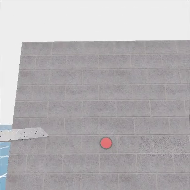

FAHexa PID 的扰动组合也已执行 8 步，包括转子饱和、气动、1 N 的 X 向风、动作噪声和观察噪声；这些设置与实际测试一致：

```bash
python scripts/research/verify_matrix.py \
  --task-id PressButton-Am-FAHexa-Abs-PID-Direct-v0 \
  --disturbance --wind-force 1 0 0 --action-noise --observation-noise \
  --steps 8 --timeout-s 240 --output-dir outputs/research/fahexa_disturbance
```

MPC 的 acados 会在当前目录生成 C 代码和模型 JSON。仿真容器默认位于可写 `/workspace/ambench-run`，因此普通 `zero_agent.py` 和 ACT/DP 评估入口可直接使用 MPC 任务 ID，源码仍只读。GUI 遥操作的 X11 启动命令和无头恢复命令见 [note.md](note.md)。本分支的两项额外实测如下：

| 功能 | 有界实测结果 |
| --- | --- |
| FAHexa MPC 普通入口 | `python scripts/environments/zero_agent.py --task PressButton-Am-FAHexa-Abs-MPC-Direct-v0 --num_envs 1 --headless` 完成 reset 和 2,386 次步进；`outputs/mpc_zero_agent_normal_cwd.log` 无权限错误或 traceback，生成文件仅在 Docker 工作卷。 |
| 本地 X11 GUI 与键盘设备 | `PressButton-Am-EE-Abs-PID-Direct-v0` 出现 1440×900 Isaac Sim 5.1.0 窗口，场景构造及 `Se3Keyboard` 初始化完成；`outputs/gui_teleop_x11.log` 出现 `Teleoperation started`。连续运行器在 180 秒上限结束，exit 124 为预期；没有手动键盘动作示范。 |

## 4. 十二个脚本专家与 canonical 数据

每个注册 ID 都携带 `scripted_policy_entry_point`。脚本专家使用任务状态机，经当前机器人控制流水线执行；BaseJoint 录制器通过当前 profile 的 IK 配置把专家 EE 目标转换为基座与关节绝对命令。先在 EE PID 下为每族取一条成功示范，随后检查各机型上的适用性。

全部 12 族的有界采集和 canonical 验证可逐项运行，失败后继续并保存 JSON/CSV 与日志：

```bash
python scripts/research/verify_scripted.py \
  --timeout-s 600 --output-dir outputs/research/scripted_all
```

先单独查一个任务可加 `--family PressButton` 并改用空的输出目录；给该单族测试加 `--video` 会保存额外 MP4，已在 PressButton 上实测。该脚本以每族 EE PID 作为任务逻辑基线；FAHexa BaseJoint PressButton 另有一条成功示范。四种物理飞行器的 PressButton PID 专家也均完成一条成功示范和 canonical validator，记录如下；这些单次结果不能推断其他任务的飞行专家成功率。

| PressButton 物理机型 | 成功示范数 | canonical 帧数（120 Hz） | recorder + validator |
| --- | ---: | ---: | --- |
| UAQuad PID | 1 | 1016 | 通过 |
| UAHexa PID | 1 | 986 | 通过 |
| FAHexa PID | 1 | 1002 | 通过 |
| OmniHexa PID | 1 | 997 | 通过 |

结果来自 `outputs/research/scripted-press-physical-20261007T1300/results.json`。2026-10-07 这轮补测沿用旧采集器的随机 seed（各 session 的 `env_cfg.yaml` 如实保存 `seed: null`）；从当前版本开始，验证脚本默认显式使用 `--seed 42`，报告记录 seed 与 episode 上限。使用公共采集器时也可加 `--seed 42` 固定任务随机化与专家轨迹：

```bash
python scripts/research/verify_scripted.py \
  --task-id PressButton-Am-UAQuad-Abs-PID-Direct-v0 \
  --task-id PressButton-Am-UAHexa-Abs-PID-Direct-v0 \
  --task-id PressButton-Am-FAHexa-Abs-PID-Direct-v0 \
  --task-id PressButton-Am-OmniHexa-Abs-PID-Direct-v0 \
  --seed 42 --timeout-s 180 --output-dir outputs/research/scripted_press_physical
```

容器内运行单任务示例：

```bash
python scripts/data/record_demos_scripted.py \
  --task PressButton-Am-EE-Abs-PID-Direct-v0 \
  --dataset_root datasets/press_button_smoke \
  --repo_id am_bench/pressbutton_ee_absolute \
  --state_keys ee_pos ee_quat gripper_width \
  --task_prompt "press the button" \
  --step_hz 120 --num_envs 1 --num_demos 1 --env_length_s 20 --seed 42 \
  --camera_names ee_camera --video --headless --device cuda:0
```

脚本默认只保存成功 episode，`--num_demos 1` 的含义是一个成功 episode；失败的尝试不计数。调试失败可加 `--save_failed_episodes`，但这些 episode 不能算成功示范。录制成功后，在同一个容器终端定位最新 session 并用验证器检查：

```bash
SESSION_INFO=$(find datasets/press_button_smoke -type f -path '*/lerobot/meta/info.json' | sort | tail -n 1)
SESSION_ROOT=${SESSION_INFO%/lerobot/meta/info.json}
test -f "$SESSION_ROOT/lerobot/meta/info.json"
python scripts/data/validate_lerobotdataset.py \
  --dataset_root "$SESSION_ROOT" \
  --repo_id am_bench/pressbutton_ee_absolute --target_hz 20
```

下面这张图来自成功 PressButton 脚本示范的 EE 相机 MP4 第 237 帧，画面显示夹爪已靠近按钮。该 session 的一条 episode 和 validator 都通过；成功由环境终止条件判定，不靠图片推断。[附加图像清单](usage_assets/evidence_manifest.json)记录这个视频和上方 UAQuad 视频的 SHA-256、帧号及源报告。

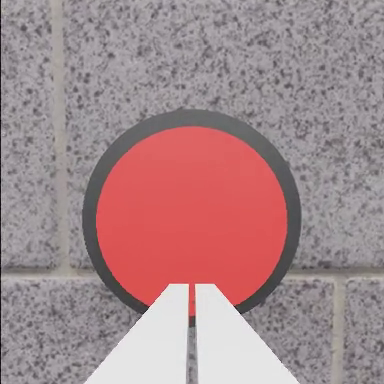

BaseJoint 数据应使用匹配 ID 和有序 state keys：

```bash
python scripts/data/record_demos_scripted.py \
  --task PressButton-Am-FAHexa-BaseJoint-Abs-PID-Direct-v0 \
  --dataset_root datasets/press_button_base_joint \
  --repo_id am_bench/press_button_base_joint_absolute \
  --state_keys base_pos base_quat arm_joint_pos gripper_width \
  --task_prompt "press the button" \
  --step_hz 120 --num_envs 1 --num_demos 1 --env_length_s 20 --seed 42 \
  --camera_names ee_camera \
  --headless --device cuda:0
```

这个 BaseJoint 配置还通过 `verify_scripted.py --task-id PressButton-Am-FAHexa-BaseJoint-Abs-PID-Direct-v0 --output-dir outputs/research/scripted-press-basejoint-20260930T2005` 做了完整采集和校验：1 条成功 episode、1019 帧、12 维 `observation.state` 与 `action`，`base_joint_absolute` 动作语义。独立结果不会计入上面的 12 族 EE PID 汇总。

保留首次失败及各次复测，核对每条成功示范的 recorder、validator、LeRobot metadata 和视频，在仿真容器内合并本次分批采集：

```bash
python scripts/research/merge_scripted_results.py \
  outputs/research/scripted-pressbutton-20260930T1850/results.json \
  outputs/research/scripted-other-families-20260930T1852/results.json \
  outputs/research/scripted-wipewindow-40s-20260930T1903/results.json \
  outputs/research/scripted-pressbutton-video-20260930T1930/results.json \
  outputs/research/scripted-wipe-fixed-success-20260930T1950/results.json \
  outputs/research/scripted-wipe-default20-20260930T2045/results.json \
  --output outputs/research/combined-final/scripted_12_default20.json \
  --expect-families 12
```

人工遥操作使用 `python scripts/data/record_demos_teleop.py --task PressButton-Am-EE-Abs-PID-Direct-v0 --help` 查看设备选项；它需要可见的 Isaac Sim 窗口和受支持输入设备。与脚本录制相同，遥操作输出也是 canonical LeRobot 数据。

### 4.1 数据格式与派生格式

```text
<session-root>/
  env_cfg.yaml
  lerobot/meta/info.json
  lerobot/meta/episodes/
  lerobot/data/
  lerobot/images/ 或 lerobot/videos/
  videos/  # 可选
```

源数据 LeRobot 0.4.4 的帧含 `observation.state`、`action`、`task` 与 `observation.images.<camera>`。`meta/info.json` 中 `ambench.action_semantics` 必须为 `ee_absolute` 或 `base_joint_absolute`，`state_keys` 记录 state 拼接顺序。模型训练使用相对目标时，由策略适配器或导出脚本从绝对动作源计算，源数据仍保留绝对语义。

把 canonical session 按 [note.md](note.md) 同步到远端 `/data/datasets/press_button_ee` 后，在**远端策略容器的 DP 环境**转换与验证。以下命令在远端容器内执行：

```bash
/opt/venvs/dp/bin/python scripts/data/dp/lerobot_to_zarr.py \
  --input_path /data/datasets/press_button_ee \
  --output_path /data/datasets/press_button_ee.zarr.zip --omit_base_image
/opt/venvs/dp/bin/python scripts/data/dp/validate_zarr.py \
  /data/datasets/press_button_ee.zarr.zip --image_size 224
```

OpenPI 固定 reader 的 v2.1 派生导出在远端策略容器的 ACT 环境执行，直接读取同一份已同步的 canonical session；实际验证生成了 169 个 20 Hz 逻辑帧：

```bash
/opt/venvs/act/bin/python scripts/data/export_lerobot_to_openpi.py \
  --dataset_roots /data/datasets/press_button_ee \
  --repo_id am_bench/multitask_openpi_original_20hz_ee_local_relative \
  --output_root /data/datasets/openpi/am_bench/multitask_openpi_original_20hz_ee_local_relative \
  --target_hz 20 \
  --omit_base_image --task_prompt "press the button"
```

多任务导出使用 `--task_prompt_map scripts/data/am_bench_language_instructions.json --require_task_prompt_map`，把各任务的 canonical session 一起传入。若已在本地仿真容器导出，也可用 `tools/research/sync_openpi_export.sh` 将 v2.1 repo 上传到远端相同布局；同步脚本拒绝覆盖已有目录。数据、配置和评估命令见下一节。

## 5. ACT、Diffusion Policy 与 OpenPI 的双容器闭环

远端策略服务持有模型与 checkpoint，Isaac 容器负责环境、相机与状态采集、低层控制和结果记录；各模型所需的预处理在对应容器内完成。执行前按 [note.md](note.md) 部署策略镜像、启动恰好一种服务并建立 SSH 隧道。远端的 checkpoint 要与所选 EE 或 BaseJoint 环境、state keys、相机和动作频率相符。

以下训练命令在远端策略容器内运行；从本地进入：

```bash
ssh -t tencent-86 'docker exec -it -w /workspace/ambench ambench-policy-research bash'
```

三个模型族分别使用 `/opt/venvs/act/bin/python`、`/opt/venvs/dp/bin/python` 与 `/opt/openpi/.venv/bin/python`。本地仿真容器用自己的 `python` 执行评估命令。同步脚本上传的示范位于远端 `/data/datasets/<remote-name>`。

**无任务数据时的真实模型接口检查。** 下面脚本在远端容器生成随机小权重，实际加载 ACT/DP 模型并做前向推理；`synthetic_inference_report.json` 留在 `/data/checkpoints`。ACT 使用 384×384，与 EE 环境默认相机一致。随机权重只证明模型调用和跨机传输可运行，不代表学会任务。

```bash
/opt/venvs/act/bin/python source/ambench_learn/tests/policies/remote/smoke_model_inference.py \
  --policy act --act-image-size 384 --output-dir /data/checkpoints/research-smoke-act
/opt/venvs/dp/bin/python source/ambench_learn/tests/policies/remote/smoke_model_inference.py \
  --policy dp --output-dir /data/checkpoints/research-smoke-dp
```

返回本地宿主机后，保持 [note.md](note.md) 的 SSH 隧道运行，再依次切换服务并让仿真容器发出真实 HTTP 推理请求：

```bash
bash tools/research/start_policy.sh act /data/checkpoints/research-smoke-act/pretrained_model
bash tools/research/wait_policy.sh act
docker exec ambench-sim-research python \
  source/ambench_learn/tests/policies/remote/smoke_remote_transport.py \
  --policy act --remote-url http://127.0.0.1:8001

bash tools/research/start_policy.sh dp /data/checkpoints/research-smoke-dp/latest.ckpt
bash tools/research/wait_policy.sh dp
docker exec ambench-sim-research python \
  source/ambench_learn/tests/policies/remote/smoke_remote_transport.py \
  --policy dp --remote-url http://127.0.0.1:8001
```

ACT 应连续收到两个有限的 8 维动作；DP 应收到有限的 `(8, 8)` 动作计划。该检查不启动 Isaac Sim；真实环境闭环仍需运行各自的 `eval` 命令并核对 `eval_summary.json`。

### 5.1 ACT

ACT 直接训练已验证的 canonical LeRobot 数据。远端训练时采用 `ee_local_relative` 或 `base_joint_relative`，保留原始数据；一个短训练检查可把 `--steps` 设为 1，正式步骤按实验配置决定。训练入口：

```bash
/opt/venvs/act/bin/python -m ambench_learn.policies.act.train \
  --dataset.repo_id=am_bench/pressbutton_ee_absolute \
  --dataset.root=/data/datasets/press_button_ee/lerobot \
  --dataset.use_imagenet_stats=true \
  --policy.type=act --policy.chunk_size=16 --policy.n_action_steps=8 \
  --policy.device=cuda --policy.push_to_hub=false \
  --output_dir=/data/checkpoints/act_press_button_smoke --job_name=press_button_act \
  --batch_size=8 --steps=1 --num_workers=0 --save_freq=1 \
  --wandb.enable=false --policy_target_hz=20 \
  --policy_action_representation=ee_local_relative
```

训练完成后，LeRobot 的 `checkpoints/last` 符号链接指向最新 step。从本地宿主机启动该权重，再让本地仿真容器通过隧道做已验证的 0.5 秒闭环烟测：

```bash
bash tools/research/start_policy.sh act \
  /data/checkpoints/act_press_button_smoke/checkpoints/last/pretrained_model
bash tools/research/wait_policy.sh act
docker exec ambench-sim-research \
  python -m ambench_learn.policies.act.eval \
  --task PressButton-Am-EE-Abs-PID-Direct-v0 \
  --remote-url http://127.0.0.1:8001 \
  --policy-id press_button_act_step1 \
  --num-rollouts 1 --num-envs 1 --n-action-steps 8 \
  --policy-target-hz 20 --episode-length-s 0.5 \
  --output-dir outputs/policy_rpc/act_isaac_step1 \
  --save-video --video-camera-names ee_camera --progress-every 10 \
  --headless --device cuda:0
```

该命令实测 `eval_summary.json` 为 `completed`、1 次 rollout、59 步，生成 MP4，任务成功 0/1。相同 checkpoint 的 20 秒完整 episode 已用 `--seed 42 --episode-length-s 20 --output-dir outputs/policy_rpc/act_isaac_full20s --progress-every 240` 跑完：`completed`、2399 步、0/1 成功。复现时将上面命令的短时、输出和录像选项替换为这四项。短训练 checkpoint 仅用于接口闭环检查，不构成有效策略成绩；测成功率应增加 rollout 数。ACT 对相对动作不能做跨锚点 temporal ensembling。

### 5.2 Diffusion Policy

DP 训练输入为从 canonical 导出的 UMI zarr。下面的一步 smoke 把固定 Hydra config 的视觉编码器改为随机初始化的 ResNet18，避免下载默认预训练权重；正式训练可恢复原配置并记录实际权重版本：

```bash
cd source/ambench_learn/ambench_learn/policies/dp/universal_manipulation_interface
WANDB_MODE=disabled /opt/venvs/dp/bin/python train.py \
  --config-name=train_diffusion_unet_timm_umi_workspace \
  task=umi_drone_ee_pos task.dataset_path=/data/datasets/press_button_ee.zarr.zip \
  task.obs_down_sample_steps=6 task.action_horizon=16 \
  task.pose_repr.obs_pose_repr=relative task.pose_repr.action_pose_repr=relative \
  policy.obs_encoder.model_name=resnet18 policy.obs_encoder.pretrained=false \
  policy.obs_encoder.feature_aggregation=avg policy.obs_encoder.transforms=null \
  'policy.down_dims=[64,128]' policy.diffusion_step_embed_dim=64 \
  policy.num_inference_steps=4 policy.noise_scheduler.num_train_timesteps=8 \
  training.num_epochs=1 training.max_train_steps=1 training.max_val_steps=1 \
  training.device=cuda:0 dataloader.batch_size=1 dataloader.num_workers=0 \
  dataloader.persistent_workers=false val_dataloader.batch_size=1 \
  val_dataloader.num_workers=0 val_dataloader.persistent_workers=false \
  exp_name=press_button_dp_smoke logging.name=press_button_dp_smoke \
  logging.mode=disabled hydra.run.dir=/data/outputs/press_button_dp_smoke
```

从本地宿主机启动远端服务，再让本地仿真容器做已验证的 0.5 秒闭环烟测：

```bash
bash tools/research/start_policy.sh dp /data/outputs/press_button_dp_smoke/checkpoints/latest.ckpt
bash tools/research/wait_policy.sh dp
docker exec ambench-sim-research \
  python -m ambench_learn.policies.dp.eval \
  --task PressButton-Am-EE-Abs-PID-Direct-v0 \
  --remote-url http://127.0.0.1:8001 \
  --policy-id press_button_dp_step1 \
  --num-rollouts 1 --num-envs 1 --episode-length-s 0.5 \
  --output-dir outputs/policy_rpc/dp_isaac_step1 \
  --save-video --video-camera-names ee_camera --progress-every 10 \
  --headless --device cuda:0
```

DP 当前每次只评估一个环境。选择 BaseJoint 训练时，替换为 `task=umi_drone_base_joint` 并配同语义数据和注册环境。
该命令实测 `eval_summary.json` 为 `completed`、1 次 rollout、59 步，生成 MP4，任务成功 0/1。相同 checkpoint 的 20 秒完整 episode 已用 `--seed 42 --episode-length-s 20 --output-dir outputs/policy_rpc/dp_isaac_full20s --progress-every 240` 跑完：`completed`、2399 步、0/1 成功。复现时将上面命令的短时、输出和录像选项替换为这四项。只有一个示范 episode 时，DP 训练的验证集为空；一步 checkpoint 只用于数据、训练和推理链路检查，不代表任务成功率。

### 5.3 OpenPI π₀ / π₀.₅

OpenPI 使用 `ext/openpi` 固定版本和独立 Python 环境。仿真端通过 `openpi-client` 连接 WebSocket，远端服务由 `start_policy.sh` 调用 `/opt/openpi/.venv/bin/python scripts/serve_policy.py policy:checkpoint`。这两个模型共享 canonical 源，训练前派生 v2.1 数据，并各自计算 norm stats、准备 base 权重、训练及服务；不能用未经适配的原始 base 权重宣称 AM-Bench 任务成绩。

| 模型 | EE 配置名 |
| --- | --- |
| π₀ | `pi0_am_bench_multitask_openpi_original_20hz_h50_ee_local_relative` |
| π₀.₅ | `pi05_am_bench_multitask_openpi_original_20hz_h50_ee_local_relative` |

BaseJoint 对应配置名分别含 `multitask_base_joint_openpi_original_20hz_h50_base_joint_relative`。导出的 v2.1 repo ID、config、stats 和 checkpoint 必须相互匹配。先从**本地宿主机**调用脚本，在本地无 GPU 策略 Docker 内下载到忽略目录 `outputs/openpi-cache/` 并逐文件验证官方 base checkpoint；随后同步到远端策略 Docker 的持久 `/data/cache/openpi` 并再次验证。校验报告分别保存在本地 `outputs/` 与远端 `/data/outputs/`：

```bash
bash tools/research/fetch_openpi_base.sh pi0
bash tools/research/fetch_openpi_base.sh pi05
```

然后在远端容器内 `cd /opt/openpi` 执行转换、统计量计算和训练。以下是已完成转换及两步训练的 π₀.₅ EE 示例；运行 π₀ 时把开头两项赋值改为 `PI_CONFIG=pi0_am_bench_multitask_openpi_original_20hz_h50_ee_local_relative` 和 `BASE_NAME=pi0_base`：

```bash
PI_CONFIG=pi05_am_bench_multitask_openpi_original_20hz_h50_ee_local_relative
BASE_NAME=pi05_base
JAX_PLATFORMS=cpu /opt/openpi/.venv/bin/python examples/convert_jax_model_to_pytorch.py \
  --checkpoint-dir "/data/cache/openpi/openpi-assets/checkpoints/$BASE_NAME" \
  --config-name "$PI_CONFIG" \
  --output-path "/data/checkpoints/openpi/${BASE_NAME}_pytorch"

/opt/openpi/.venv/bin/python -m scripts.compute_norm_stats \
  --config-name "$PI_CONFIG" \
  --assets-base-dir /data/assets \
  --repo-id am_bench/multitask_openpi_original_20hz_ee_local_relative \
  --num-workers 2

JAX_PLATFORMS=cpu /opt/openpi/.venv/bin/torchrun --standalone --nnodes=1 --nproc_per_node=1 \
  -m scripts.train_pytorch "$PI_CONFIG" \
  --exp-name smoke --pytorch-weight-path "/data/checkpoints/openpi/${BASE_NAME}_pytorch" \
  --assets-base-dir /data/assets --checkpoint-base-dir /data/checkpoints/openpi \
  --data.repo-id am_bench/multitask_openpi_original_20hz_ee_local_relative \
  --batch-size 1 --num-train-steps 2 --num-workers 0 \
  --save-interval 1 --no-resume --no-overwrite --no-wandb-enabled
```

π₀、π₀.₅ 官方 base 权重来自 OpenPI 固定 README 的 `gs://openpi-assets/checkpoints/pi0_base` 与 `pi05_base`。`--pytorch-weight-path` 必须指向包含 `model.safetensors` 的**目录**。π₀.₅ 已按以上配置训练两步，有限 loss 为 0.0944、0.1177，checkpoint 位于 `/data/checkpoints/openpi/pi05_am_bench_multitask_openpi_original_20hz_h50_ee_local_relative/smoke/2/`。从本地宿主机启动远端服务后，可先在仿真容器做无需 Isaac 的真实权重 WebSocket 前向：

```bash
PI_CONFIG=pi05_am_bench_multitask_openpi_original_20hz_h50_ee_local_relative
bash tools/research/start_policy.sh pi "$PI_CONFIG" \
  "/data/checkpoints/openpi/$PI_CONFIG/smoke/2"
bash tools/research/wait_policy.sh pi
docker exec ambench-sim-research \
  python source/ambench_learn/tests/policies/remote/smoke_openpi_transport.py \
  --host 127.0.0.1 --port 8000
```

实测连续两次返回 `action_representation=ee_local_relative`、有限的 `(50, 8)` 动作块。该检查不启动环境；以下为已验证的 0.5 秒 Isaac 闭环烟测：

```bash
docker exec ambench-sim-research \
  python -m ambench_learn.policies.pi.eval \
  --host 127.0.0.1 --port 8000 \
  --task PressButton-Am-EE-Abs-PID-Direct-v0 \
  --prompt "press the button" --num-rollouts 1 --num-envs 1 \
  --episode-length-s 0.5 --n-action-steps 8 --policy-target-hz 20 \
  --policy-id pi05_ee_smoke_step2 \
  --output-dir outputs/policy_rpc/pi05_isaac_step2 \
  --save-video --video-camera-names ee_camera --progress-every 10 \
  --headless --device cuda:0
```

π₀.₅ 该次 `eval_summary.json` 为 `completed`、1 次 rollout、59 步，生成 MP4，任务成功 0/1。π₀ 用同一份 canonical 派生数据及其独立的 norm stats、base 权重做了相同的两步训练；把上面两段中的 `PI_CONFIG`、`--policy-id` 和 `--output-dir` 分别换为 `pi0_am_bench_multitask_openpi_original_20hz_h50_ee_local_relative`、`pi0_ee_smoke_step2` 和 `outputs/policy_rpc/pi0_isaac_step2`，其短闭环也返回 `completed`、59 步、0/1 成功并生成 MP4。π₀ 的训练 checkpoint 位于 `/data/checkpoints/openpi/pi0_am_bench_multitask_openpi_original_20hz_h50_ee_local_relative/smoke/2/`。

两种模型的 20 秒 episode 都已使用 `--seed 42 --episode-length-s 20 --progress-every 240` 跑完，不保存录像，输出目录分别为 `outputs/policy_rpc/pi0_isaac_full20s` 和 `outputs/policy_rpc/pi05_isaac_full20s`；两份 `eval_summary.json` 均为 `completed`、2399 步、0/1 成功。复现时将上述短闭环命令的时长、输出目录和录像选项替换为这些实测选项。两步训练仅验证全链路调用；测任务成功率应增加示范、训练步数和 rollout 数。

2026-09-30 的远端验证使用 GPU 0 RTX PRO 5000 72 GB；部署脚本每次重新检查并选择没有计算进程的最小 GPU ID。π₀.₅ 不与本地 16 GB 仿真 GPU 争显存；SSH 隧道将观察与动作传输到远端。`start_policy.sh pi` 设置 `TORCHDYNAMO_DISABLE=1`，避免首次推理进行长时间编译；比较速度时应记录这个服务设置。

### 5.4 FAHexa BaseJoint 的 12 维模型链路

`PressButton-Am-FAHexa-BaseJoint-Abs-PID-Direct-v0` 的成功专家示范使用 `base_joint_absolute`，state/action 均为 12 维。本次源 session 在本地主机的 `outputs/research/scripted-press-basejoint-20260930T2005/datasets/PressButton/PressButtonFAHexaBaseJointAbsPID/demo-20260930_115956`，1 episode / 1019 个 120 Hz 帧，LeRobot validator 已通过。在本地主机上传这个 canonical session；若重新采集，替换第一行的路径即可：

```bash
BJ_SESSION=outputs/research/scripted-press-basejoint-20260930T2005/datasets/PressButton/PressButtonFAHexaBaseJointAbsPID/demo-20260930_115956
bash tools/research/sync_dataset.sh "$BJ_SESSION" press_button_base_joint
```

以下训练与转换命令在**远端策略容器**中运行。ACT 从同一 canonical session 以 20 Hz 逻辑帧训练，checkpoint 记录 `base_joint_relative`；DP 先将相同 session 导成 UMI zarr 并验证，再用 BaseJoint Hydra task 训练。每种只训练一步，用于验证 12 维数据和模型调用接口。

```bash
/opt/venvs/act/bin/python -m ambench_learn.policies.act.train \
  --dataset.repo_id=am_bench/press_button_base_joint_absolute \
  --dataset.root=/data/datasets/press_button_base_joint/lerobot \
  --dataset.use_imagenet_stats=true \
  --policy.type=act --policy.chunk_size=16 --policy.n_action_steps=8 \
  --policy.device=cuda --policy.push_to_hub=false \
  --output_dir=/data/checkpoints/act_press_button_base_joint_smoke \
  --job_name=press_button_base_joint_act --batch_size=8 --steps=1 \
  --num_workers=0 --save_freq=1 --wandb.enable=false \
  --policy_target_hz=20 --policy_action_representation=base_joint_relative

/opt/venvs/dp/bin/python scripts/data/dp/lerobot_to_zarr.py \
  --input_path /data/datasets/press_button_base_joint \
  --output_path /data/datasets/press_button_base_joint.zarr.zip --omit_base_image
/opt/venvs/dp/bin/python scripts/data/dp/validate_zarr.py \
  /data/datasets/press_button_base_joint.zarr.zip --image_size 224
cd source/ambench_learn/ambench_learn/policies/dp/universal_manipulation_interface
WANDB_MODE=disabled /opt/venvs/dp/bin/python train.py \
  --config-name=train_diffusion_unet_timm_umi_workspace \
  task=umi_drone_base_joint task.dataset_path=/data/datasets/press_button_base_joint.zarr.zip \
  task.obs_down_sample_steps=6 task.action_horizon=16 \
  task.pose_repr.obs_pose_repr=relative task.pose_repr.action_pose_repr=relative \
  policy.obs_encoder.model_name=resnet18 policy.obs_encoder.pretrained=false \
  policy.obs_encoder.feature_aggregation=avg policy.obs_encoder.transforms=null \
  'policy.down_dims=[64,128]' policy.diffusion_step_embed_dim=64 \
  policy.num_inference_steps=4 policy.noise_scheduler.num_train_timesteps=8 \
  training.num_epochs=1 training.max_train_steps=1 training.max_val_steps=1 \
  training.device=cuda:0 dataloader.batch_size=1 dataloader.num_workers=0 \
  dataloader.persistent_workers=false val_dataloader.batch_size=1 \
  val_dataloader.num_workers=0 val_dataloader.persistent_workers=false \
  exp_name=press_button_dp_base_joint_smoke \
  logging.name=press_button_dp_base_joint_smoke logging.mode=disabled \
  hydra.run.dir=/data/outputs/press_button_dp_base_joint_smoke
```

返回本地主机，先启动 ACT，再切换 DP；以下命令均用真实一步 checkpoint、SSH 隧道和本地 Isaac Sim 运行。切换服务会停止 8001 端口上的前一个模型。

```bash
BJ_TASK=PressButton-Am-FAHexa-BaseJoint-Abs-PID-Direct-v0
bash tools/research/start_policy.sh act \
  /data/checkpoints/act_press_button_base_joint_smoke/checkpoints/last/pretrained_model
bash tools/research/wait_policy.sh act
docker exec ambench-sim-research python \
  source/ambench_learn/tests/policies/remote/smoke_remote_transport.py \
  --policy act --action-semantics base_joint_absolute \
  --remote-url http://127.0.0.1:8001
docker exec ambench-sim-research python -m ambench_learn.policies.act.eval \
  --task "$BJ_TASK" --remote-url http://127.0.0.1:8001 \
  --policy-id press_button_base_joint_act_step1 \
  --num-rollouts 1 --num-envs 1 --n-action-steps 8 --policy-target-hz 20 \
  --episode-length-s 0.5 --output-dir outputs/policy_rpc/act_base_joint_isaac_step1 \
  --save-video --video-camera-names ee_camera --progress-every 10 \
  --headless --device cuda:0

bash tools/research/start_policy.sh dp \
  /data/outputs/press_button_dp_base_joint_smoke/checkpoints/latest.ckpt
bash tools/research/wait_policy.sh dp
docker exec ambench-sim-research python \
  source/ambench_learn/tests/policies/remote/smoke_remote_transport.py \
  --policy dp --action-semantics base_joint_absolute \
  --remote-url http://127.0.0.1:8001
docker exec ambench-sim-research python -m ambench_learn.policies.dp.eval \
  --task "$BJ_TASK" --remote-url http://127.0.0.1:8001 \
  --policy-id press_button_base_joint_dp_step1 \
  --num-rollouts 1 --num-envs 1 --episode-length-s 0.5 \
  --output-dir outputs/policy_rpc/dp_base_joint_isaac_step1 \
  --save-video --video-camera-names ee_camera --progress-every 10 \
  --headless --device cuda:0
```

ACT 的真实 HTTP 请求连续两次返回 12 维动作；DP 返回有限的 `(96, 12)` 计划。两个 `eval_summary.json` 均为 `completed`、59 步、0/1 成功，均保存 MP4。一步训练和半秒评估仅验证 BaseJoint 接口，不能推断 20 秒任务成功率。

OpenPI 从**同一** canonical session 导出独立的 BaseJoint v2.1 数据。在远端策略容器的仓库根目录运行导出，再到 `/opt/openpi` 分别计算两种配置的 stats、从第 5.3 节已转换的官方 base 权重训练一步：

```bash
cd /workspace/ambench
/opt/venvs/act/bin/python scripts/data/export_lerobot_to_openpi.py \
  --dataset_roots /data/datasets/press_button_base_joint \
  --repo_id am_bench/multitask_base_joint_openpi_original_20hz_base_joint_relative \
  --output_root /data/datasets/openpi/am_bench/multitask_base_joint_openpi_original_20hz_base_joint_relative \
  --target_hz 20 --omit_base_image --task_prompt "press the button"
cd /opt/openpi
for MODEL in pi0 pi05; do
  PI_CONFIG="${MODEL}_am_bench_multitask_base_joint_openpi_original_20hz_h50_base_joint_relative"
  BASE_NAME="${MODEL}_base"
  /opt/openpi/.venv/bin/python -m scripts.compute_norm_stats \
    --config-name "$PI_CONFIG" --assets-base-dir /data/assets \
    --repo-id am_bench/multitask_base_joint_openpi_original_20hz_base_joint_relative \
    --num-workers 2
  JAX_PLATFORMS=cpu /opt/openpi/.venv/bin/torchrun --standalone --nnodes=1 --nproc_per_node=1 \
    -m scripts.train_pytorch "$PI_CONFIG" \
    --exp-name base_joint_smoke \
    --pytorch-weight-path "/data/checkpoints/openpi/${BASE_NAME}_pytorch" \
    --assets-base-dir /data/assets --checkpoint-base-dir /data/checkpoints/openpi \
    --data.repo-id am_bench/multitask_base_joint_openpi_original_20hz_base_joint_relative \
    --batch-size 1 --num-train-steps 1 --num-workers 0 \
    --save-interval 1 --no-resume --no-overwrite --no-wandb-enabled
done
```

本次两种 norm stats 均生成，π₀/π₀.₅ 的有限单步 loss 分别为 5.0940/0.0332。返回本地主机，下面以 π₀ 为例；复现 π₀.₅ 时将 `PI_CONFIG` 的 `pi0_` 前缀、`--policy-id` 和 `--output-dir` 中的 `pi0` 改为 `pi05`，并加 `--seed 42`。两个服务均返回 `base_joint_relative` 元数据和连续两个有限的 `(50, 12)` 动作块，两种模型均已完成本地 Isaac 闭环。

```bash
PI_CONFIG=pi0_am_bench_multitask_base_joint_openpi_original_20hz_h50_base_joint_relative
bash tools/research/start_policy.sh pi "$PI_CONFIG" \
  "/data/checkpoints/openpi/$PI_CONFIG/base_joint_smoke/1"
bash tools/research/wait_policy.sh pi
docker exec ambench-sim-research python \
  source/ambench_learn/tests/policies/remote/smoke_openpi_transport.py \
  --host 127.0.0.1 --port 8000 --action-semantics base_joint_absolute
docker exec ambench-sim-research python -m ambench_learn.policies.pi.eval \
  --host 127.0.0.1 --port 8000 \
  --task PressButton-Am-FAHexa-BaseJoint-Abs-PID-Direct-v0 \
  --prompt "press the button" --num-rollouts 1 --num-envs 1 \
  --episode-length-s 0.5 --n-action-steps 8 --policy-target-hz 20 \
  --policy-id pi0_base_joint_smoke_step1 \
  --output-dir outputs/policy_rpc/pi0_base_joint_isaac_step1 \
  --save-video --video-camera-names ee_camera --progress-every 10 \
  --headless --device cuda:0
```

π₀、π₀.₅ 的 BaseJoint `eval_summary.json` 均为 `completed`、1 次 rollout、59 步、0/1 成功并保存 MP4，结果分别在 `outputs/policy_rpc/pi0_base_joint_isaac_step1` 和 `pi05_base_joint_isaac_step1`。π₀.₅ 的闭环在 2026-10-07 补齐，wall time 3.22 秒。该示范验证 12 维跨容器控制链路；一步训练和半秒评估不能推断默认 20 秒任务成功率。

## 6. 评估记录与可视化

三种 evaluator 均应输出 `results.txt`、`eval_summary.json`、tracking JSONL/analysis，可选 MP4。`--save-video --video-camera-names ee_camera` 可留下可视证据。只有 `eval_summary.json` 记录 `status: "completed"` 且 rollout 数量足够，才能计算任务成功率、子任务完成率与 tracking 指标。

有界可视化的最小顺序：

1. 跑 EE PID 的场景录像并检查画面。
2. 跑同一任务的一个脚本成功示范，检查录像及 canonical 数据。
3. 从该 canonical 数据训练一个短模型 checkpoint。
4. 启动远端服务，完成一个闭环 rollout，检查 summary 与 MP4。
5. 全量矩阵验证五种机型和全部 12 族，再扩大训练与评估。

生成的录像、checkpoint、数据、训练日志留在忽略目录，不放入 Git。可以把经核验的代表帧放到 `usage_assets/` 并在本文标明任务、机型、seed、命令和帧时间；不能用项目概念图代替实测画面。

## 7. 本分支验证记录

下表在每次复现后按实际输出填写。`未执行` 是明确状态，不代表失败或通过。在**本地主机的仓库根目录**用下面的纯标准库脚本从忽略目录中的原始报告重新生成[验证快照](usage_assets/validation_snapshot.json)；它要求 106 个环境、12 族专家和四个真实 20 秒策略 episode 均齐全：

```bash
python3 scripts/research/snapshot_validation.py \
  --matrix outputs/research/combined-final/verified_106_after_wipe_fix.json \
  --scripted outputs/research/combined-final/scripted_12_default20.json \
  --policy-root outputs/policy_rpc \
  --require-base-joint \
  --output usage_assets/validation_snapshot.json
```

| 项目 | 状态 | 证据或原因 |
| --- | --- | --- |
| 仿真镜像构建与依赖导入 | 通过 | 最终镜像 `sha256:f6b7d491…` 已运行；Python 3.11.13、NumPy 1.26.0、Torch 2.7.0+cu128、CUDA 可用、LeRobot 0.4.4 与 accelerate 1.12 可导入，acados `t_renderer` 可执行 |
| 策略镜像构建与远端 GPU | 通过 | 远端容器 `ambench-policy-research` 仅看见 GPU 0 RTX PRO 5000 72 GB；8000/8001 仅绑定服务器 `127.0.0.1` |
| Gym registry | 通过 | 2026-09-30，`outputs/research/registry-smoke-20260930T1740/registry.json`：106 ID、12 族 |
| PressButton EE PID 场景与相机 | 通过 | `outputs/research/press-ee-video-20260930T1744/results.json`：8/8 步，384×384 MP4 与上图 |
| UAQuad base_camera 与 FAHexa 扰动 | 通过 | UAQuad `outputs/research/press-uaquad-base-camera-20260930T1933/results.json`：30/30 步、base_camera MP4；FAHexa `press-disturbance-20260930T1932/results.json`：1 N 风、饱和、气动、动作/观察噪声下 8/8 步 |
| ACT/DP 随机权重跨机模型推理 | 通过（接口烟测） | `outputs/policy_rpc/`：远端 GPU 加载两种真实模型；本地仿真 Docker 经 SSH tunnel 取得有限 8D 动作及 `(8, 8)` 计划；随机权重无任务能力 |
| OpenPI 配置与 WebSocket | 通过（π₀、π₀.₅ 真实模型接口） | 远端 adapter 17/17；两个官方 base 分别为 33 文件/12,014,440,489 B 与 29 文件/12,441,749,581 B，经本地及远端 GCS 校验、转换与各自两步训练；本地仿真 Docker 经隧道分别收到真实 checkpoint 的 `(50, 8)` 动作序列，见 `outputs/policy_rpc/pi0_trained_remote_ws.log`、`pi05_trained_remote_ws.log` |
| 106/106 注册与 reset/step | 通过（首轮及针对性复测） | `outputs/research/combined-final/verified_106_after_wipe_fix.json`：逐 ID 核对 child JSON、步数及来源，106/106、12 族；首轮 103/106，MPC/NDT 三项复测 3/3，WipeWindow 修复后 8/8 重新通过；12 类 EE 相机录像及上方图集已生成 |
| 12/12 脚本专家成功示范 | 通过（每族 EE PID 一条） | PressButton `outputs/research/scripted-pressbutton-20260930T1850/results.json`：1 episode/1018 帧；`scripted-other-families-20260930T1852` 的另外 10 类通过；WipeWindow 默认 20 s 修正后见 `scripted-wipe-default20-20260930T2045/results.json`：1 episode/1747 帧。全部 12 个 session 均通过 LeRobot validator；合并报告为 `scripted_12_default20.json` |
| 四种物理机型 PressButton 专家 | 通过（每机型一条） | `outputs/research/scripted-press-physical-20261007T1300/results.json`：UAQuad1016、UAHexa986、FAHexa1002、OmniHexa997 帧；四条成功 episode 均通过 canonical validator。旧采集器 seed未固定，不能推断多任务成功率 |
| FAHexa BaseJoint 专家示范 | 通过（单任务） | `outputs/research/scripted-press-basejoint-20260930T2005/results.json`：PressButton 1 条成功 episode/1019 帧，12 维 state/action，`base_joint_absolute`，LeRobot validator exit0 |
| canonical LeRobot + DP/OpenPI 派生格式 | 通过（单任务数据链） | PressButton canonical LeRobot 0.4.4 已通过 validator 并同步远端，`info.json` 两端 SHA-256 一致；DP zarr 导出、validator 1 episode/1018 steps 通过；OpenPI v2.1 导出 169 个 20 Hz 逻辑帧，π₀/π₀.₅ 两个 config 的 norm stats 均生成。见 `outputs/policy_rpc/dp_convert.log`、`dp_validate.log`、`openpi_export.log`、`openpi_norm_pi0.log`、`openpi_norm_pi05.log` |
| ACT 一步训练与跨机调用 | 通过（模型接口） | 远端从 PressButton canonical 的 169 个 20 Hz 帧训练 1 步，checkpoint `/data/checkpoints/act_press_button_smoke/checkpoints/last/pretrained_model`；训练及本地 Docker → 远端真实 checkpoint HTTP 见 `outputs/policy_rpc/act_train.log`、`act_trained_remote_http.log` |
| DP 一步训练与跨机调用 | 通过（模型接口） | 远端从 PressButton zarr 训练 1 步，checkpoint `/data/outputs/press_button_dp_smoke/checkpoints/latest.ckpt`；训练及本地 Docker → 远端真实 checkpoint HTTP 见 `outputs/policy_rpc/dp_train.log`、`dp_trained_remote_http.log` |
| ACT / DP Isaac 闭环 | 通过（任务成功均 0/1） | 0.5 秒录像闭环见 `outputs/policy_rpc/act_isaac_step1/eval_summary.json`、`dp_isaac_step1/eval_summary.json`：均 `completed`、59 步、0/1。默认 20 秒 episode 见 `outputs/policy_rpc/act_isaac_full20s/eval_summary.json`、`dp_isaac_full20s/eval_summary.json`：均 `completed`、2399 步、0/1；远端服务日志各有 400 次 `/infer` 请求，ACT 耗时 103.5 s、DP 63 s。一步训练 checkpoint 验证完整跨机链路，不代表有效任务成绩 |
| OpenPI π₀ / π₀.₅ 远端闭环 | 通过（20 秒闭环，任务成功均 0/1） | 两个官方 base 均经本地及远端 GCS 校验、转成 PyTorch、从同一 canonical 派生数据各训练 2 步；本地 Docker 经 WebSocket 分别收到真实 checkpoint 的 `(50, 8)` 动作块。两个 0.5 秒 Isaac 闭环均 `completed`、59 步、0/1 且有 MP4；`outputs/policy_rpc/pi0_isaac_full20s/eval_summary.json` 与 `pi05_isaac_full20s/eval_summary.json` 均 `completed`、2399 步、0/1 |
| FAHexa BaseJoint 四种高层模型 | 通过（0.5 秒闭环，任务成功均 0/1） | ACT、DP、π₀、π₀.₅ 从同一 12 维成功示范各训练 1 步，HTTP/WebSocket 返回有限 12 维动作；`outputs/policy_rpc/{act,dp,pi0,pi05}_base_joint_isaac_step1/eval_summary.json` 均 `completed`、59 步、0/1 且有 MP4。π₀.₅ 闭环于 2026-10-07 补齐 |

公开文档提供的是代码与运行方法，仓库没有打包训练数据和任务 checkpoint。任何未完成的阶段都会保留真实状态及直接日志，不推断模型精度或任务成功率。
